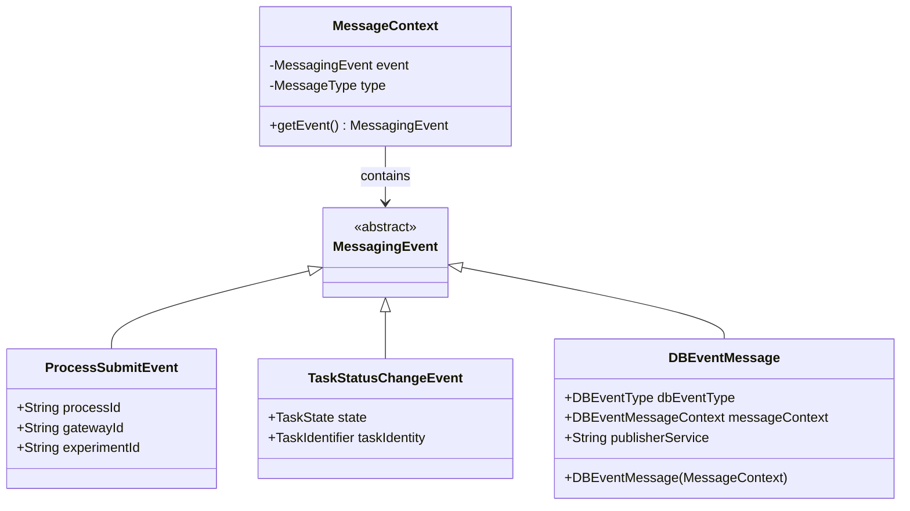

# DBEventMessage extends MessagingEvent Integration

## Problem

- `MessageContext` expects `MessagingEvent` but `DBEventMessage` doesn't extend it
- `DBEventMessage` is being passed to `MessageContext` constructors causing type errors
- Other event types (`ProcessSubmitEvent`, `TaskStatusChangeEvent`, etc.) all extend `MessagingEvent`
- `DBEventMessageHandler` has a TODO and missing constructor `new DBEventMessage(messageContext)`

## Solution

Make `DBEventMessage` extend `MessagingEvent` to align with the existing event hierarchy pattern.

## Implementation Steps

### 1. Update DBEventMessage to extend MessagingEvent

- **File**: `airavata-api/src/main/java/org/apache/airavata/common/model/DBEventMessage.java`
- Change class declaration: `public class DBEventMessage extends MessagingEvent`
- This allows `DBEventMessage` to be used in `MessageContext` constructors

### 2. Add constructor to extract DBEventMessage from MessageContext

- **File**: `airavata-api/src/main/java/org/apache/airavata/common/model/DBEventMessage.java`
- Add constructor: `public DBEventMessage(MessageContext messageContext)`
- Implementation: Extract the event from `messageContext.getEvent()` and cast to `DBEventMessage`
- This fixes the TODO in `DBEventMessageHandler` line 85

### 3. Fix MessageConsumer to handle domain models

- **File**: `airavata-api/src/main/java/org/apache/airavata/messaging/core/impl/MessageConsumer.java`
- Current issue: Line 62 tries to deserialize Thrift bytes into domain model `DBEventMessage` using `ThriftUtils.createThriftFromBytes()`, but domain models don't implement `TBase`
- Solution: Deserialize into Thrift model first, then convert to domain model using mapper, OR check if event is already a domain model
- Since `message.getEvent()` returns `ByteBuffer`, we need to deserialize it. If the message type is `DB_EVENT`, we should deserialize to Thrift `DBEventMessage` first, then map to domain model

### 4. Update DBEventPublisherUtils

- **File**: `airavata-api/src/main/java/org/apache/airavata/messaging/core/util/DBEventPublisherUtils.java`
- Line 117: `new MessageContext(dbEventMessage, MessageType.DB_EVENT, "", "")` - this will now work since `DBEventMessage` extends `MessagingEvent`
- No changes needed, but verify it compiles

### 5. Update other DB event handlers

- **Files**: 
  - `airavata-api/src/main/java/org/apache/airavata/sharing/messaging/SharingServiceDBEventHandler.java`
  - `airavata-api/src/main/java/org/apache/airavata/registry/messaging/RegistryServiceDBEventHandler.java`
- These handlers deserialize `DBEventMessage` from `MessageContext.getEvent()`
- After extending `MessagingEvent`, they can cast: `(DBEventMessage) messageContext.getEvent()`
- Update deserialization logic to work with domain models (may need mappers)

### 6. Verify all MessageContext usages

- Check all places where `DBEventMessage` is passed to `MessageContext` constructors
- Ensure they compile after the change
- Key locations:
  - `DBEventPublisherUtils.getDBEventMessageContext()` - line 117
  - `DBEventMessageHandler.onMessage()` - line 109

## Architecture Diagram

## Notes

- The field name `messageContext` in `DBEventMessage` (type `DBEventMessageContext`) is confusing but doesn't conflict with the `MessageContext` class
- All other event types follow the same pattern of extending `MessagingEvent`, so this change maintains consistency
- The constructor taking `MessageContext` will extract the event and cast it, assuming the `MessageContext` contains a `DBEventMessage` event