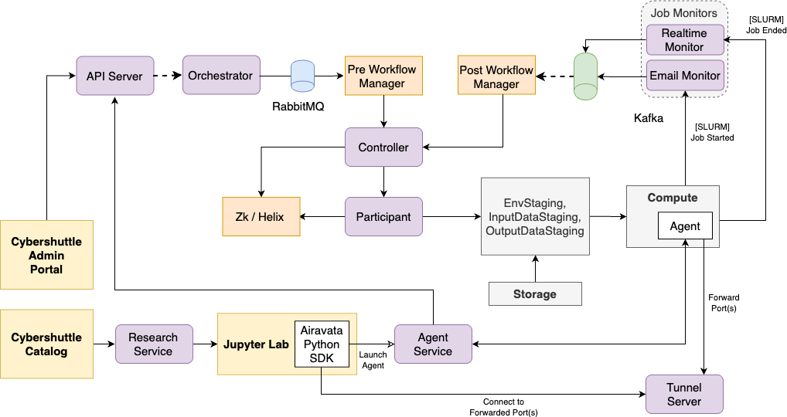
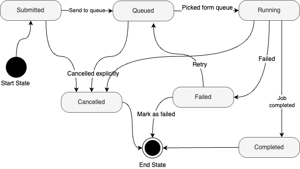
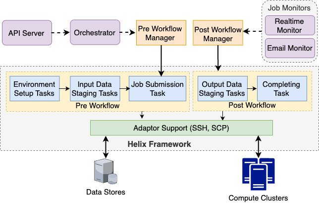

# Apache Airavata


[](https://github.com/apache/airavata/actions/workflows/maven-build.yml)
[](https://opensource.org/licenses/Apache-2.0)
[](https://github.com/apache/airavata/graphs/contributors)

Apache Airavata is a software framework for executing and managing computational jobs on distributed computing resources including local clusters, supercomputers, national grids, academic and commercial clouds. Airavata builds on general concepts of service oriented computing, distributed messaging, and workflow composition and orchestration. Airavata bundles a server package with an API, client software development Kits and a general purpose reference UI implementation.

## Key Features

- 🔧 Service-oriented architecture with distributed messaging
- 🔄 Fully-managed task lifecycle (environment setup, data staging, execution, and output retrieval)
- ☁️ Multi-cloud and hybrid cloud support
- 🖥️ Comprehensive API and SDK ecosystem
- 🌐 [Reference UI Implementations](https://github.com/apache/airavata-portals)

## Using Airavata

If you’re a researcher, Airavata offers several ways to streamline your workflows:

1. Submit Batch Jobs via the **Airavata Application Portal** -- [Example](https://admin.cybershuttle.org)
2. Launch Interactive Experiments through the **Airavata Research Portal** -- [Example](https://cybershuttle.org)
3. Explore and run published experiments from the **Airavata Research Catalog** -- [Example](https://cybershuttle.org/resources?resourceTypes=REPOSITORY)
4. Run interactive computational jobs directly from your IDE using **Airavata Python SDK** -- [PyPI](https://pypi.org/project/airavata-python-sdk/)


## 🧱 The Airavata Ecosystem

Apache Airavata is composed of modular components spanning core services, data management, user interfaces, and developer tooling.

### 🔧 Core Services
- [`airavata`](https://github.com/apache/airavata) – Main resource management and task orchestration middleware
- [`airavata-custos`](https://github.com/apache/airavata-custos) – Identity and access management framework
- [`airavata-mft`](https://github.com/apache/airavata-mft) – Managed file transfer services
- [`airavata-portals`](https://github.com/apache/airavata-portals) – All frontends for airavata

### 📦 Data & Metadata Services
- [`airavata-data-lake`](https://github.com/apache/airavata-data-lake) – Data lake and storage backend
- [`airavata-data-catalog`](https://github.com/apache/airavata-data-catalog) – Metadata and search services

### 📚 Documentation & Branding
- [`airavata-docs`](https://github.com/apache/airavata-docs) – Developer documentation
- [`airavata-user-docs`](https://github.com/apache/airavata-user-docs) – End-user guides
- [`airavata-admin-user-docs`](https://github.com/apache/airavata-admin-user-docs) – Admin-focused documentation
- [`airavata-custos-docs`](https://github.com/apache/airavata-custos-docs) – Custos documentation
- [`airavata-site`](https://github.com/apache/airavata-site) – Project website

### 🧪 Experimental & Research
- [`airavata-sandbox`](https://github.com/apache/airavata-sandbox) – Prototypes and early-stage work
- [`airavata-labs`](https://github.com/apache/airavata-labs) – Experimental projects
- [`airavata-jupyter-kernel`](https://github.com/apache/airavata-jupyter-kernel) – Jupyter integration
- [`airavata-cerebrum`](https://github.com/apache/airavata-cerebrum) – Airavata for Neuroscience


## 🔄 How Airavata Works

Airavata is composed as 4 top-level services that work together to facilitate the full lifecycle of computational jobs.



### 1. Airavata API Server `(apache-airavata-api-server)`

The Airavata API Server bootstraps the services needed to run/monitor computational jobs, access/share results of computational runs, and manage fine-grained access to computational resources.


#### Orchestrator
> Class Name: `org.apache.airavata.server.ServerMain`
> Command: `bin/orchestrator.sh`

The Orchestrator spins up 7 servers (of type `org.apache.airavata.common.utils.IServer`) for external clients to run computational jobs from.

- **API** - public-facing API consumed by Airavata SDKs and dashboards. It bridges external clients and internal services, and is served over Thrift.
  (`org.apache.airavata.api.server.AiravataAPIServer`)
- **DB Event Manager** - Monitors task execution events (launch, transitions, completion/failure) and syncs them to the Airavata DB via pub/sub hooks.
  (`org.apache.airavata.db.event.manager.DBEventManagerRunner`)
- **Registry** - Manages metadata and definitions for executable tasks and applications.
  (`org.apache.airavata.registry.api.service.RegistryAPIServer`)
- **Credential Store** - Manages secure storage and retrieval of credentials for accessing registered compute resources.
  (`org.apache.airavata.credential.store.server.CredentialStoreServer`)
- **Sharing Registry** - Handles sharing and permissioning of Airavata resources between users and groups.
  (`org.apache.airavata.sharing.registry.server.SharingRegistryServer`)
- **Orchestrator** - Constructs workflow DAGs, assigns unique IDs to tasks, and hands them off to the workflow manager.
  (`org.apache.airavata.orchestrator.server.OrchestratorServer`)
- **Profile** - Manages users, tenants, compute resources, and group profiles.
  (`org.apache.airavata.service.profile.server.ProfileServiceServer`)

#### Controller
> Class Name: `org.apache.airavata.helix.impl.controller.HelixController`
> Command: `bin/controller.sh`

The Controller manages the step-by-step transition of task state on *helix-side*. It uses Apache Helix to track step start, completion, and failure paths, ensuring the next step starts upon successful completion or retrying the current step on failure.



#### Participant
> Class Name: `org.apache.airavata.helix.impl.participant.GlobalParticipant`
> Command: `bin/participant.sh`

The participant synchronizes the *helix-side* state transition of a task with its concrete execution at *airavata-side*. The currently registered steps are: `EnvSetupTask`, `InputDataStagingTask`, `OutputDataStagingTask`, `JobVerificationTask`, `CompletingTask`, `ForkJobSubmissionTask`, `DefaultJobSubmissionTask`, `LocalJobSubmissionTask`, `ArchiveTask`, `WorkflowCancellationTask`, `RemoteJobCancellationTask`, `CancelCompletingTask`, `DataParsingTask`, `ParsingTriggeringTask`, and `MockTask`.

#### Email Monitor
> Class Name: `org.apache.airavata.monitor.email.EmailBasedMonitor`
> Command: `bin/email-monitor.sh`

The email monitor periodically checks an email inbox for job status updates sent via email. If it reads a new email with a job status update, it relays that state-change to the internal MQ (KafkaProducer).

#### Realtime Monitor
> Class Name: `org.apache.airavata.monitor.realtime.RealtimeMonitor`
> Command: `bin/realtime-monitor.sh`

The realtime monitor listens to incoming state-change messages on the internal MQ (KafkaConsumer), and relays that state-change to the internal MQ (KafkaProducer). When a task is completed at the compute resource, the realtime monitor is notified of this.

#### Pre Workflow Manager
> Class Name: `org.apache.airavata.helix.impl.workflow.PreWorkflowManager`
> Command: `bin/pre-wm.sh`

The pre-workflow manager listens on the internal MQ (KafkaConsumer) to inbound tasks at **pre-execution** phase. When a task DAG is received, it handles the environment setup and data staging phases of the DAG in a robust manner, which includes fault-handling. All these happen BEFORE the task DAG is submitted to the controller, and subsequently to the participant.

#### Post Workflow Manager
> Class Name: `org.apache.airavata.helix.impl.workflow.PostWorkflowManager`
> Command: `bin/post-wm.sh`

The post-workflow listens on the internal MQ (KafkaConsumer) to inbound tasks at **post-execution** phase. Once a task is received, it handles the cleanup and output fetching phases of the task DAG in a robust manner, which includes fault-handling. Once the main task completes executing, this is announced to the realtime monitor, upon which the post-workflow phase is triggered. Once triggered, it submits this state change to the controller.




### 2. Airavata File Server `(apache-airavata-file-server)`
> Class Name: `org.apache.airavata.file.server.FileServerApplication`
> Command: `bin/

The Airavata File Server is a lightweight SFTP wrapper running on storage nodes integrated with Airavata. It lets users securely access storage via SFTP, using Airavata authentication tokens as ephemeral passwords.


### 3. Airavata Agent Service `(apache-airavata-agent-service)` [NEW]
> Class Name: `org.apache.airavata.agent.connection.service.AgentServiceApplication`

The Airavata Agent Service is the backend for launching **interactive** jobs using Airavata.
It provide constructs to launch a custom "Agent" on a compute resource, that connects back to the Agent Service through a bi-directional gRPC channel.
The Airavata Python SDK primarily utilizes the Agent Service (gRPC) and the Airavata API (Thrift) to submit and execute interactive jobs, spawn subprocesses, and create network tunnels to subprocesses, even if they are behind NAT.


### 4. Airavata Research Service `(apache-airavata-research-service)` [NEW]
> Class Name: `org.apache.airavata.research.service.ResearchServiceApplication`

The Airavata Research Service is the backend for the **research catalog** in Airavata. It provides the API to add, list, modify, and publish notebooks, repositories, datasets, and computational models in cybershuttle, and launch interactive remote sessions to utilize them in a research setting.


## 🏗️ Getting Started


### Option 1 - Build from Source

Before setting up Apache Airavata, ensure that you have:

| Requirement | Version | Check Using |
|-------------|---------|-------|
| **Java SDK** | 17+ | `java --version` |
| **Apache Maven** | 3.8+ | `mvn -v` |
| **Git** | Latest | `git -v` |

First, clone the project repository from GitHub.
```bash
git clone https://github.com/apache/airavata.git
cd airavata
```

Next, build the project using Maven.
```bash
# with tests (slower, but safer)
mvn clean install
# OR without tests (faster)
mvn clean install -DskipTests
```

Once the project is built, four `tar.gz` bundles will be generated in the `./distributions` folder.
```bash
├── apache-airavata-agent-service-0.21-SNAPSHOT.tar.gz
├── apache-airavata-api-server-0.21-SNAPSHOT.tar.gz
├── apache-airavata-file-server-0.21-SNAPSHOT.tar.gz
└── apache-airavata-research-service-0.21-SNAPSHOT.tar.gz

1 directory, 4 files
```

Next, copy the deployment scripts and configurations into the `./distributions` folder.

```bash
cp -r dev-tools/deployment-scripts/ distribution
cp -r vault/ distribution/vault

tree ./distribution
distribution
├── apache-airavata-agent-service-0.21-SNAPSHOT.tar.gz
├── apache-airavata-api-server-0.21-SNAPSHOT.tar.gz
├── apache-airavata-file-server-0.21-SNAPSHOT.tar.gz
├── apache-airavata-research-service-0.21-SNAPSHOT.tar.gz
├── distribution_backup.sh
├── distribution_update.sh
├── services_down.sh
├── services_up.sh
└── vault
    ├── airavata-server.properties
    ├── airavata.sym.p12
    ├── application-agent-service.yml
    ├── application-research-service.yml
    ├── email-config.yml
    └── log4j2.xml

2 directories, 16 files
```

**What's in the vault?**

* `airavata.sym.p12` - contains the symmetric key used to secure stored credentials.
* `airavata-server.properties` - config file for the airavata api server.
* `application-agent-service.yml` - config file for the airavata agent service.
* `application-file-server.yml` - config file for the airavata file server.
* `application-research-service.yml` - config file for the airavata research service.
* `application-restproxy.properties` - config file for the airavata rest proxy.
* `email-config.yml` - contains the email addresses observed by the email monitor.
* `log4j2.xml` - contains the Log4j configuration for all airavata services.

Next, start the services using the deployment scripts.

```bash
cd distribution
./distribution_update.sh
./services_up.sh
```

Voila, you are now running Airavata! You can now tail the server logs using `multitail` (all logs) or `tail` (specific logs).

```bash
multitail apache-airavata-*/logs/*.log

```

### 🐳 Option 2 - Run with Docker (Experimental)

> ⚠️ **Note:** Docker deployment is experimental and not recommended for production use.

Before setting up Apache Airavata, ensure that you have:

| Requirement | Version | Check Using |
|-------------|---------|-------|
| **Java SDK** | 17+ | `java --version` |
| **Apache Maven** | 3.8+ | `mvn -v` |
| **Git** | Latest | `git -v` |
| **Docker Engine** | 20.10+ | `docker -v` |
| **Docker Compose** | 2.0+ | `docker compose version` |

In your `/etc/hosts`, point `airavata.host` to `127.0.0.1`:
```
127.0.0.1    airavata.host
```

First, clone the project repository from GitHub.
```bash
git clone https://github.com/apache/airavata.git
cd airavata
```

Next, build the project distribution using Maven.

```bash
# with tests (slower, but safer)
mvn clean install
# OR without tests (faster)
mvn clean install -DskipTests
```

Next, build the containers and start them through compose.

```bash

# build the containers
mvn docker:build -pl modules/distribution

# start containers via compose
docker-compose \
  -f modules/distribution/src/main/docker/docker-compose.yml \
  up -d

# check whether services are running
docker-compose ps
```

**Service Endpoints:**
- **API Server:** `airavata.host:8960`
- **Profile Service:** `airavata.host:8962`
- **Keycloak:** `airavata.host:8443`

**Stop Services:**
```bash
docker-compose \
  -f modules/ide-integration/src/main/containers/docker-compose.yml \
  -f modules/distribution/src/main/docker/docker-compose.yml \
  down
```


## 🤝 Contributing

We welcome contributions from the community! Here's how you can help:

1. **🍴 Fork the repository**
2. **🌿 Create a feature branch**
3. **✨ Make your changes**
4. **🧪 Add tests if applicable**
5. **📝 Submit a pull request**

**Learn More:**
- [Contributing Guidelines](http://airavata.apache.org/get-involved.html)
- [Code of Conduct](https://www.apache.org/foundation/policies/conduct.html)
- [Developer Resources](https://cwiki.apache.org/confluence/display/AIRAVATA)

### Setting up your IDE

The easiest way to setup a development environment is to follow the instructions in the [ide-integration README](./modules/ide-integration/README.md).Those instructions will guide you on setting up a development environment with IntelliJ IDEA.

### Additional Tools

* `org.apache.airavata.sharing.registry.migrator.airavata.AiravataDataMigrator`
* `modules/deployment-scripts`
* `modules/load-client`


## 💬 Community & Support

**Get Help:**
- 📧 **User Mailing List:** [users@airavata.apache.org](mailto:users@airavata.apache.org)
- 👨‍💻 **Developer Mailing List:** [dev@airavata.apache.org](mailto:dev@airavata.apache.org)
- 🔗 **All Mailing Lists:** [airavata.apache.org/mailing-list](https://airavata.apache.org/mailing-list.html)

## 📄 License

```
Licensed to the Apache Software Foundation (ASF) under one or more contributor
license agreements. See the NOTICE file distributed with this work for
additional information regarding copyright ownership.

The ASF licenses this file to you under the Apache License, Version 2.0 (the
"License"); you may not use this file except in compliance with the License.
You may obtain a copy of the License at:

    http://www.apache.org/licenses/LICENSE-2.0

Unless required by applicable law or agreed to in writing, software distributed
under the License is distributed on an "AS IS" BASIS, WITHOUT WARRANTIES OR
CONDITIONS OF ANY KIND, either express or implied. See the License for the
specific language governing permissions and limitations under the License.
```

See the [LICENSE](LICENSE) file for complete license details.

---

<div align="center">
  <strong>Made with ❤️ by the Apache Airavata Community</strong>
</div>
