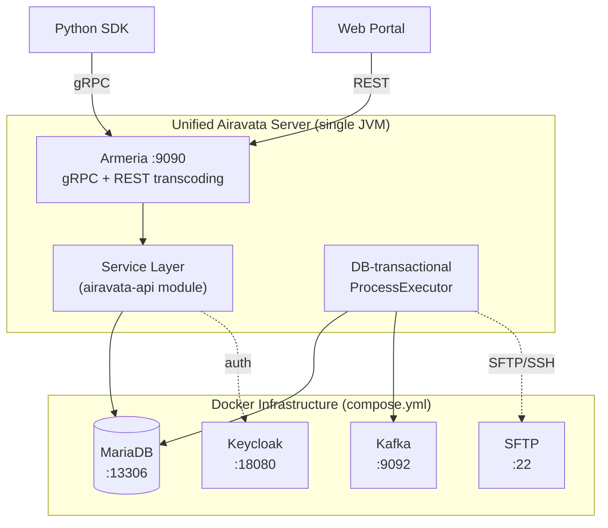
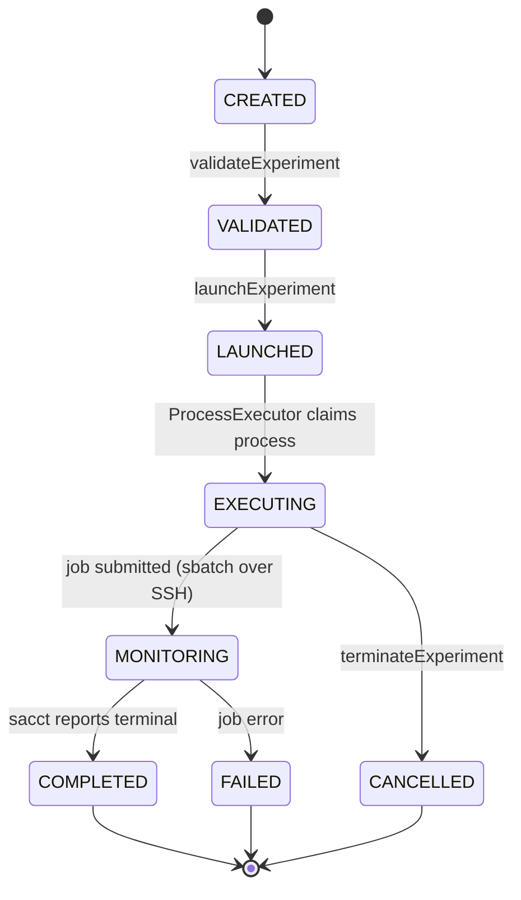
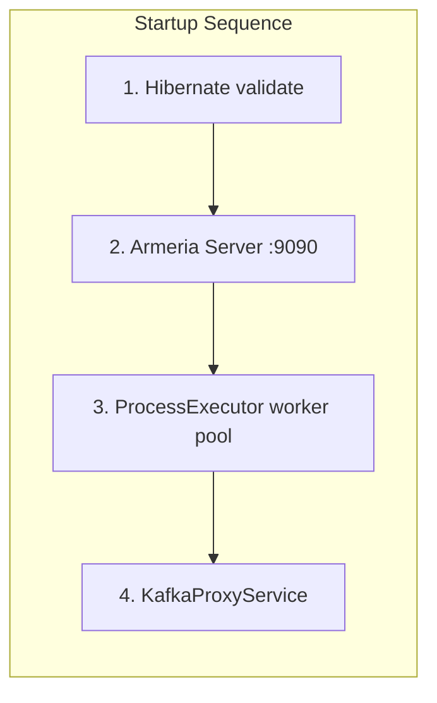

# Apache Airavata


[](https://github.com/apache/airavata/actions/workflows/maven-build.yml)
[](https://opensource.org/licenses/Apache-2.0)
[](https://github.com/apache/airavata/graphs/contributors)

Apache Airavata is a software framework for executing and managing computational jobs on distributed computing resources including local clusters, supercomputers, national grids, academic and commercial clouds. Airavata builds on general concepts of service oriented computing, distributed messaging, and workflow composition and orchestration. Airavata bundles a server package with an API, client software development Kits and a general purpose reference UI implementation.

## Key Features

- 🔧 Service-oriented architecture with distributed messaging
- 🔄 Fully-managed task lifecycle (environment setup, data staging, execution, and output retrieval)
- ☁️ Multi-cloud and hybrid cloud support
- 🖥️ Comprehensive API and SDK ecosystem
- 🌐 [Reference UI Implementations](https://github.com/apache/airavata-portals)

## Using Airavata

If you’re a researcher, Airavata offers several ways to streamline your workflows:

1. Submit Batch Jobs via the **Airavata Application Portal** -- [Example](https://admin.cybershuttle.org)
2. Launch Interactive Experiments through the **Airavata Research Portal** -- [Example](https://cybershuttle.org)
3. Explore and run published experiments from the **Airavata Research Catalog** -- [Example](https://cybershuttle.org/resources?resourceTypes=REPOSITORY)
4. Run interactive computational jobs directly from your IDE using **Airavata Python SDK** -- [PyPI](https://pypi.org/project/airavata-python-sdk/)


## 🧱 The Airavata Ecosystem

Apache Airavata is composed of modular components spanning core services, data management, user interfaces, and developer tooling.

### 🔧 Core Services
- [`airavata`](https://github.com/apache/airavata) – Main resource management and task orchestration middleware
- [`airavata-custos`](https://github.com/apache/airavata-custos) – Identity and access management framework
- [`airavata-mft`](https://github.com/apache/airavata-mft) – Managed file transfer services
- [`airavata-portals`](https://github.com/apache/airavata-portals) – All frontends for airavata

### 📦 Data & Metadata Services
- [`airavata-data-lake`](https://github.com/apache/airavata-data-lake) – Data lake and storage backend
- [`airavata-data-catalog`](https://github.com/apache/airavata-data-catalog) – Metadata and search services

### 📚 Documentation & Branding
- [`airavata-docs`](https://github.com/apache/airavata-docs) – Developer documentation
- [`airavata-user-docs`](https://github.com/apache/airavata-user-docs) – End-user guides
- [`airavata-admin-user-docs`](https://github.com/apache/airavata-admin-user-docs) – Admin-focused documentation
- [`airavata-custos-docs`](https://github.com/apache/airavata-custos-docs) – Custos documentation
- [`airavata-site`](https://github.com/apache/airavata-site) – Project website

### 🧪 Experimental & Research
- [`airavata-sandbox`](https://github.com/apache/airavata-sandbox) – Prototypes and early-stage work
- [`airavata-labs`](https://github.com/apache/airavata-labs) – Experimental projects
- [`airavata-jupyter-kernel`](https://github.com/apache/airavata-jupyter-kernel) – Jupyter integration
- [`airavata-cerebrum`](https://github.com/apache/airavata-cerebrum) – Airavata for Neuroscience


## 🔄 How Airavata Works

Airavata runs as a **single unified JVM** (Spring Boot + Armeria) that serves gRPC and REST (HTTP/JSON transcoding) on a single port, plus background workers.


```mermaid
graph TB
    subgraph "Docker Infrastructure (compose.yml)"
        DB[(MariaDB<br/>:13306)]
        KFK[Kafka<br/>:9092]
        KC[Keycloak<br/>:18080]
        SFTP[SFTP<br/>:22]
    end

    subgraph "Unified Airavata Server (single JVM)"
        direction TB
        ARMERIA["Armeria :9090<br/>gRPC + REST transcoding"]
        SVC["Service Layer<br/>(airavata-api module)"]
        BG["DB-transactional<br/>ProcessExecutor"]
    end

    SDK[Python SDK] -->|gRPC| ARMERIA
    Portal[Web Portal] -->|REST| ARMERIA
    ARMERIA --> SVC
    SVC --> DB
    BG --> DB
    BG --> KFK
    BG -.->|SFTP/SSH| SFTP
    SVC -.->|auth| KC
```

### 1. Unified Airavata Server `(airavata-server)`
> Entry point: `org.apache.airavata.server.AiravataServerMain`
> Started via: `tilt up` or `java -jar airavata-server/target/airavata-server-0.21-SNAPSHOT.jar`

The unified server hosts gRPC and REST (via Armeria HTTP/JSON transcoding) on a single port, Spring Boot services (Research, Agent, File Server), and background workers in a single JVM. On startup it:

1. Validates the `airavata` schema with Hibernate `ddl-auto=validate` (the schema is built and the tenant seeded **outside the JVM** before startup — see [Quick Start](#quick-start-tilt))
2. Starts Armeria server on port **9090** (gRPC + REST transcoding + DocService at `/docs`)
3. Starts the DB-transactional `ProcessExecutor` worker pool

#### Architecture: Service Layer + gRPC Transport

All business logic lives in a transport-agnostic **service layer** (`org.apache.airavata.service.*`). gRPC service implementations delegate to services. Proto definitions with `google.api.http` annotations provide automatic REST transcoding via Armeria.

| Service | Responsibility |
|---|---|
| `ExperimentService` | Experiment lifecycle (create, launch, clone, terminate, intermediate outputs) |
| `ProjectService` | Project CRUD and search |
| `GatewayService` | Gateway management and sharing domain setup |
| `ApplicationCatalogService` | App modules, deployments, and interfaces |
| `ResourceService` | Compute/storage resources, job submission, data movement, storage info |
| `CredentialService` | SSH/password credential management with sharing |
| `ResourceSharingService` | Resource sharing and access control |
| `GroupResourceProfileService` | Group resource profiles and policies |
| `GatewayResourceProfileService` | Gateway resource preferences |
| `UserResourceProfileService` | User resource preferences |
| `SSHAccountService` | SSH account provisioning and validation |
| `DataProductService` | Data products and replicas |
| `NotificationService` | Notification CRUD |
| `ParserService` | Parsers and parsing templates |

Shared utilities: `SharingHelper` (sharing operations), `RequestContext` (transport-agnostic identity).

#### Background Services (Spring lifecycle, same JVM)

| Service | Responsibility |
|---|---|
| `ProcessExecutor` | Orchestration engine — a `SmartLifecycle` worker pool that claims ready work with `SELECT … FOR UPDATE SKIP LOCKED` and walks each experiment's `PROCESS → TASK` DAG (env setup → data staging → job submission → monitoring) to completion |
| `DbLaunchOrchestrator` | Materializes the `PROCESS`/`TASK` DAG for an experiment at launch and advances its status |
| `KafkaProxyService` | Bridges the remote-agent path over Kafka (KRaft mode) |

The DB (`PROCESS`/`TASK`/`EXEC_STATUS`) is the transactional source of truth — exactly-once task claiming across threads and JVM restarts, with no Helix/ZooKeeper/Curator/RabbitMQ on the run path.


```mermaid
stateDiagram-v2
    [*] --> CREATED
    CREATED --> VALIDATED : validateExperiment
    VALIDATED --> LAUNCHED : launchExperiment
    LAUNCHED --> EXECUTING : ProcessExecutor claims process
    EXECUTING --> MONITORING : job submitted (sbatch over SSH)
    MONITORING --> COMPLETED : sacct reports terminal
    MONITORING --> FAILED : job error
    EXECUTING --> CANCELLED : terminateExperiment
    COMPLETED --> [*]
    FAILED --> [*]
    CANCELLED --> [*]
```


```mermaid
graph LR
    subgraph "Startup Sequence"
        direction TB
        A[1. Hibernate validate] --> B[2. Armeria Server :9090]
        B --> C[3. ProcessExecutor worker pool]
        C --> D[4. KafkaProxyService]
    end
```


### Embedded Spring Boot Services

The following services are embedded in the unified server (not run separately):

| Service | Module | Purpose |
|---------|--------|---------|
| **Agent Service** | `airavata-api/agent-service` | Agent sidecar lifecycle, bidirectional gRPC for interactive jobs |
| **Research Service** | `airavata-api/research-service` | Research catalog, application catalog, data products, output parsing |

Additional service modules in `airavata-api/`:

| Module | Purpose |
|--------|---------|
| `compute-service` | HPC resource catalog, resource profiles, resource scheduling |
| `storage-service` | Storage resources, data movement interfaces and protocols |
| `credential-service` | SSH keys, passwords, credential store |
| `iam-service` | Identity, access management, gateways, user profiles |
| `sharing-service` | Permissions, groups, tags, resource discovery |
| `orchestration-service` | Process/task/job execution, workflow orchestration |


## 🏗️ Getting Started

### Prerequisites

| Requirement | Version | Check Using |
|-------------|---------|-------|
| **Java SDK** | 17+ | `java --version` |
| **Apache Maven** | 3.8+ | `mvn -v` |
| **Docker Engine** | 20.10+ | `docker -v` |
| **Docker Compose** | 2.0+ | `docker compose version` |
| **Tilt** | 0.33+ | `tilt version` |

### Quick Start (Tilt)

Tilt orchestrates the full development stack — infrastructure, build, and all services — and seeds a ready-to-run tenant. A fresh clone works end to end with no manual setup:

```bash
git clone https://github.com/apache/airavata.git
cd airavata
tilt up
```

`tilt up` brings up (via `compose.yml`):
- **Infrastructure**: MariaDB, Keycloak (realm auto-imported), an SFTP storage server, and a self-contained docker-SLURM cluster
- **Unified Airavata Server**: gRPC + REST on port 9090, API docs at `/docs`

The dev tenant is **seeded outside the JVM, before the server starts**. On a fresh database volume the `db` container runs its `/docker-entrypoint-initdb.d` scripts — `db/migration/airavata/V1__Baseline_schema.sql` (the schema baseline) followed by `conf/db/seed.sql` (the tenant) — and only then does the server boot and validate that schema (`ddl-auto=validate`; it never mutates the database). The seed provisions a **complete, ready-to-use tenant**: the default gateway + sharing groups, the SFTP storage resource + SSH credential, the SLURM compute resource + `normal` batch queue + group resource profile, the **Echo** application (module, interface, `/bin/echo` deployment), and a **Default Project** — all shared with the `default-admin` account so they appear in the portal out of the box. The dev SSH keypair (`conf/sftp/id_rsa[.pub]`) is a committed, fixed dev-only key that matches the seeded (keystore-encrypted) credential. The init runs once per fresh volume; `./devstack/devstack reset` (or wiping the `db_data` volume) re-runs it from scratch.

Open the Tilt UI at `http://localhost:10350` to watch all resources turn green.

### Run your first experiment (Echo)

The web portal runs from the sibling [`airavata-portals`](https://github.com/apache/airavata-portals) repo (`cd ../airavata-portals && tilt up --port 10351`). Once both stacks are green:

1. Open the portal at `https://gateway.airavata.host` and log in as **`default-admin`** / **`ade4#21242ftfd`**.
2. Create an experiment: choose the **Echo** application, the **Default Project**, and the **slurm** compute resource (queue `normal`). The `Input_to_Echo` field defaults to `Hello, Airavata!`.
3. Launch it. The experiment runs on the docker-SLURM cluster (env setup → `sbatch` over SSH → `sacct` monitoring → SFTP output staging) and reaches **COMPLETED**, with `Echo.stdout` containing the echoed input.

Every `tilt down` / `tilt up` reproduces this working state from scratch, so anyone who clones the repos can run Echo from the get-go.

### Manual Start

```bash
docker compose up -d                          # Infrastructure
mvn clean package -DskipTests -T4             # Build
java -jar airavata-server/target/airavata-server-0.21-SNAPSHOT.jar  # Start server
```

Or use the helper scripts:

```bash
./dev-tools/scripts/setup.sh    # Infrastructure + build
./dev-tools/scripts/start.sh    # Start server
```

### Health Monitoring

The Armeria server on port **9090** exposes:

| Endpoint | Method | Description |
|----------|--------|-------------|
| `/internal/actuator/health` | GET | Health check |
| `/docs` | GET | Armeria DocService (API documentation) |

### Configuration

The main configuration file is `airavata-server/src/main/resources/application.yml`. Key settings:

* `spring.datasource.url` — JDBC URL (default: `jdbc:mariadb://localhost:13306/airavata`)
* `armeria.server.port` — Armeria server port (default: `9090`)
* `airavata.security.openid-url` — Keycloak realm URL

### Integration Tests

```bash
mvn test -pl airavata-api -Dgroups=runtime
```

### Server Ports

| Transport | Port | Purpose |
|-----------|------|---------|
| Armeria | 9090 | gRPC + REST (HTTP/JSON transcoding), DocService at `/docs`, health at `/internal/actuator/health` |


## 🤝 Contributing

We welcome contributions from the community! Here's how you can help:

1. **🍴 Fork the repository**
2. **🌿 Create a feature branch**
3. **✨ Make your changes**
4. **🧪 Add tests if applicable**
5. **📝 Submit a pull request**

**Learn More:**
- [Contributing Guidelines](http://airavata.apache.org/get-involved.html)
- [Code of Conduct](https://www.apache.org/foundation/policies/conduct.html)
- [Developer Resources](https://cwiki.apache.org/confluence/display/AIRAVATA)

### Setting up your IDE

Use `tilt up` to start the full stack, then attach your IDE debugger. For remote debugging, add `-agentlib:jdwp=transport=dt_socket,server=y,suspend=n,address=5005` to the `serve_cmd` in the Tiltfile.


## 💬 Community & Support

**Get Help:**
- 📧 **User Mailing List:** [users@airavata.apache.org](mailto:users@airavata.apache.org)
- 👨‍💻 **Developer Mailing List:** [dev@airavata.apache.org](mailto:dev@airavata.apache.org)
- 🔗 **All Mailing Lists:** [airavata.apache.org/mailing-list](https://airavata.apache.org/mailing-list.html)

## 📄 License

```
Licensed to the Apache Software Foundation (ASF) under one or more contributor
license agreements. See the NOTICE file distributed with this work for
additional information regarding copyright ownership.

The ASF licenses this file to you under the Apache License, Version 2.0 (the
"License"); you may not use this file except in compliance with the License.
You may obtain a copy of the License at:

    http://www.apache.org/licenses/LICENSE-2.0

Unless required by applicable law or agreed to in writing, software distributed
under the License is distributed on an "AS IS" BASIS, WITHOUT WARRANTIES OR
CONDITIONS OF ANY KIND, either express or implied. See the License for the
specific language governing permissions and limitations under the License.
```

See the [LICENSE](LICENSE) file for complete license details.

---

<div align="center">
  <strong>Made with ❤️ by the Apache Airavata Community</strong>
</div>
