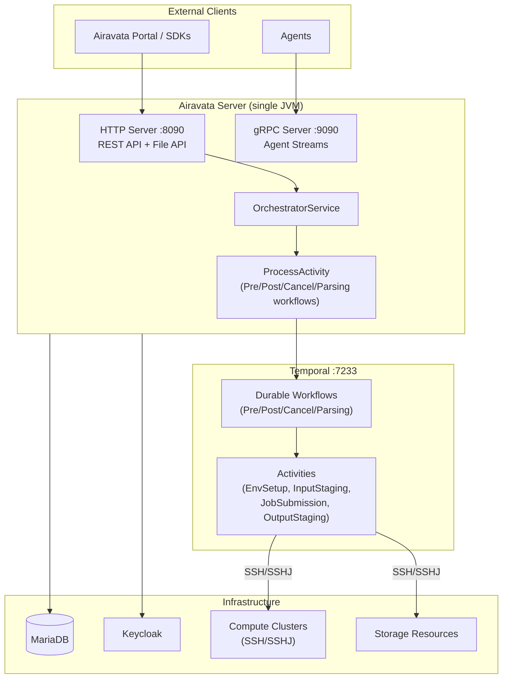
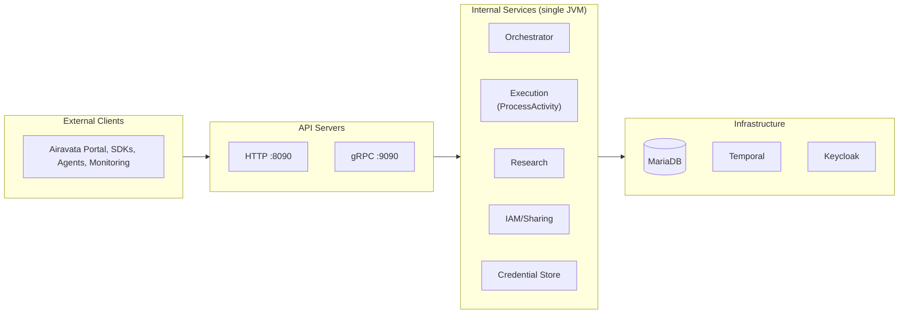
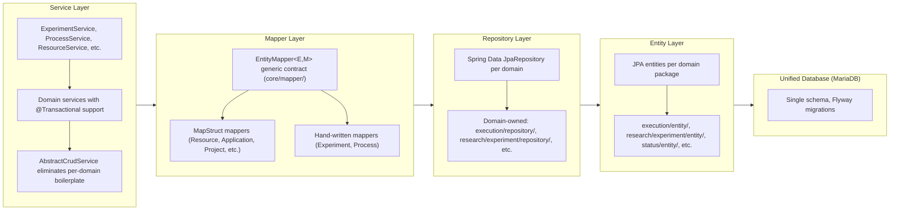

# Apache Airavata


[](https://github.com/apache/airavata/actions/workflows/maven-build.yml)
[](https://opensource.org/licenses/Apache-2.0)
[](https://github.com/apache/airavata/graphs/contributors)

Airavata runs and manages computational jobs and workflows on clusters, supercomputers, grids, and clouds. Submit jobs, monitor processes, automate workflows, transfer data, schedule tasks, and retrieve outputs. Use the Airavata Portal, the Python SDK, or REST and gRPC APIs.

## Key Features

- Services over distributed messaging
- Task lifecycle: setup env, stage data, run, retrieve output
- Multi-cloud and hybrid cloud
- REST and gRPC APIs; Python SDK
- [Airavata Portal](https://github.com/apache/airavata-portals) (Next.js)

## Using Airavata

- **Airavata Portal** — Submit and manage batch jobs, launch experiments, explore published runs (one Next.js app).
- **Airavata Python SDK** — Run experiments from your IDE; [PyPI](https://pypi.org/project/airavata-python-sdk/).

---

## Quick Start

### Prerequisites

| Requirement | Version | Verify |
|-------------|---------|--------|
| **Java JDK** | 25+ | `java --version` |
| **Apache Maven** | 3.8+ | `mvn -v` |
| **Git** | Latest | `git --version` |
| **Docker** | 20.10+ | `docker --version` |
| **Docker Compose** | 2.0+ | `docker compose version` |

Minimum 8GB RAM, 10GB disk. Unix (Linux/macOS) or Windows with WSL2.

**One-click:** [Dev Container](#dev-container) (Docker only; no local Java/Maven).

### Build and run

```bash
# Clone and enter repo
git clone https://github.com/apache/airavata.git
cd airavata/airavata-api

# Build (runs tests)
mvn clean install
# Skip tests:  mvn clean install -DskipTests
# Or:          ./scripts/build.sh

# Run (builds if needed, inits Docker+Keycloak+DB, starts server; first run ~5–10 min)
./scripts/run.sh
# Credentials: default-admin / admin123

# --- Airavata Portal (optional) ---
git clone https://github.com/apache/airavata-portals.git
cd airavata-portals
npm install
cp .env.example .env.local
# Edit .env.local: KEYCLOAK_CLIENT_SECRET (from ../.devcontainer/dev.env.defaults), API_URL, KEYCLOAK_ISSUER, NEXTAUTH_*
npm run dev

# --- Alternatives ---
# Manual init then start:
./scripts/init.sh [--clean] [--run]
./scripts/dev.sh serve
# Cold start / full reset (tear down, bring up stack, start):
./scripts/init.sh --clean --run
# Tear down only:
docker compose -f ../.devcontainer/compose.yml down -v
```

### Dev Container

VS Code/Cursor: "Reopen in Container." Run `./scripts/run.sh` inside.

### Troubleshooting

- **Database init failed:** Ensure `./scripts/dev.sh init` runs (check Flyway logs).
- **Keycloak login 400/409:** Run `./scripts/init.sh --clean` to reset.
- **Port in use:** See [Troubleshooting](#troubleshooting) below.

---

## Reference

### CLI commands

From `airavata-api/`:

```bash
./scripts/dev.sh <command> [options]   # dev mode (hot reload, optional --debug)
./scripts/jar.sh <command> [options]  # JAR mode (default command: serve)
```

Examples: `./scripts/dev.sh serve`, `./scripts/dev.sh --debug serve`, `./scripts/jar.sh serve`, `./scripts/dev.sh --help`.

Or from `airavata-api/modules/distribution`: `mvn exec:java -Dexec.args="<command> [options]"`, or `./scripts/dev.sh serve`.

When using the distribution bundle (tarball or fat JAR):

```bash
./bin/airavata.sh <command> [options]
# Or: java -Dairavata.home=... -Dairavata.config.dir=... -jar airavata-*.jar <command> [options]
```

### Main Commands

| Command | Description |
|---------|-------------|
| `--help` | Show help |
| `--version` | Show version |
| `init` | Initialize databases |
| `init --clean` | Drop and recreate all databases |
| `serve` | Start in foreground (default) |
| `serve -d` | Start in background (daemon) |
| `serve --dev` | Start in foreground with hot-reload (DevTools) |

### Management Commands

| Command | Description |
|---------|-------------|
| `account --help` | Manage accounts |
| `project --help` | Manage projects |
| `compute --help` | Manage compute resources |
| `storage --help` | Manage storage resources |
| `group --help` | Manage groups |
| `application --help` | Manage applications |
| `service status` | Check service status |
| `test run` | Run tests |

### Server ports

| Server | Port | Config property |
|--------|------|-----------------|
| HTTP (REST, File, Agent, Research API) | 8090 | `server.port` / `airavata.services.http.server.port` |
| gRPC (agent/research streams) | 9090 | `airavata.services.grpc.server.port` |
| Temporal (workflow engine) | 7233 | `spring.temporal.connection.target` |

---

## Architecture

All services run in one JVM (`AiravataServer`) and handle the full job lifecycle.


```mermaid
flowchart TB
    subgraph Clients["External Clients"]
        Portals["Airavata Portal / SDKs"]
        Agents["Agents"]
    end

    subgraph Server["Airavata Server (single JVM)"]
        HTTP["HTTP Server :8090<br/>REST API + File API"]
        gRPC["gRPC Server :9090<br/>Agent Streams"]
        Orch["OrchestratorService"]
        PA["ProcessActivity<br/>(Pre/Post/Cancel/Parsing workflows)"]
    end

    subgraph Temporal["Temporal :7233"]
        Workflows["Durable Workflows<br/>(Pre/Post/Cancel/Parsing)"]
        Activities["Activities<br/>(EnvSetup, InputStaging,<br/>JobSubmission, OutputStaging)"]
    end

    subgraph External["Infrastructure"]
        DB[(MariaDB)]
        KC[Keycloak]
        Compute["Compute Clusters<br/>(SSH/SSHJ)"]
        Storage["Storage Resources"]
    end

    Portals --> HTTP
    Agents --> gRPC
    HTTP --> Orch
    Orch --> PA
    PA --> Workflows
    Workflows --> Activities
    Activities -->|SSH/SSHJ| Compute
    Activities -->|SSH/SSHJ| Storage
    Server --> DB
    Server --> KC
```

### System overview


```mermaid
flowchart LR
    subgraph Clients["External Clients"]
        direction TB
        C["Airavata Portal, SDKs, Agents, Monitoring"]
    end

    subgraph Servers["API Servers"]
        direction TB
        HTTP["HTTP :8090"]
        gRPC["gRPC :9090"]
    end

    subgraph App["Internal Services (single JVM)"]
        direction LR
        O["Orchestrator"]
        Ex["Execution<br/>(ProcessActivity)"]
        Res["Research"]
        S["IAM/Sharing"]
        Cr["Credential Store"]
    end

    subgraph Infra["Infrastructure"]
        direction TB
        MariaDB[(MariaDB)]
        Temporal[Temporal]
        Keycloak[Keycloak]
    end

    Clients --> Servers
    Servers --> App
    App --> Infra
```

### API and workflows

- **HTTP (8090):** REST at `/api/v1/`, File API at `/api/v1/files/`, Agent at `/api/v1/agents/`, Research at `/api/v1/research/`.
- **gRPC (9090):** Bidirectional streaming for agents and research.
- **Temporal workflows:** ProcessActivity with PreWf, PostWf, CancelWf, ParsingWf (orchestration and activities via ProcessDAGEngine). In-process event delivery for status changes.
- **Internal:** Orchestrator, Execution Engine, Research Services, Credential Store, IAM/Sharing, Workflow Managers. Schema and entities: [docs/ERD.md](airavata-api/docs/ERD.md).

---

## Internal Code Architecture

The core API (`airavata-api/modules/airavata-api`) is layered.

### Package structure

Domain-first layout where each domain owns its entity, repository, mapper, service, and model:

```text
org.apache.airavata/
├── execution/             # Orchestration, scheduling, DAG execution, Temporal activities
│   ├── activity/          # Temporal workflows (Pre/Post/Cancel) and ActivitiesImpl
│   ├── orchestration/     # OrchestratorService, ProcessResourceResolver, ValidationService
│   ├── scheduling/        # ProcessScheduler, ScheduledTaskManager
│   ├── dag/               # ProcessDAGEngine, TaskNode, interceptors
│   ├── monitoring/        # JobStatusEventPublisher, email monitoring
│   ├── state/             # StateValidators, StateModel
│   ├── service/           # ProcessService interface + DefaultProcessService
│   ├── entity/            # ProcessEntity, ComputeSubmissionTrackingEntity
│   ├── repository/        # ProcessRepository
│   ├── mapper/            # ProcessMapper
│   ├── model/             # ProcessModel
│   ├── event/             # LocalStatusEvent
│   └── task/              # TaskContext
├── research/              # Research domain grouping
│   ├── experiment/        # Experiments: entity/repo/mapper/service/model/util
│   ├── application/       # App catalog: entity/repo/mapper/service/model/adapter
│   ├── artifact/          # Research artifacts: entity/repo/service/model/dto
│   ├── project/           # Research projects: entity/repo/service/dto
│   └── session/           # User sessions: entity/repo/service/model/dto
├── compute/               # Compute resources and job execution
│   ├── resource/          # Resource models/services/entities/repos + job submission infra
│   └── provider/          # Backend impls: slurm/, local/, aws/ (each has a ComputeProvider)
├── storage/               # Data staging
│   ├── resource/          # Storage models (enums, POJOs)
│   └── client/            # StorageClient interface + SftpStorageClient (sftp/)
├── status/                # Event and status management
│   ├── entity/            # EventEntity
│   ├── repository/        # StatusRepository
│   ├── mapper/            # StatusMapper
│   ├── service/           # StatusService
│   └── model/             # Status models
├── protocol/              # Transport adapters (SSH, streaming)
├── iam/                   # Keycloak, sharing, authorization
├── gateway/               # Multi-tenant gateway management
├── credential/            # Credential store
├── accounting/            # Allocation project accounting
├── workflow/              # Workflow DAG definitions (not execution)
├── core/                  # Cross-cutting: EntityMapper, CrudService, exceptions, utils
│   ├── mapper/            # EntityMapper<E,M> generic contract
│   ├── service/           # CrudService<M>, AbstractCrudService<E,M>
│   ├── exception/         # Common exceptions
│   ├── model/             # Shared model types
│   ├── util/              # IdGenerator, PaginationUtil
│   └── telemetry/         # Observability
└── config/                # Spring configuration
```

### Data layer

Domain-driven data layer where each package owns its entity, repository, mapper, and service:


```mermaid
flowchart LR
    subgraph Service["Service Layer"]
        direction TB
        S1["ExperimentService, ProcessService, ResourceService, etc."]
        S2["Domain services with @Transactional support"]
        S3["AbstractCrudService eliminates per-domain boilerplate"]
        S1 --> S2 --> S3
    end

    subgraph Mapper["Mapper Layer"]
        direction TB
        M1["EntityMapper&lt;E,M&gt; generic contract (core/mapper/)"]
        M2["MapStruct mappers (Resource, Application, Project, etc.)"]
        M3["Hand-written mappers (Experiment, Process)"]
        M1 --> M2 & M3
    end

    subgraph Repo["Repository Layer"]
        direction TB
        R1["Spring Data JpaRepository per domain"]
        R2["Domain-owned: execution/repository/, research/experiment/repository/, etc."]
        R1 --> R2
    end

    subgraph Entity["Entity Layer"]
        direction TB
        E1["JPA entities per domain package"]
        E2["execution/entity/, research/experiment/entity/, status/entity/, etc."]
        E1 --> E2
    end

    subgraph DB["Unified Database (MariaDB)"]
        D1["Single schema, Flyway migrations"]
    end

    Service --> Mapper --> Repo --> Entity --> DB
```

**Schema and services:** Each domain package owns its entities, repositories, mappers, and services (e.g. `research/experiment/entity/`, `execution/entity/`, `status/entity/`). Generic DRY infrastructure in `core/` (`EntityMapper`, `CrudService`, `AbstractCrudService`) eliminates boilerplate. MapStruct maps entities to domain models. Schema: [docs/ERD.md](airavata-api/docs/ERD.md).

---

## Configuration

- **Paths:** Home via `--home` or `AIRAVATA_HOME`; config via `--config-dir` or `AIRAVATA_CONFIG_DIR` (default `{home}/conf`); logs under home.
- **Files:** `application.properties` (or `airavata.properties`), `keystores/airavata.sym.p12`, `logback.xml` in config dir.
- **Agent tunnel (optional):** `airavata.services.agent.tunnelserver.host`, `.port`, `.url`, `.token` — remote tunnel server; Airavata does not start it.

---

## Deployment

Bundle layout:

```
airavata-0.21-SNAPSHOT/
├── bin/airavata.sh
├── lib/*.jar
├── conf/   (keystores, *.properties, *.yml, templates/)
├── logs/
├── LICENSE, NOTICE, RELEASE_NOTES
```

### Tarball or Fat JAR

**From tarball:**

```bash
cd distribution
tar -xzf airavata-0.21-SNAPSHOT.tar.gz
cd airavata-0.21-SNAPSHOT

# Copy configuration files into conf/
cp ../../conf/airavata.properties conf/
cp ../../conf/airavata.sym.p12 conf/keystores/
cp ../../conf/*.yml conf/
cp ../../conf/logback.xml conf/

# Start (default: AIRAVATA_HOME = parent of bin/, config = AIRAVATA_HOME/conf)
./bin/airavata.sh -d start      # daemon mode
./bin/airavata.sh               # foreground mode

# Or pass home and config dir as arguments
./bin/airavata.sh --home /opt/apache-airavata --config-dir /etc/airavata/conf -d start
./bin/airavata.sh --home /opt/apache-airavata --config-dir /etc/airavata/conf
```

**Fat JAR:** Put the JAR in a directory. Use `bin/airavata.sh` (sets `-Dairavata.home` and `-Dairavata.config.dir` from `--home`/`--config-dir` or env) or run Java directly:

```bash
# Script sets home/config for you
./bin/airavata.sh --home /path/to/install --config-dir /path/to/conf -d start

# Or run Java directly (set airavata.home and airavata.config.dir)
java -Dairavata.home=/path/to/install -Dairavata.config.dir=/path/to/conf -jar airavata-0.21-SNAPSHOT.jar serve
```

**Stop/Restart:** same script with `-d stop` / `-d restart` (use the same `--home`/`--config-dir` or env if you used them to start).

**Paths:** Home = install root (`--home` or `AIRAVATA_HOME`). Config dir = `application.properties`, `logback.xml`, etc. (`--config-dir` or `AIRAVATA_CONFIG_DIR`; default `{home}/conf`). Logs under home.

### Docker (experimental)

```bash
# Build the distribution first (from airavata-api/)
cd airavata-api && mvn clean install -DskipTests && cd ..

# Build Docker image from the distribution Dockerfile (from repo root)
docker build -t airavata:latest -f airavata-api/modules/distribution/src/main/docker/Dockerfile airavata-api/modules/distribution/target

# Run the container (configure environment variables for DB, Keycloak, Temporal)
docker run -p 8090:8090 -p 9090:9090 airavata:latest
```

### Ansible (production)

```bash
cd deployment/ansible

# Copy and customize inventory
cp -r inventories/template inventories/my-deployment
# Edit inventories/my-deployment/hosts and group_vars/all/vars.yml

# Deploy everything
ansible-playbook -i inventories/my-deployment deploy.yml

# Or deploy components individually using tags
ansible-playbook -i inventories/my-deployment deploy.yml --tags database
ansible-playbook -i inventories/my-deployment deploy.yml --tags temporal
ansible-playbook -i inventories/my-deployment deploy.yml --tags apiserver
ansible-playbook -i inventories/my-deployment deploy.yml --tags keycloak
```

See [deployment/ansible/README.md](deployment/ansible/README.md).

---

## Development

### IDE Setup

Import as Maven project. Java 25+, annotation processing on.

**VS Code:** [launch.json](airavata-api/.vscode/launch.json) (Serve, Serve Debug) and [tasks.json](airavata-api/.vscode/tasks.json) (Init, Build, Test). Run `./scripts/init.sh --clean` from `airavata-api/` before first Serve.

**IntelliJ:** Import as Maven project from `airavata-api/`. Create Run Configurations for Serve and Serve Debug.

### Running Tests

With DB, Keycloak, and Temporal up (for integration tests), run:

```bash
./scripts/init.sh                            # ensure db, Keycloak, Temporal up (no --clean)
mvn test -Dskip.slurm.tests=true            # all tests, skip SLURM if no cluster
```

Without pre-starting services (many tests use Testcontainers):

```bash
mvn test                                    # All tests
mvn test -pl modules/airavata-api            # Specific module (from airavata-api/)
mvn test -Dtest=SomeTestClass               # Specific test
```

**Test categories:**
- **Unit and repository:** Testcontainers (MariaDB). Many pass with `mvn test`; some fail in certain environments.
- **Workflow/state-machine:** Need Temporal. In CI without Temporal, tests can stay CREATED/SUBMITTED and fail; expected when workflow runtime is off.
- **SLURM:** Need Docker + SLURM Testcontainer (`csniper/slurm-lab`). Skip: `mvn test -Dskip.slurm.tests=true`. Enable all: `mvn test -P test`.
- **Credential store:** Need backend (e.g. Vault); may skip or fail if missing.
- Build without tests: `mvn clean install -DskipTests`.

### Schema migrations (contributors)

Schema: single Flyway baseline at `src/main/resources/conf/db/migration/airavata/V1__Baseline_schema.sql`. JPA via package scanning (no `persistence.xml`). To change schema: (1) Add or update the entity. (2) Add a versioned migration (e.g. `V2__Description.sql`) so DB matches entity; use `IF NOT EXISTS`/`IF EXISTS`. Drop column/table must be done manually. Tarball uses these Flyway scripts only.

**Simplifications:** Child tables merged into JSON (e.g. batch queues → `RESOURCE.capabilities`). TASK table removed (tasks are transient DAG nodes, not persisted). JOB table remains for HPC job tracking with FK to PROCESS. [docs/ERD.md](airavata-api/docs/ERD.md).

---

## Troubleshooting

### Port already in use

```bash
lsof -i :8090
kill -9 <PID>
```

### Database connection refused

From the repo root:

```bash
docker compose -f .devcontainer/compose.yml ps db
docker compose -f .devcontainer/compose.yml logs db
docker compose -f .devcontainer/compose.yml restart db
```

### Maven build failures

```bash
rm -rf ~/.m2/repository/org/apache/airavata
mvn clean install -DskipTests -U
```

### Out of memory

```bash
export MAVEN_OPTS="-Xmx4g -XX:MaxMetaspaceSize=512m"
mvn clean install -DskipTests
```

### Logs

- Dev: console. Bundle: `airavata-0.21-SNAPSHOT/logs/airavata.log`. Docker: `docker compose logs <service>`

---

## The Airavata Ecosystem

### Core
- [`airavata`](https://github.com/apache/airavata) – Orchestrate resources and tasks
- [`airavata-custos`](https://github.com/apache/airavata-custos) – IAM
- [`airavata-mft`](https://github.com/apache/airavata-mft) – File transfer
- [`airavata-portals`](https://github.com/apache/airavata-portals) – Airavata Portal (Next.js)

### Data
- [`airavata-data-lake`](https://github.com/apache/airavata-data-lake) – Data lake and storage
- [`airavata-data-catalog`](https://github.com/apache/airavata-data-catalog) – Metadata and search

### Docs
- [`airavata-docs`](https://github.com/apache/airavata-docs) – Developer docs
- [`airavata-user-docs`](https://github.com/apache/airavata-user-docs) – User guides
- [`airavata-site`](https://github.com/apache/airavata-site) – Project site

### Powered by Airavata

- [Cybershuttle](https://cybershuttle.org/) – Research computing platform
- [Bio-realistic multiscale simulations of cortical circuits](https://github.com/cyber-shuttle/allenai-v1)
- [Computational neuroscience models from brain atlases](https://github.com/cyber-shuttle/airavata-cerebrum)
- [Large-scale brain model simulations](https://github.com/cyber-shuttle/whole-brain-public)
- [Neural data analysis with torch_brain](https://github.com/cyber-shuttle/neurodata25_torchbrain_notebooks)
- [NAMD Workshop examples](https://github.com/cyber-shuttle/namd-workshop-2024)
- [OpenFold Attention Visualization](https://github.com/vizfold/attention-viz-demo)

See more projects at [cybershuttle.org/resources](https://cybershuttle.org/resources).

---

## Contributing

1. Fork the repo
2. Create a feature branch
3. Make your changes
4. Add tests if applicable
5. Submit a pull request

**Resources:**
- [Contributing Guidelines](http://airavata.apache.org/get-involved.html)
- [Code of Conduct](https://www.apache.org/foundation/policies/conduct.html)
- [Developer Wiki](https://cwiki.apache.org/confluence/display/AIRAVATA)

---

## Community & Support

- **User Mailing List:** [users@airavata.apache.org](mailto:users@airavata.apache.org)
- **Developer Mailing List:** [dev@airavata.apache.org](mailto:dev@airavata.apache.org)
- **All Mailing Lists:** [airavata.apache.org/mailing-list](https://airavata.apache.org/mailing-list.html)
- **GitHub Issues:** [github.com/apache/airavata/issues](https://github.com/apache/airavata/issues)

---

## License

```
Licensed to the Apache Software Foundation (ASF) under one or more contributor
license agreements. See the NOTICE file distributed with this work for
additional information regarding copyright ownership.

The ASF licenses this file to you under the Apache License, Version 2.0 (the
"License"); you may not use this file except in compliance with the License.
You may obtain a copy of the License at:

    http://www.apache.org/licenses/LICENSE-2.0

Unless required by applicable law or agreed to in writing, software distributed
under the License is distributed on an "AS IS" BASIS, WITHOUT WARRANTIES OR
CONDITIONS OF ANY KIND, either express or implied. See the License for the
specific language governing permissions and limitations under the License.
```

See [LICENSE](LICENSE).
