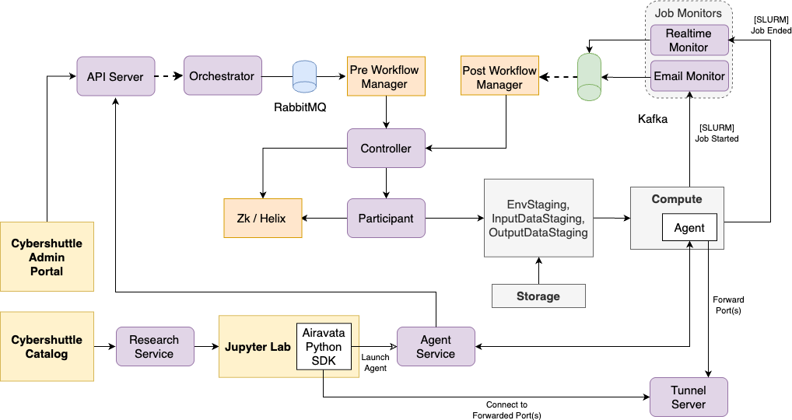
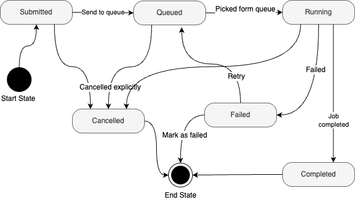
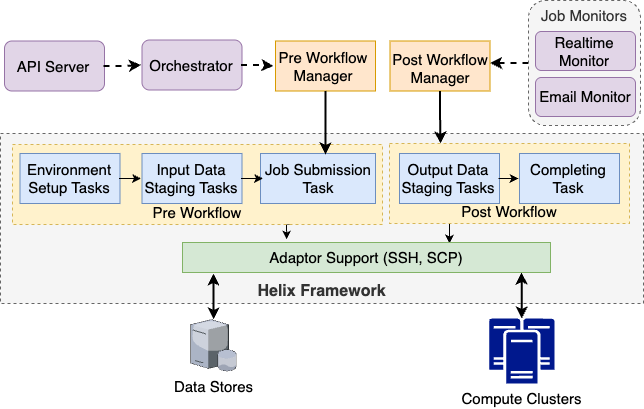

# Apache Airavata


[](https://github.com/apache/airavata/actions/workflows/maven-build.yml)
[](https://opensource.org/licenses/Apache-2.0)
[](https://github.com/apache/airavata/graphs/contributors)

Apache Airavata is a software framework for executing and managing computational jobs on distributed computing resources including local clusters, supercomputers, national grids, academic and commercial clouds. Airavata builds on general concepts of service oriented computing, distributed messaging, and workflow composition and orchestration. Airavata bundles a server package with an API, client software development Kits and a general purpose reference UI implementation.

## Key Features

- 🔧 Service-oriented architecture with distributed messaging
- 🔄 Fully-managed task lifecycle (environment setup, data staging, execution, and output retrieval)
- ☁️ Multi-cloud and hybrid cloud support
- 🖥️ Comprehensive API and SDK ecosystem
- 🌐 [Reference UI Implementations](https://github.com/apache/airavata-portals)

## Using Airavata

If you’re a researcher, Airavata offers several ways to streamline your workflows:

1. Submit Batch Jobs via the **Airavata Application Portal** -- [Example](https://admin.cybershuttle.org)
2. Launch Interactive Experiments through the **Airavata Research Portal** -- [Example](https://cybershuttle.org)
3. Explore and run published experiments from the **Airavata Research Catalog** -- [Example](https://cybershuttle.org/resources?resourceTypes=REPOSITORY)
4. Run interactive computational jobs directly from your IDE using **Airavata Python SDK** -- [PyPI](https://pypi.org/project/airavata-python-sdk/)


## 🧱 The Airavata Ecosystem

Apache Airavata is composed of modular components spanning core services, data management, user interfaces, and developer tooling.

### 🔧 Core Services
- [`airavata`](https://github.com/apache/airavata) – Main resource management and task orchestration middleware
- [`airavata-custos`](https://github.com/apache/airavata-custos) – Identity and access management framework
- [`airavata-mft`](https://github.com/apache/airavata-mft) – Managed file transfer services
- [`airavata-portals`](https://github.com/apache/airavata-portals) – All frontends for airavata

### 📦 Data & Metadata Services
- [`airavata-data-lake`](https://github.com/apache/airavata-data-lake) – Data lake and storage backend
- [`airavata-data-catalog`](https://github.com/apache/airavata-data-catalog) – Metadata and search services

### 📚 Documentation & Branding
- [`airavata-docs`](https://github.com/apache/airavata-docs) – Developer documentation
- [`airavata-user-docs`](https://github.com/apache/airavata-user-docs) – End-user guides
- [`airavata-admin-user-docs`](https://github.com/apache/airavata-admin-user-docs) – Admin-focused documentation
- [`airavata-custos-docs`](https://github.com/apache/airavata-custos-docs) – Custos documentation
- [`airavata-site`](https://github.com/apache/airavata-site) – Project website

### 🧪 Experimental & Research
- [`airavata-sandbox`](https://github.com/apache/airavata-sandbox) – Prototypes and early-stage work
- [`airavata-labs`](https://github.com/apache/airavata-labs) – Experimental projects
- [`airavata-jupyter-kernel`](https://github.com/apache/airavata-jupyter-kernel) – Jupyter integration
- [`airavata-cerebrum`](https://github.com/apache/airavata-cerebrum) – Airavata for Neuroscience


## 🔄 How Airavata Works

Airavata is composed as 5 top-level services that work together to facilitate the full lifecycle of computational jobs. All services run in a unified Spring Boot application (`AiravataServer`) within a single JVM process.



### Unified Distribution

Airavata provides a **unified distribution bundle** (`airavata`) that includes all services in a single Spring Boot application. The application can be run in two modes:

- **Thrift Mode** (default): Enables Thrift API Server along with all background services
- **REST Mode**: Enables REST Proxy instead of Thrift API, along with all background services

The unified bundle simplifies deployment by running all services in a single JVM process, managed by Spring Boot's lifecycle.

**Bundle Structure:**
```
airavata-0.21-SNAPSHOT/
├── bin/
│   └── airavata.sh                 # Startup script for AiravataServer
├── lib/
│   └── airavata-0.21-SNAPSHOT.jar  # Executable JAR (Spring Boot application)
├── conf/
│   ├── keystores/                  # Keystore files
│   ├── *.properties                # Config files from all services
│   ├── *.yml                       # Config files from services
│   ├── *.xml                       # Config files
│   └── templates/                  # Template files
├── logs/                           # Logs directory
├── INSTALL
├── LICENSE
├── NOTICE
├── RELEASE_NOTES
└── README.md
```

The unified application (`AiravataServer`) is a Spring Boot application that starts all services in a single JVM process:
- **Main Class**: `org.apache.airavata.AiravataServer`
- **All services** run as Spring components within the same application
- **Background services** (Controller, Participant, Workflow Managers, Monitors) are started automatically as daemon threads
- **Mode-dependent**: Thrift API or REST Proxy can be enabled via configuration properties

### 1. Airavata API Server

The Airavata API Server provides the core services needed to run/monitor computational jobs, access/share results of computational runs, and manage fine-grained access to computational resources.

#### Main Application
> Class Name: `org.apache.airavata.AiravataServer`
> Command: `bin/airavata.sh` (or `java -jar lib/airavata-*.jar`)

The `AiravataServer` is a Spring Boot application that starts all services in a single JVM process. It includes:

- **Thrift API Server** - Public-facing API consumed by Airavata SDKs and dashboards. Serves the Thrift API on port 8930 (configurable).
  (`org.apache.airavata.api.thrift.server.AiravataServiceServer`)
- **REST API Server** - Alternative RESTful API interface (can run in parallel with Thrift or replace it).
  (Spring Boot Web application)
- **Profile Service** - Manages users, tenants, compute resources, and group profiles. Served on port 8962 (configurable).
  (`org.apache.airavata.api.thrift.server.ProfileServiceServer`)
- **Registry Service** - Manages metadata and definitions for executable tasks and applications.
  (`org.apache.airavata.registry.api.service.RegistryAPIServer`)
- **Credential Store** - Manages secure storage and retrieval of credentials for accessing registered compute resources.
  (`org.apache.airavata.credential.server.CredentialStoreServer`)
- **Sharing Registry** - Handles sharing and permissioning of Airavata resources between users and groups.
  (`org.apache.airavata.sharing.registry.server.SharingRegistryServer`)
- **Orchestrator Service** - Constructs workflow DAGs, assigns unique IDs to tasks, and hands them off to the workflow manager.
  (`org.apache.airavata.orchestrator.server.OrchestratorServer`)
- **DB Event Manager** - Monitors task execution events (launch, transitions, completion/failure) and syncs them to the Airavata DB via pub/sub hooks.
  (`org.apache.airavata.db.event.manager.DBEventManagerRunner`)

#### Controller
> Class Name: `org.apache.airavata.helix.impl.controller.HelixController`
> Started: Automatically by Spring Boot via `BackgroundServicesLauncher`

The Controller manages the step-by-step transition of task state on *helix-side*. It uses Apache Helix to track step start, completion, and failure paths, ensuring the next step starts upon successful completion or retrying the current step on failure. The Controller is started automatically as a daemon thread when `AiravataServer` starts (enabled via `helix.controller.enabled=true` in configuration).



#### Participant
> Class Name: `org.apache.airavata.helix.impl.participant.GlobalParticipant`
> Started: Automatically by Spring Boot via `BackgroundServicesLauncher`

The participant synchronizes the *helix-side* state transition of a task with its concrete execution at *airavata-side*. The currently registered steps are: `EnvSetupTask`, `InputDataStagingTask`, `OutputDataStagingTask`, `JobVerificationTask`, `CompletingTask`, `ForkJobSubmissionTask`, `DefaultJobSubmissionTask`, `LocalJobSubmissionTask`, `ArchiveTask`, `WorkflowCancellationTask`, `RemoteJobCancellationTask`, `CancelCompletingTask`, `DataParsingTask`, `ParsingTriggeringTask`, and `MockTask`. The Participant is started automatically as a daemon thread when `AiravataServer` starts (enabled via `helix.participant.enabled=true` in configuration).

#### Email Monitor
> Class Name: `org.apache.airavata.monitor.email.EmailBasedMonitor`
> Started: Automatically by Spring Boot via `BackgroundServicesLauncher`

The email monitor periodically checks an email inbox for job status updates sent via email. If it reads a new email with a job status update, it relays that state-change to the internal MQ (KafkaProducer). The Email Monitor is started automatically as a daemon thread when `AiravataServer` starts (enabled via `services.monitor.email.monitorEnabled=true` in configuration).

#### Realtime Monitor
> Class Name: `org.apache.airavata.monitor.realtime.RealtimeMonitor`
> Started: Automatically by Spring Boot via `BackgroundServicesLauncher`

The realtime monitor listens to incoming state-change messages on the internal MQ (KafkaConsumer), and relays that state-change to the internal MQ (KafkaProducer). When a task is completed at the compute resource, the realtime monitor is notified of this. The Realtime Monitor is started automatically as a daemon thread when `AiravataServer` starts (enabled via `services.monitor.realtime.monitorEnabled=true` in configuration).

#### Pre Workflow Manager
> Class Name: `org.apache.airavata.helix.impl.workflow.PreWorkflowManager`
> Started: Automatically by Spring Boot via `BackgroundServicesLauncher`

The pre-workflow manager listens on the internal MQ (KafkaConsumer) to inbound tasks at **pre-execution** phase. When a task DAG is received, it handles the environment setup and data staging phases of the DAG in a robust manner, which includes fault-handling. All these happen BEFORE the task DAG is submitted to the controller, and subsequently to the participant. The Pre Workflow Manager is started automatically as a daemon thread when `AiravataServer` starts (enabled via `services.prewm.enabled=true` in configuration).

#### Post Workflow Manager
> Class Name: `org.apache.airavata.helix.impl.workflow.PostWorkflowManager`
> Started: Automatically by Spring Boot via `BackgroundServicesLauncher`

The post-workflow listens on the internal MQ (KafkaConsumer) to inbound tasks at **post-execution** phase. Once a task is received, it handles the cleanup and output fetching phases of the task DAG in a robust manner, which includes fault-handling. Once the main task completes executing, this is announced to the realtime monitor, upon which the post-workflow phase is triggered. Once triggered, it submits this state change to the controller. The Post Workflow Manager is started automatically as a daemon thread when `AiravataServer` starts (enabled via `services.postwm.enabled=true` in configuration).




### 2. Airavata File Server
> Class Name: `org.apache.airavata.file.server.FileServerApplication`
> Started: Automatically as a Spring component within `AiravataServer`

The Airavata File Server is a lightweight SFTP wrapper running on storage nodes integrated with Airavata. It lets users securely access storage via SFTP, using Airavata authentication tokens as ephemeral passwords. The File Server is started automatically as part of the unified `AiravataServer` application.


### 3. Airavata Agent Service
> Class Name: `org.apache.airavata.agent.connection.service.AgentServiceApplication`
> Started: Automatically as a Spring component within `AiravataServer`

The Airavata Agent Service is the backend for launching **interactive** jobs using Airavata. It provides constructs to launch a custom "Agent" on a compute resource, that connects back to the Agent Service through a bi-directional gRPC channel. The Airavata Python SDK primarily utilizes the Agent Service (gRPC) and the Airavata API (Thrift) to submit and execute interactive jobs, spawn subprocesses, and create network tunnels to subprocesses, even if they are behind NAT. The Agent Service is started automatically as part of the unified `AiravataServer` application.


### 4. Airavata Research Service
> Class Name: `org.apache.airavata.research.service.ResearchServiceApplication`
> Started: Automatically as a Spring component within `AiravataServer`

The Airavata Research Service is the backend for the **research catalog** in Airavata. It provides the API to add, list, modify, and publish notebooks, repositories, datasets, and computational models in cybershuttle, and launch interactive remote sessions to utilize them in a research setting. The Research Service is started automatically as part of the unified `AiravataServer` application.

### 5. Airavata REST Proxy
> Class Name: `org.apache.airavata.restapi.restapiApplication`
> Started: Automatically as a Spring Boot Web application within `AiravataServer` (when `services.rest.enabled=true`)

The Airavata REST Proxy provides a RESTful API interface to Airavata services. It acts as an alternative to the Thrift API, offering HTTP/JSON endpoints for clients that prefer REST over Thrift. The REST Proxy runs as part of the unified `AiravataServer` application and can be enabled alongside or instead of the Thrift API via configuration properties.


## 🏗️ Getting Started


### Option 1 - Build from Source

Before setting up Apache Airavata, ensure that you have:

| Requirement | Version | Check Using |
|-------------|---------|-------|
| **Java SDK** | 25+ | `java --version` |
| **Apache Maven** | 3.8+ | `mvn -v` |
| **Git** | Latest | `git -v` |

First, clone the project repository from GitHub.
```bash
git clone https://github.com/apache/airavata.git
cd airavata
```

Next, build the project using Maven.
```bash
# with tests (slower, but safer)
mvn clean install
# OR without tests (faster)
mvn clean install -DskipTests
```

Once the project is built, a unified bundle will be generated in the `./distribution` folder.
```bash
├── airavata-0.21-SNAPSHOT.tar.gz  # Unified bundle
└── airavata-0.21-SNAPSHOT-{arch}  # Native binary (when built with -Pnative)

1 directory, 2 files (1 tarball, 1 native binary)
```

**Recommended:** Use the unified bundle (`airavata`) for easier deployment and management.

### Option 1A - Using Unified Bundle (Recommended)

Extract the unified bundle and start all services with a single command:

```bash
# Extract the unified bundle
cd distribution
tar -xzf airavata-0.21-SNAPSHOT.tar.gz
cd airavata-0.21-SNAPSHOT

# Copy configuration files from vault to conf directory
cp ../../vault/airavata.properties conf/
cp ../../vault/airavata.sym.p12 conf/keystores/
cp ../../vault/application-agent-service.yml conf/
cp ../../vault/application-file-server.yml conf/
cp ../../vault/application-research-service.yml conf/
cp ../../vault/application-restapi.properties conf/
cp ../../vault/email-config.yml conf/
cp ../../vault/logback.xml conf/

# Start all services in Thrift mode (default)
./bin/airavata.sh -d start

# OR start in REST mode
./bin/airavata.sh -mode rest -d start

# Stop all services
./bin/airavata.sh -d stop

# Restart all services
./bin/airavata.sh -d restart

# Run in foreground (for debugging)
./bin/airavata.sh
```

**Modes:**
- **Thrift Mode** (`-mode thrift` or default): Enables Thrift API Server (`services.thrift.enabled=true`, `services.rest.enabled=false`)
- **REST Mode** (`-mode rest`): Enables REST Proxy (`services.rest.enabled=true`, `services.thrift.enabled=false`)

**Note:** Both Thrift and REST can be enabled simultaneously by setting both `services.thrift.enabled=true` and `services.rest.enabled=true` in `airavata.properties`.

**What's in the vault?**

* `airavata.sym.p12` - contains the symmetric key used to secure stored credentials.
* `airavata.properties` - config file for the airavata api server.
* `application-agent-service.yml` - config file for the airavata agent service.
* `application-file-server.yml` - config file for the airavata file server.
* `application-research-service.yml` - config file for the airavata research service.
* `application-restapi.properties` - config file for the airavata rest proxy.
* `email-config.yml` - contains the email addresses observed by the email monitor.
* `logback.xml` - contains the Logback configuration for all airavata services.

### Option 1B - Using Individual Service Distributions

> ⚠️ **Note:** Individual service distributions are not currently generated by the build. Only the unified bundle is produced. This section is kept for reference in case individual distributions are needed in the future.

If individual service distributions were available, you would deploy them as follows:

```bash
# Extract all service distributions
cd distribution
for tarball in apache-airavata-*.tar.gz; do
  tar -xzf "$tarball"
done

# Copy configuration files
cp -r ../vault airavata-0.21-SNAPSHOT/conf/

# Copy deployment scripts
cp -r ../dev-tools/deployment-scripts/ .

# Start services using deployment scripts
./distribution_update.sh
./services_up.sh
```

**View Logs:**

```bash
# Using unified bundle
tail -f logs/*.log

# Using individual distributions (if available)
multitail apache-airavata-*/logs/*.log
```

### 🐳 Option 2 - Run with Docker (Experimental)

> ⚠️ **Note:** Docker deployment is experimental and not recommended for production use.

Before setting up Apache Airavata, ensure that you have:

| Requirement | Version | Check Using |
|-------------|---------|-------|
| **Java SDK** | 25+ | `java --version` |
| **Apache Maven** | 3.8+ | `mvn -v` |
| **Git** | Latest | `git -v` |
| **Docker Engine** | 20.10+ | `docker -v` |
| **Docker Compose** | 2.0+ | `docker compose version` |

```

First, clone the project repository from GitHub.
```bash
git clone https://github.com/apache/airavata.git
cd airavata
```

Next, build the project distribution using Maven.

```bash
# with tests (slower, but safer)
mvn clean install
# OR without tests (faster)
mvn clean install -DskipTests
```

Next, build the containers and start them through compose.

```bash
# build the containers (using unified distribution)
mvn docker:build -pl modules/distribution

# start containers via compose
docker-compose \
  -f modules/distribution/src/main/docker/docker-compose.yml \
  up -d

# check whether services are running
docker-compose ps
```

**Note:** Docker deployment uses the unified distribution bundle for simplified container management.

**Service Endpoints:**
- **API Server:** `localhost:8960`
- **Profile Service:** `localhost:8962`
- **Keycloak:** `localhost:8443`

**Stop Services:**
```bash
docker-compose \
  -f modules/ide-integration/src/main/containers/docker-compose.yml \
  -f modules/distribution/src/main/docker/docker-compose.yml \
  down
```

### 🚀 Option 3 - Native Binary (GraalVM)

Build and use the GraalVM native binary for Airavata. The native binary provides faster startup times and lower memory footprint compared to the JAR-based distribution.

#### Prerequisites

Before building the native binary, ensure that you have:

| Requirement | Version | Check Using |
|-------------|---------|-------|
| **GraalVM JDK** | 25+ | `java -version` (should show GraalVM) |
| **Native Image** | Installed | `gu install native-image` |
| **Apache Maven** | 3.8+ | `mvn -v` |
| **Build Tools** | Required | `gcc` (Linux) or Xcode Command Line Tools (macOS) |

#### Build

```bash
cd modules/distribution
mvn clean package -Pnative -DskipTests
```

The native binary will be generated in the `distribution/` folder at the project root with the naming convention `airavata-{version}-{arch}`:
- `airavata-0.21-SNAPSHOT-amd64` (on x86_64 systems)
- `airavata-0.21-SNAPSHOT-arm64` (on aarch64/ARM64 systems)
- `airavata-0.21-SNAPSHOT-{arch}` (for other architectures)

**Note:** Architecture names are normalized (x86_64 → amd64, aarch64 → arm64) for consistency.

#### Usage

##### CLI Commands

```bash
# Navigate to distribution folder
cd ../../distribution

# Initialize Airavata databases
./airavata-0.21-SNAPSHOT-{arch} init --clean

# Initialize root account
./airavata-0.21-SNAPSHOT-{arch} account init --username=admin --password=pass --gateway=my-gateway

# Start server (requires --config-dir)
./airavata-0.21-SNAPSHOT-{arch} serve --config-dir /path/to/config

# Other available commands
./airavata-0.21-SNAPSHOT-{arch} project --help      # Manage projects
./airavata-0.21-SNAPSHOT-{arch} compute --help      # Manage compute resources
./airavata-0.21-SNAPSHOT-{arch} storage --help      # Manage storage resources
./airavata-0.21-SNAPSHOT-{arch} group --help        # Manage groups
./airavata-0.21-SNAPSHOT-{arch} application --help  # Manage applications
./airavata-0.21-SNAPSHOT-{arch} service --help     # Manage services
```

##### Configuration

The `serve` command requires `--config-dir` pointing to a directory containing:
- `airavata.properties` - Main Airavata configuration
- `logback.xml` - Logging configuration
- `application-agent-service.yml` - Agent service configuration (optional)
- `application-file-server.yml` - File server configuration (optional)
- `application-research-service.yml` - Research service configuration (optional)
- `application-restapi.properties` - REST API configuration (optional)
- `email-config.yml` - Email monitor configuration (optional)
- `META-INF/persistence.xml` - JPA persistence configuration
- `keystores/` - Directory containing keystore files (e.g., `airavata.sym.p12`)

##### Service Control

In `airavata.properties`:
```properties
services.thrift.enabled=true   # Default: true
services.rest.enabled=false    # Default: false
```

Both can run in parallel if both are `true`.

#### Native Image Configuration

Configuration files are in `modules/distribution/src/main/resources/META-INF/native-image/`:
- `reflect-config.json` - Reflection metadata
- `resource-config.json` - Resource patterns

##### Generating Configs

Use GraalVM tracing agent to auto-discover requirements:

```bash
# Build JAR first
cd modules/distribution
mvn clean install -DskipTests

# Run with agent to generate native image configuration
java -agentlib:native-image-agent=config-output-dir=target/native-image-config \
  -jar target/airavata-*.jar serve --config-dir /path/to/config

# Exercise all functionality, then merge generated configs
# After merging, build native binary with: mvn clean package -Pnative -DskipTests
```

##### Updating Configs

1. Run agent and exercise all functionality
2. Review `target/native-image-config/` output
3. Merge relevant entries to `modules/distribution/src/main/resources/META-INF/native-image/`
4. Rebuild native image

#### Troubleshooting

**Missing reflection**: Add class to `reflect-config.json` and rebuild  
**Missing resource**: Add pattern to `resource-config.json` and rebuild  
**Build fails**: Check GraalVM version (`java -version` should show GraalVM)

#### Notes

- Build time: 5-15 minutes (first build), 2-5 minutes (incremental)
- Configs are maintained manually from agent output
- Platform-specific: build separately for Linux/macOS/Windows
- Binary location: `distribution/` folder at project root

#### Known Warnings

Some warnings may appear from dependency native-image.properties files:
- AWS SDK's `--allow-incomplete-classpath` warning: This is from the AWS SDK dependency and cannot be directly fixed. It's informational and doesn't affect functionality.
- Proxy configuration warnings: Some dependencies use deprecated proxy-config.json format. These are from third-party libraries and will be resolved as those libraries update.


## 🤝 Contributing

We welcome contributions from the community! Here's how you can help:

1. **🍴 Fork the repository**
2. **🌿 Create a feature branch**
3. **✨ Make your changes**
4. **🧪 Add tests if applicable**
5. **📝 Submit a pull request**

**Learn More:**
- [Contributing Guidelines](http://airavata.apache.org/get-involved.html)
- [Code of Conduct](https://www.apache.org/foundation/policies/conduct.html)
- [Developer Resources](https://cwiki.apache.org/confluence/display/AIRAVATA)

### Setting up your IDE

The easiest way to setup a development environment is to follow the instructions in the [ide-integration README](./modules/ide-integration/README.md).Those instructions will guide you on setting up a development environment with IntelliJ IDEA.

### Additional Tools

* `org.apache.airavata.sharing.registry.migrator.airavata.AiravataDataMigrator`
* `modules/deployment-scripts`
* `modules/load-client`


## 💬 Community & Support

**Get Help:**
- 📧 **User Mailing List:** [users@airavata.apache.org](mailto:users@airavata.apache.org)
- 👨‍💻 **Developer Mailing List:** [dev@airavata.apache.org](mailto:dev@airavata.apache.org)
- 🔗 **All Mailing Lists:** [airavata.apache.org/mailing-list](https://airavata.apache.org/mailing-list.html)

## 📄 License

```
Licensed to the Apache Software Foundation (ASF) under one or more contributor
license agreements. See the NOTICE file distributed with this work for
additional information regarding copyright ownership.

The ASF licenses this file to you under the Apache License, Version 2.0 (the
"License"); you may not use this file except in compliance with the License.
You may obtain a copy of the License at:

    http://www.apache.org/licenses/LICENSE-2.0

Unless required by applicable law or agreed to in writing, software distributed
under the License is distributed on an "AS IS" BASIS, WITHOUT WARRANTIES OR
CONDITIONS OF ANY KIND, either express or implied. See the License for the
specific language governing permissions and limitations under the License.
```

See the [LICENSE](LICENSE) file for complete license details.

---

<div align="center">
  <strong>Made with ❤️ by the Apache Airavata Community</strong>
</div>
