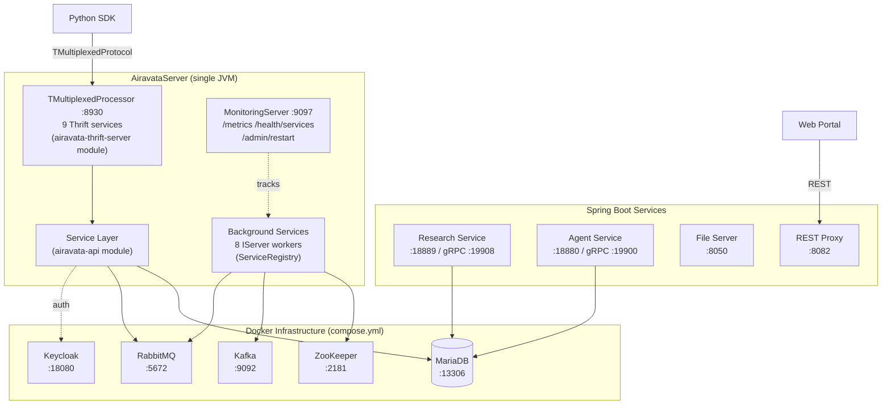
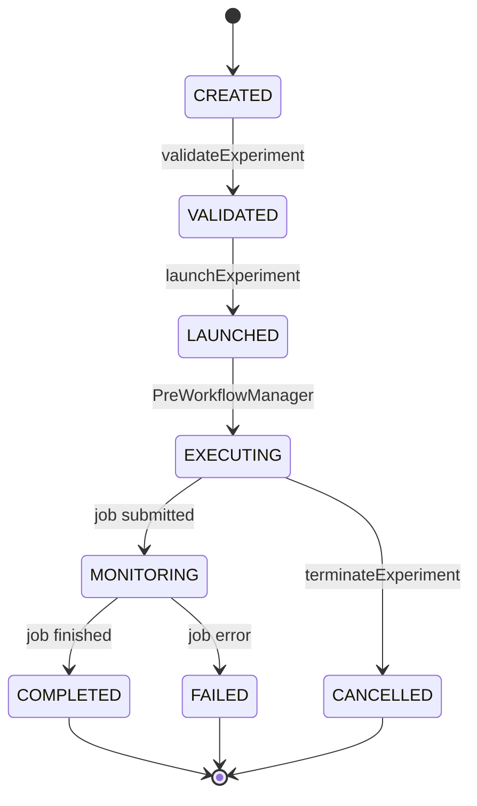
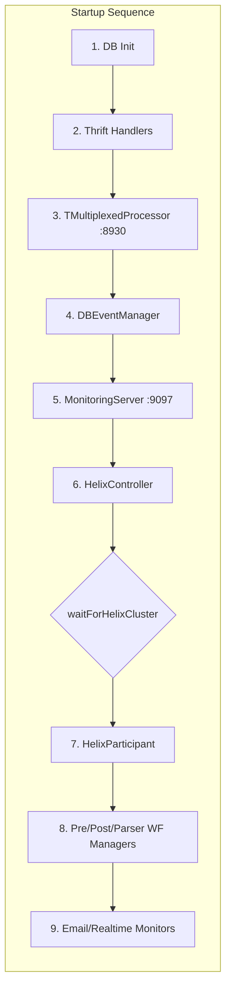

# Apache Airavata


[](https://github.com/apache/airavata/actions/workflows/maven-build.yml)
[](https://opensource.org/licenses/Apache-2.0)
[](https://github.com/apache/airavata/graphs/contributors)

Apache Airavata is a software framework for executing and managing computational jobs on distributed computing resources including local clusters, supercomputers, national grids, academic and commercial clouds. Airavata builds on general concepts of service oriented computing, distributed messaging, and workflow composition and orchestration. Airavata bundles a server package with an API, client software development Kits and a general purpose reference UI implementation.

## Key Features

- 🔧 Service-oriented architecture with distributed messaging
- 🔄 Fully-managed task lifecycle (environment setup, data staging, execution, and output retrieval)
- ☁️ Multi-cloud and hybrid cloud support
- 🖥️ Comprehensive API and SDK ecosystem
- 🌐 [Reference UI Implementations](https://github.com/apache/airavata-portals)

## Using Airavata

If you’re a researcher, Airavata offers several ways to streamline your workflows:

1. Submit Batch Jobs via the **Airavata Application Portal** -- [Example](https://admin.cybershuttle.org)
2. Launch Interactive Experiments through the **Airavata Research Portal** -- [Example](https://cybershuttle.org)
3. Explore and run published experiments from the **Airavata Research Catalog** -- [Example](https://cybershuttle.org/resources?resourceTypes=REPOSITORY)
4. Run interactive computational jobs directly from your IDE using **Airavata Python SDK** -- [PyPI](https://pypi.org/project/airavata-python-sdk/)


## 🧱 The Airavata Ecosystem

Apache Airavata is composed of modular components spanning core services, data management, user interfaces, and developer tooling.

### 🔧 Core Services
- [`airavata`](https://github.com/apache/airavata) – Main resource management and task orchestration middleware
- [`airavata-custos`](https://github.com/apache/airavata-custos) – Identity and access management framework
- [`airavata-mft`](https://github.com/apache/airavata-mft) – Managed file transfer services
- [`airavata-portals`](https://github.com/apache/airavata-portals) – All frontends for airavata

### 📦 Data & Metadata Services
- [`airavata-data-lake`](https://github.com/apache/airavata-data-lake) – Data lake and storage backend
- [`airavata-data-catalog`](https://github.com/apache/airavata-data-catalog) – Metadata and search services

### 📚 Documentation & Branding
- [`airavata-docs`](https://github.com/apache/airavata-docs) – Developer documentation
- [`airavata-user-docs`](https://github.com/apache/airavata-user-docs) – End-user guides
- [`airavata-admin-user-docs`](https://github.com/apache/airavata-admin-user-docs) – Admin-focused documentation
- [`airavata-custos-docs`](https://github.com/apache/airavata-custos-docs) – Custos documentation
- [`airavata-site`](https://github.com/apache/airavata-site) – Project website

### 🧪 Experimental & Research
- [`airavata-sandbox`](https://github.com/apache/airavata-sandbox) – Prototypes and early-stage work
- [`airavata-labs`](https://github.com/apache/airavata-labs) – Experimental projects
- [`airavata-jupyter-kernel`](https://github.com/apache/airavata-jupyter-kernel) – Jupyter integration
- [`airavata-cerebrum`](https://github.com/apache/airavata-cerebrum) – Airavata for Neuroscience


## 🔄 How Airavata Works

Airavata is composed of a consolidated JVM server plus three Spring Boot microservices that together facilitate the full lifecycle of computational jobs.


```mermaid
graph TB
    subgraph "Docker Infrastructure (compose.yml)"
        DB[(MariaDB<br/>:13306)]
        RMQ[RabbitMQ<br/>:5672]
        ZK[ZooKeeper<br/>:2181]
        KFK[Kafka<br/>:9092]
        KC[Keycloak<br/>:18080]
    end

    subgraph "AiravataServer (single JVM)"
        direction TB
        MUX["TMultiplexedProcessor :8930<br/>9 Thrift services<br/>(airavata-thrift-server module)"]
        SVC["Service Layer<br/>(airavata-api module)"]
        BG["Background Services<br/>8 IServer workers<br/>(ServiceRegistry)"]
        MON["MonitoringServer :9097<br/>/metrics  /health/services<br/>/admin/restart"]
    end

    subgraph "Spring Boot Services"
        RS[Research Service<br/>:18889 / gRPC :19908]
        AS[Agent Service<br/>:18880 / gRPC :19900]
        FS[File Server<br/>:8050]
        RP[REST Proxy<br/>:8082]
    end

    SDK[Python SDK] -->|TMultiplexedProtocol| MUX
    Portal[Web Portal] -->|REST| RP
    MUX --> SVC
    SVC --> DB
    SVC --> RMQ
    BG --> ZK
    BG --> KFK
    BG --> RMQ
    AS --> DB
    RS --> DB
    SVC -.->|auth| KC
    MON -.->|tracks| BG
```

### 1. Airavata Server `(airavata-thrift-server + airavata-api)`
> Entry point: `org.apache.airavata.api.server.AiravataServer` (in `airavata-thrift-server` module)
> Started via: `tilt up` or manually with `java -cp ...`

`AiravataServer` is the single JVM that hosts all Thrift services and background workers. On startup it:

1. Initializes the unified `airavata` database via Flyway
2. Registers 9 Thrift services on a single `TMultiplexedProcessor` (port **8930**)
3. Starts background `IServer` workers after the Thrift server is ready

#### Architecture: Service Layer + Thrift Transport

All business logic lives in a transport-agnostic **service layer** (`org.apache.airavata.service.*`). Thrift handlers are thin adapters that delegate to services via `ThriftAdapter`, translating between Thrift types and service exceptions. This decoupling enables future REST/gRPC transports without duplicating logic.

| Service | Responsibility |
|---|---|
| `ExperimentService` | Experiment lifecycle (create, launch, clone, terminate, intermediate outputs) |
| `ProjectService` | Project CRUD and search |
| `GatewayService` | Gateway management and sharing domain setup |
| `ApplicationCatalogService` | App modules, deployments, and interfaces |
| `ResourceService` | Compute/storage resources, job submission, data movement, storage info |
| `CredentialService` | SSH/password credential management with sharing |
| `ResourceSharingService` | Resource sharing and access control |
| `GroupResourceProfileService` | Group resource profiles and policies |
| `GatewayResourceProfileService` | Gateway resource preferences |
| `UserResourceProfileService` | User resource preferences |
| `SSHAccountService` | SSH account provisioning and validation |
| `DataProductService` | Data products and replicas |
| `NotificationService` | Notification CRUD |
| `ParserService` | Parsers and parsing templates |

Shared utilities: `SharingHelper` (sharing operations), `EventPublisher` (messaging), `RequestContext` (transport-agnostic identity).

#### Thrift Services (all on port 8930, multiplexed)

| Service name | Handler | Responsibility |
|---|---|---|
| `Airavata` | `AiravataServerHandler` | Public API — delegates to service layer |
| `RegistryService` | `RegistryServerHandler` | Metadata and definitions for tasks and applications |
| `CredentialStore` | `CredentialStoreServerHandler` | Secure storage and retrieval of compute credentials |
| `SharingRegistry` | `SharingRegistryServerHandler` | Sharing and permissioning of Airavata resources |
| `UserProfile` | `UserProfileServiceHandler` | User profile management |
| `TenantProfile` | `TenantProfileServiceHandler` | Tenant/gateway management |
| `IamAdminServices` | `IamAdminServicesHandler` | IAM administration |
| `GroupManager` | `GroupManagerServiceHandler` | Group and role management |
| `Orchestrator` | `OrchestratorServerHandler` | Workflow DAG construction and task dispatch |

#### Background Services (IServer lifecycle, same JVM)

| Service | Responsibility |
|---|---|
| `DBEventManagerRunner` | Syncs task execution events to the DB via pub/sub |
| `MonitoringServer` | Prometheus metrics endpoint (optional) |
| `ComputationalResourceMonitoringService` | Polls compute resource queue status |
| `DataInterpreterService` | Metadata analysis for submitted jobs |
| `ProcessReschedulingService` | Retries and reschedules failed processes |
| `HelixController` | Manages Helix cluster state transitions |
| `GlobalParticipant` | Executes task steps (`EnvSetupTask`, `InputDataStagingTask`, `OutputDataStagingTask`, `JobVerificationTask`, `CompletingTask`, `ForkJobSubmissionTask`, `DefaultJobSubmissionTask`, `LocalJobSubmissionTask`, `ArchiveTask`, `WorkflowCancellationTask`, `RemoteJobCancellationTask`, `CancelCompletingTask`, `DataParsingTask`, `ParsingTriggeringTask`) |
| `PreWorkflowManager` | Handles pre-execution phase (env setup, data staging) |
| `PostWorkflowManager` | Handles post-execution phase (cleanup, output fetching) |
| `ParserWorkflowManager` | Handles parsing/data-interpretation workflow phase |
| `EmailBasedMonitor` | Polls email inbox for job status updates (optional) |
| `RealtimeMonitor` | Listens on Kafka for real-time job state changes |


```mermaid
stateDiagram-v2
    [*] --> CREATED
    CREATED --> VALIDATED : validateExperiment
    VALIDATED --> LAUNCHED : launchExperiment
    LAUNCHED --> EXECUTING : PreWorkflowManager
    EXECUTING --> MONITORING : job submitted
    MONITORING --> COMPLETED : job finished
    MONITORING --> FAILED : job error
    EXECUTING --> CANCELLED : terminateExperiment
    COMPLETED --> [*]
    FAILED --> [*]
    CANCELLED --> [*]
```


```mermaid
graph LR
    subgraph "Startup Sequence"
        direction TB
        A[1. DB Init] --> B[2. Thrift Handlers]
        B --> C[3. TMultiplexedProcessor :8930]
        C --> D[4. DBEventManager]
        D --> E[5. MonitoringServer :9097]
        E --> F[6. HelixController]
        F --> G{waitForHelixCluster}
        G --> H[7. HelixParticipant]
        H --> I[8. Pre/Post/Parser WF Managers]
        I --> J[9. Email/Realtime Monitors]
    end
```


### 2. Airavata File Server `(apache-airavata-file-server)`
> Class Name: `org.apache.airavata.file.server.FileServerApplication`
> Command: `bin/

The Airavata File Server is a lightweight SFTP wrapper running on storage nodes integrated with Airavata. It lets users securely access storage via SFTP, using Airavata authentication tokens as ephemeral passwords.


### 3. Airavata Agent Service `(apache-airavata-agent-service)` [NEW]
> Class Name: `org.apache.airavata.agent.connection.service.AgentServiceApplication`

The Airavata Agent Service is the backend for launching **interactive** jobs using Airavata.
It provide constructs to launch a custom "Agent" on a compute resource, that connects back to the Agent Service through a bi-directional gRPC channel.
The Airavata Python SDK primarily utilizes the Agent Service (gRPC) and the Airavata API (Thrift) to submit and execute interactive jobs, spawn subprocesses, and create network tunnels to subprocesses, even if they are behind NAT.


### 4. Airavata Research Service `(apache-airavata-research-service)` [NEW]
> Class Name: `org.apache.airavata.research.service.ResearchServiceApplication`

The Airavata Research Service is the backend for the **research catalog** in Airavata. It provides the API to add, list, modify, and publish notebooks, repositories, datasets, and computational models in cybershuttle, and launch interactive remote sessions to utilize them in a research setting.


## 🏗️ Getting Started

### Prerequisites

| Requirement | Version | Check Using |
|-------------|---------|-------|
| **Java SDK** | 17+ | `java --version` |
| **Apache Maven** | 3.8+ | `mvn -v` |
| **Docker Engine** | 20.10+ | `docker -v` |
| **Docker Compose** | 2.0+ | `docker compose version` |
| **Tilt** | 0.33+ | `tilt version` |

### Quick Start (Tilt)

Tilt orchestrates the full development stack — infrastructure, build, and all services:

```bash
git clone https://github.com/apache/airavata.git
cd airavata
tilt up
```

This starts:
- **Infrastructure**: MariaDB, RabbitMQ, ZooKeeper, Kafka, Keycloak (via `compose.yml`)
- **Airavata Thrift Server**: All 9 services on port 8930, monitoring on 9097
- **Spring Boot Services**: Research Service (18889), Agent Service (18880), File Server (8050), REST Proxy (8082)

Open the Tilt UI at `http://localhost:10350` to monitor all resources. Integration tests can be triggered manually from the Tilt UI.

### Manual Start

```bash
docker compose up -d                          # Infrastructure
mvn clean package -DskipTests -T4             # Build
java -cp "airavata-thrift-server/target/classes:airavata-api/target/classes:airavata-api/target/dependency/*" \
  -Dairavata.config.dir=airavata-api/src/main/resources \
  org.apache.airavata.api.server.AiravataServer   # Thrift server
mvn spring-boot:run -pl modules/research-framework/research-service  # Research Service
mvn spring-boot:run -pl modules/agent-framework/agent-service        # Agent Service
mvn spring-boot:run -pl modules/file-server                          # File Server
mvn spring-boot:run -pl modules/restproxy                            # REST Proxy
```

### Health Monitoring

The monitoring server on port **9097** exposes:

| Endpoint | Method | Description |
|----------|--------|-------------|
| `/metrics` | GET | Prometheus metrics |
| `/health/services` | GET | JSON status of all background services (UP/DOWN/DISABLED) |
| `/admin/restart/{name}` | POST | Restart a background service by name |

Spring Boot services expose `/actuator/health` on their respective ports.

### Configuration

The main configuration file is `airavata-api/src/main/resources/airavata-server.properties`. Key settings:

* `apiserver.port` — Thrift port (default: `8930`)
* `airavata.jdbc.url` — JDBC URL for the unified `airavata` database
* `email.based.monitoring.enabled` — Enable/disable email-based job monitor
* `api.server.monitoring.enabled` — Enable/disable Prometheus metrics endpoint

### Integration Tests

```bash
mvn test -pl integration-tests -Dgroups=integration
```

Tests verify: all 9 thrift services, database tables, RabbitMQ exchanges, Kafka broker, Keycloak realm, Prometheus metrics, and the `/health/services` endpoint.

### Spring Boot Microservices

| Service | Port | gRPC | Purpose |
|---|---|---|---|
| **Research Service** | 18889 | 19908 | Research catalog API |
| **Agent Service** | 18880 | 19900 | Backend for interactive jobs |
| **File Server** | 8050 | — | SFTP wrapper for storage nodes |
| **REST Proxy** | 8082 | — | REST-to-Kafka bridge |


## 🤝 Contributing

We welcome contributions from the community! Here's how you can help:

1. **🍴 Fork the repository**
2. **🌿 Create a feature branch**
3. **✨ Make your changes**
4. **🧪 Add tests if applicable**
5. **📝 Submit a pull request**

**Learn More:**
- [Contributing Guidelines](http://airavata.apache.org/get-involved.html)
- [Code of Conduct](https://www.apache.org/foundation/policies/conduct.html)
- [Developer Resources](https://cwiki.apache.org/confluence/display/AIRAVATA)

### Setting up your IDE

Use `tilt up` to start the full stack, then attach your IDE debugger to the running services. For the Airavata Thrift Server, use remote JVM debug (add `-agentlib:jdwp=transport=dt_socket,server=y,suspend=n,address=5005` to the `serve_cmd` in the Tiltfile). For Spring Boot services, use `mvn spring-boot:run -Dspring-boot.run.jvmArguments="-agentlib:jdwp=..."` directly.


## 💬 Community & Support

**Get Help:**
- 📧 **User Mailing List:** [users@airavata.apache.org](mailto:users@airavata.apache.org)
- 👨‍💻 **Developer Mailing List:** [dev@airavata.apache.org](mailto:dev@airavata.apache.org)
- 🔗 **All Mailing Lists:** [airavata.apache.org/mailing-list](https://airavata.apache.org/mailing-list.html)

## 📄 License

```
Licensed to the Apache Software Foundation (ASF) under one or more contributor
license agreements. See the NOTICE file distributed with this work for
additional information regarding copyright ownership.

The ASF licenses this file to you under the Apache License, Version 2.0 (the
"License"); you may not use this file except in compliance with the License.
You may obtain a copy of the License at:

    http://www.apache.org/licenses/LICENSE-2.0

Unless required by applicable law or agreed to in writing, software distributed
under the License is distributed on an "AS IS" BASIS, WITHOUT WARRANTIES OR
CONDITIONS OF ANY KIND, either express or implied. See the License for the
specific language governing permissions and limitations under the License.
```

See the [LICENSE](LICENSE) file for complete license details.

---

<div align="center">
  <strong>Made with ❤️ by the Apache Airavata Community</strong>
</div>
