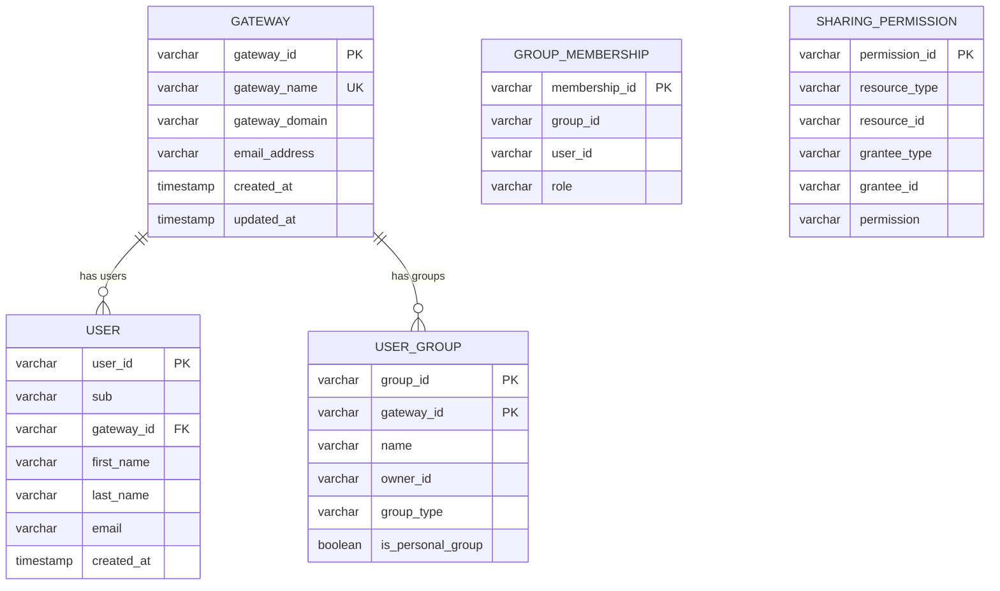
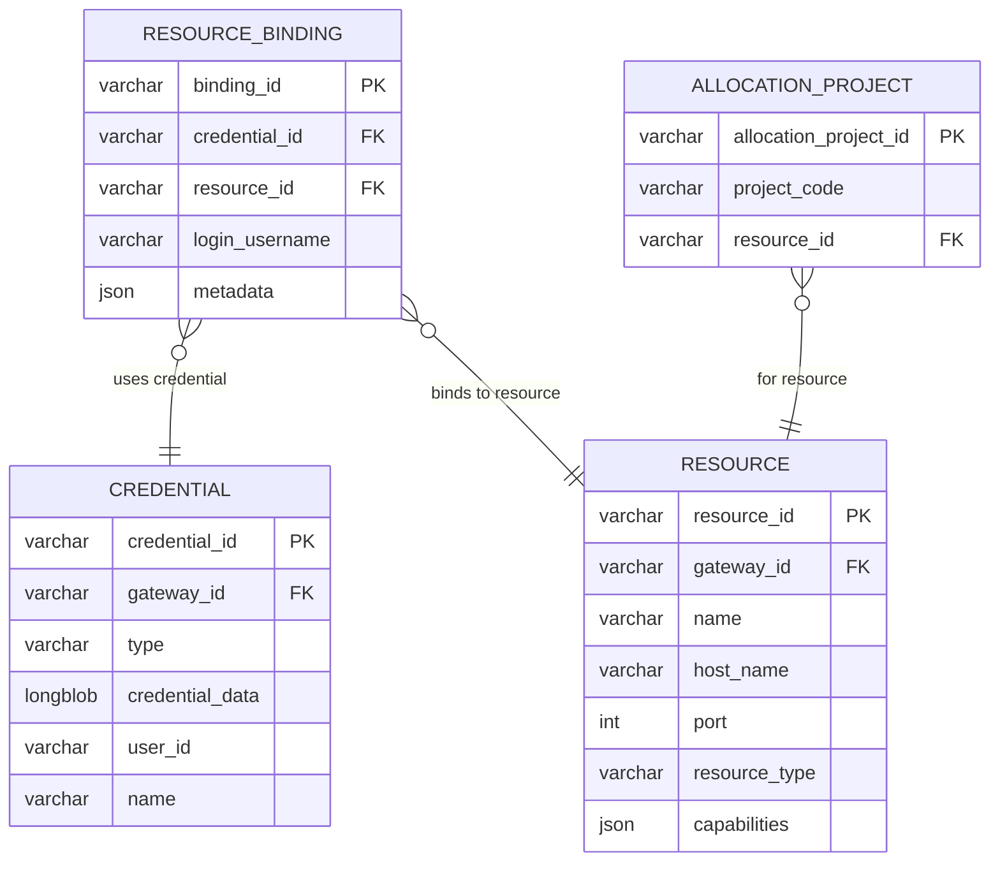
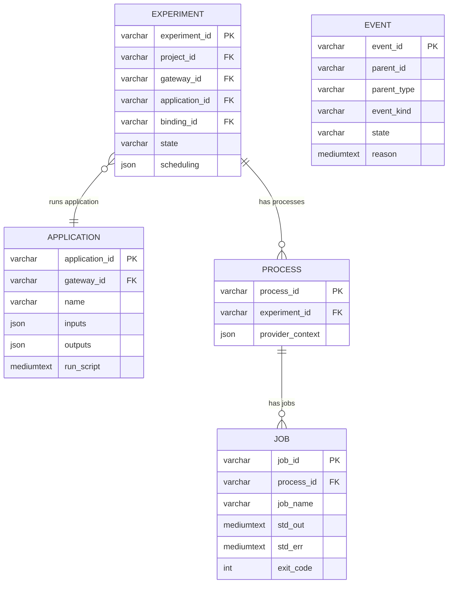
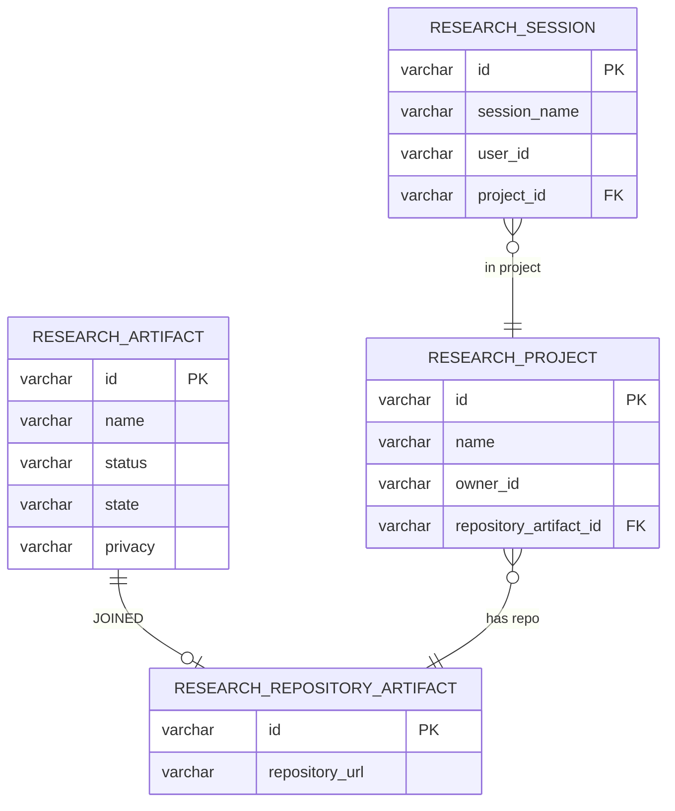
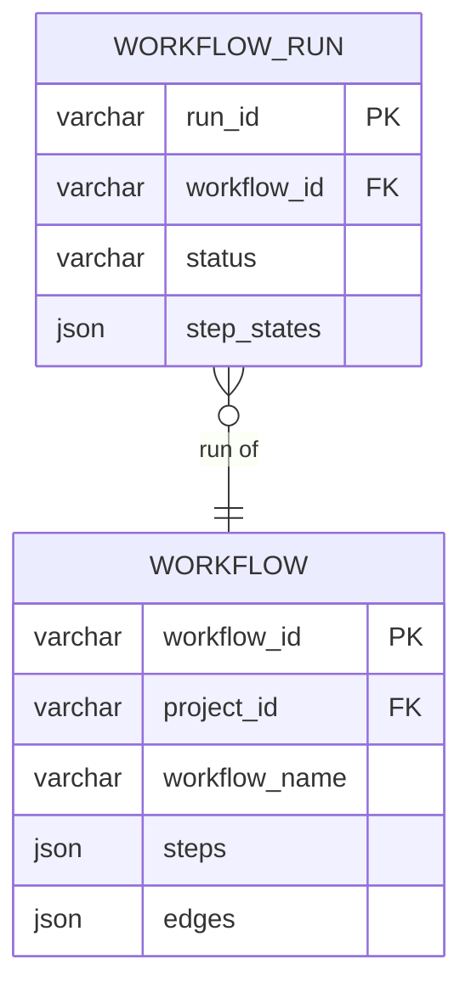

# Airavata API Server

The core backend for Apache Airavata. A unified Spring Boot application that runs all services in a single JVM — REST API, gRPC, orchestration, Temporal workflows, credential store, IAM integration, and job execution.

## Quick Start

```bash
# Prerequisites: Java 25+, Maven 3.8+, Docker 20.10+

# One command: build + init infrastructure + serve
./scripts/run.sh
# Credentials: default-admin / admin123

# --- Or step by step ---
mvn clean install -DskipTests          # build
./scripts/init.sh --clean              # init infrastructure (Docker, Keycloak, DB)
./scripts/dev.sh serve                 # start server
```

Swagger UI: http://localhost:8090/swagger-ui/index.html

## Modules

| Module | Path | Description |
|--------|------|-------------|
| **airavata-api** | `modules/airavata-api/` | Core domain logic, entities, repositories, services |
| **grpc-api** | `modules/grpc-api/` | gRPC protocol definitions and codegen (agent, research streams) |
| **rest-api** | `modules/rest-api/` | REST controllers, security filters, OpenAPI docs |
| **distribution** | `modules/distribution/` | Spring Boot entry point, packaging, Docker image |

Build order: `airavata-api` -> `grpc-api` -> `rest-api` -> `distribution`

## Server Ports

| Server | Port | Config Property |
|--------|------|-----------------|
| HTTP (REST, File, Agent, Research API) | 8090 | `server.port` |
| gRPC (agent/research streams) | 9090 | `spring.grpc.server.port` |
| Temporal (workflow engine) | 7233 | `spring.temporal.connection.target` |

## Scripts

From `airavata-api/`:

| Script | Purpose |
|--------|---------|
| `./scripts/build.sh` | Build: `mvn clean install`. Use `--skip-tests` for compile-only. |
| `./scripts/run.sh` | **One command:** build (if needed) + init --clean + serve |
| `./scripts/init.sh` | Init infra (Keycloak + DB). `--clean` = reset. `--run` = then serve |
| `./scripts/dev.sh` | Dev mode: `serve`, `init`, etc. `--debug` for jdwp |
| `./scripts/jar.sh` | Run from built JAR |
| `./scripts/setup-echo-experiment.sh` | End-to-end smoke test (18 steps) |

**Cold start:** `./scripts/init.sh --clean --run` tears down containers/volumes, brings up infra, runs Keycloak setup and DB migrations, then serves. Teardown only: `docker compose -f ../.devcontainer/compose.yml down -v`.

## REST API Endpoints

All endpoints are prefixed with `/api/v1/` and follow RESTful conventions.

| Endpoint Category | Controller | Base Path | Description |
|-------------------|------------|-----------|-------------|
| Auth | `AuthController` | `/api/v1/auth` | Logout and federated logout |
| System | `SystemController` | `/api/v1` | Health check, public config |
| Experiments | `ExperimentController` | `/api/v1/experiments` | Experiment lifecycle management |
| Processes | `ProcessController` | `/api/v1/processes` | Process execution and monitoring |
| Jobs | `JobController` | `/api/v1/jobs` | Job status and management |
| Applications | `ApplicationController` | `/api/v1/applications` | Application CRUD |
| Installations | `ApplicationInstallationController` | `/api/v1/installations` | Application installation on resources |
| Resources | `ResourceController` | `/api/v1/resources` | Unified compute/storage resource management |
| Resource Bindings | `ResourceBindingController` | `/api/v1/bindings` | Credential-resource binding management |
| Projects | `ProjectController` | `/api/v1/projects` | Project management |
| Allocation Projects | `AllocationProjectController` | `/api/v1/allocation-projects` | HPC allocation project management |
| Gateways | `GatewayController` | `/api/v1/gateways` | Gateway CRUD |
| Users | `UserController` | `/api/v1/users` | User management |
| Groups | `GroupController` | `/api/v1/groups` | Group management and membership |
| Credentials | `CredentialController` | `/api/v1` | SSH/password credential CRUD |
| Workflows | `WorkflowController` | `/api/v1/workflows` | Workflow definitions |
| Workflow Runs | `WorkflowRunController` | `/api/v1/workflow-runs` | Workflow run execution and status |
| Notices | `NoticeController` | `/api/v1/notices` | Notification management |
| Statistics | `StatisticsController` | `/api/v1/statistics` | Experiment and system statistics |
| SSH Keys | `SSHKeyController` | `/api/v1/ssh-keygen` | SSH key pair generation |
| Connectivity Test | `ConnectivityTestController` | `/api/v1/connectivity-test` | SSH/SFTP/SLURM connectivity validation |
| Monitoring | `MonitoringJobStatusController` | `/api/v1/monitoring` | Job status callback endpoint |
| Research Artifacts | `ResearchArtifactController` | `/api/v1/research/artifacts` | Research artifact CRUD |
| Research Projects | `ResearchProjectController` | `/api/v1/research/artifacts/projects` | Research project management |
| Research Sessions | `ResearchSessionController` | `/api/v1/research-hub/sessions` | Research session management |

OpenAPI docs: `http://localhost:8090/swagger-ui/index.html` | `http://localhost:8090/v3/api-docs`

## Package Structure

Domain-first layout where each domain owns its entity, repository, mapper, service, and model:

```text
org.apache.airavata/
├── execution/             # Orchestration, scheduling, DAG execution, Temporal activities
│   ├── activity/          # Temporal workflows (Pre/Post/Cancel) and ActivitiesImpl
│   ├── orchestration/     # OrchestratorService, ProcessResourceResolver
│   ├── scheduling/        # ProcessScheduler, ScheduledTaskManager
│   ├── dag/               # ProcessDAGEngine, TaskNode, interceptors
│   ├── monitoring/        # JobStatusEventPublisher, email monitoring
│   └── state/             # StateValidators, StateModel
├── research/              # Research domain grouping
│   ├── experiment/        # Experiments: entity/repo/mapper/service/model
│   ├── application/       # App catalog: entity/repo/mapper/service/model
│   ├── artifact/          # Research artifacts
│   ├── project/           # Research projects
│   └── session/           # User sessions
├── compute/               # Compute resources and job execution
│   ├── resource/          # Resource models/services/entities + job submission infra
│   └── provider/          # Backend impls: slurm/, local/, aws/
├── storage/               # Data staging
│   ├── resource/          # Storage models
│   └── client/            # StorageClient interface + SftpStorageClient
├── status/                # Event and status management
├── protocol/              # SSH/SCP/SFTP transport adapters
├── iam/                   # Keycloak, sharing, authorization
├── gateway/               # Multi-tenant gateway management
├── credential/            # Credential store
├── accounting/            # Allocation project accounting
├── workflow/              # Workflow DAG definitions
├── core/                  # Cross-cutting: EntityMapper, CrudService, exceptions, utils
└── config/                # Spring configuration
```

## Configuration

Main config: `modules/distribution/src/main/resources/application.properties`

| Category | Key Properties |
|----------|---------------|
| Database | `spring.datasource.url`, `spring.datasource.username`, `spring.datasource.password` |
| Keycloak | `airavata.security.iam.server-url`, `airavata.security.iam.realm` |
| Temporal | `spring.temporal.connection.target` |
| Agent | `airavata.services.agent.enabled`, `airavata.services.agent.storage.path` |
| gRPC | `spring.grpc.server.port` |
| Monitoring | `airavata.services.monitor.compute.job-status-callback-url` |

Paths: Home via `--home` or `AIRAVATA_HOME`; config via `--config-dir` or `AIRAVATA_CONFIG_DIR` (default `{home}/conf`).

## Schema Migrations

Single Flyway baseline at `modules/distribution/src/main/resources/conf/db/migration/airavata/V1__Baseline_schema.sql`. To change schema: add a versioned migration (e.g. `V2__Description.sql`) with `IF NOT EXISTS`/`IF EXISTS`.

## Database ERD

Entity-Relationship Diagram for the Airavata database schema.

### Schema Summary

- **38 tables** in the Flyway V1 baseline migration (`V1__Baseline_schema.sql`)
- **No views** — `EXPERIMENT_SUMMARY` is a denormalized table
- **Engine**: InnoDB, charset `utf8mb4`, collation `utf8mb4_unicode_ci`
- **Requires**: MariaDB 10.2+ (JSON column support)
- **All table names use UPPER_CASE**

### Table Origin

All 38 tables are defined in the V1 Flyway baseline migration. There are no Hibernate `ddl-auto`-created tables.

| Part | Tables |
|------|--------|
| Part 1 — Tenant, Identity & IAM (7) | GATEWAY, USER, NOTIFICATION, TAG, USER_GROUP, GROUP_MEMBERSHIP, SHARING_PERMISSION |
| Part 2 — Compute & Credentials (7) | RESOURCE, CREDENTIAL, RESOURCE_BINDING, RESOURCE_PREFERENCE, ALLOCATION_PROJECT, CREDENTIAL_ALLOCATION_PROJECT, COMPUTE_SUBMISSION_TRACKING |
| Part 3 — Application & Experiment (10) | APPLICATION, APPLICATION_INSTALLATION, PROJECT, PROJECT_DATASET, EXPERIMENT, EXPERIMENT_INPUT, EXPERIMENT_OUTPUT, PROCESS, EVENT, JOB |
| Part 4 — Research Platform (11) | RESEARCH_ARTIFACT, RESEARCH_MODEL_ARTIFACT, RESEARCH_NOTEBOOK_ARTIFACT, RESEARCH_REPOSITORY_ARTIFACT, RESEARCH_DATASET_ARTIFACT, RESEARCH_ARTIFACT_AUTHORS, RESEARCH_ARTIFACT_TAGS, ARTIFACT_STAR, RESEARCH_PROJECT, RESEARCH_PROJECT_DATASET, RESEARCH_SESSION |
| Part 5 — Workflow & Tracking (3) | WORKFLOW, WORKFLOW_RUN, EXPERIMENT_SUMMARY |

### Part 1 — Tenant, Identity & IAM



### Part 2 — Compute & Credentials



### Part 3 — Application & Experiment Pipeline



### Part 4 — Research Platform



### Part 5 — Workflow & Tracking



### Complete Table Index

| # | Table | PK | JPA Entity |
|---|-------|-----|------------|
| 1 | GATEWAY | gateway_id | GatewayEntity |
| 2 | USER | user_id | UserEntity |
| 3 | NOTIFICATION | notification_id | NotificationEntity |
| 4 | TAG | id | TagEntity |
| 5 | RESOURCE | resource_id | ComputeResourceEntity |
| 6 | CREDENTIAL | credential_id | CredentialEntity |
| 7 | RESOURCE_BINDING | binding_id | ResourceBindingEntity |
| 8 | RESOURCE_PREFERENCE | preference_id | ResourcePreferenceEntity |
| 9 | APPLICATION | application_id | ApplicationEntity |
| 10 | APPLICATION_INSTALLATION | installation_id | ApplicationInstallationEntity |
| 11 | ALLOCATION_PROJECT | allocation_project_id | AllocationProjectEntity |
| 12 | CREDENTIAL_ALLOCATION_PROJECT | (credential_id, alloc_project_id) | CredentialAllocationProjectEntity |
| 13-17 | RESEARCH_ARTIFACT + subtypes | id | ResearchArtifactEntity (abstract) |
| 18-20 | RESEARCH_ARTIFACT_AUTHORS/TAGS, ARTIFACT_STAR | composite / id | @ElementCollection / @ManyToMany |
| 21 | PROJECT | project_id | ProjectEntity |
| 22 | RESEARCH_PROJECT | id | ResearchProjectEntity |
| 23-24 | PROJECT_DATASET, RESEARCH_PROJECT_DATASET | composite | @ManyToMany join |
| 25 | EXPERIMENT | experiment_id | ExperimentEntity |
| 26-27 | EXPERIMENT_INPUT/OUTPUT | input_id / output_id | ExperimentInputEntity / ExperimentOutputEntity |
| 28 | PROCESS | process_id | ProcessEntity |
| 29 | EVENT | event_id | EventEntity |
| 30 | JOB | job_id | JobEntity |
| 31 | RESEARCH_SESSION | id | SessionEntity |
| 32 | USER_GROUP | (group_id, gateway_id) | UserGroupEntity |
| 33 | GROUP_MEMBERSHIP | membership_id | GroupMembershipEntity |
| 34 | SHARING_PERMISSION | permission_id | SharingPermissionEntity |
| 35 | WORKFLOW | workflow_id | WorkflowEntity |
| 36 | WORKFLOW_RUN | run_id | WorkflowRunEntity |
| 37 | COMPUTE_SUBMISSION_TRACKING | compute_resource_id | ComputeSubmissionTrackingEntity |
| 38 | EXPERIMENT_SUMMARY | experiment_id | ExperimentSummaryEntity (@Immutable) |

## Testing

```bash
# With infrastructure running (for integration tests)
./scripts/init.sh                            # ensure DB, Keycloak, Temporal up
mvn test -Dskip.slurm.tests=true            # all tests, skip SLURM

# Without pre-starting services (many tests use Testcontainers)
mvn test                                    # all tests
mvn test -pl modules/airavata-api            # specific module
mvn test -Dtest=SomeTestClass               # specific test

# SLURM tests need Docker + SLURM Testcontainer
docker compose -f ../.devcontainer/compose.yml --profile test up -d
mvn test -P test
```

## Docker

```bash
# Build distribution + Docker image
mvn clean install -DskipTests
docker build -t airavata:latest -f modules/distribution/src/main/docker/Dockerfile modules/distribution/target

# Run
docker run -p 8090:8090 -p 9090:9090 airavata:latest
```

## License

Licensed under the Apache License, Version 2.0. See [LICENSE](../LICENSE).
