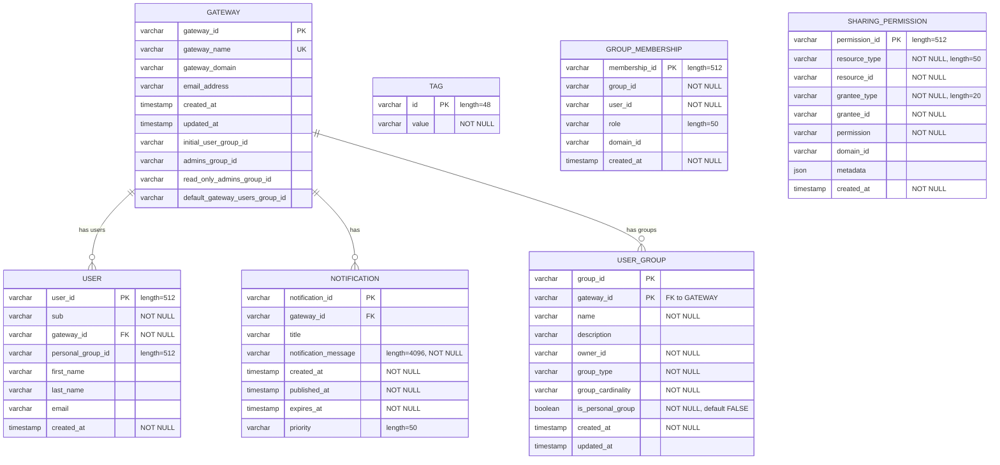
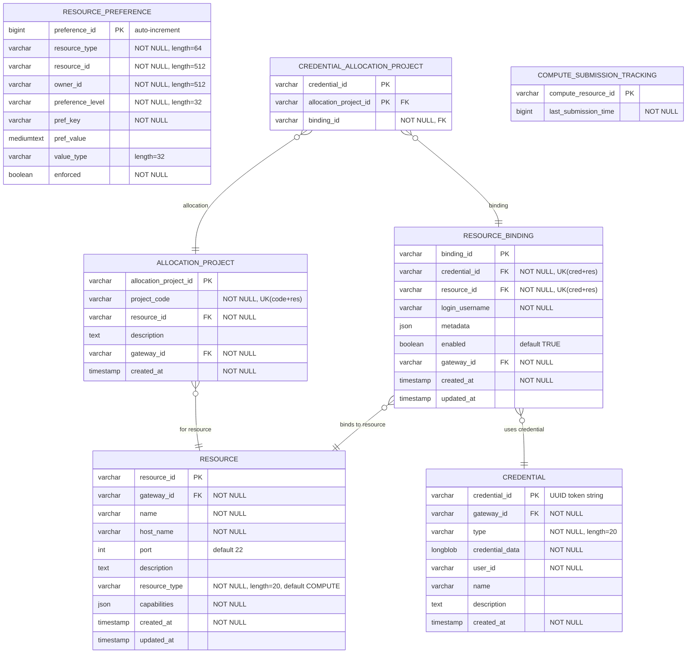
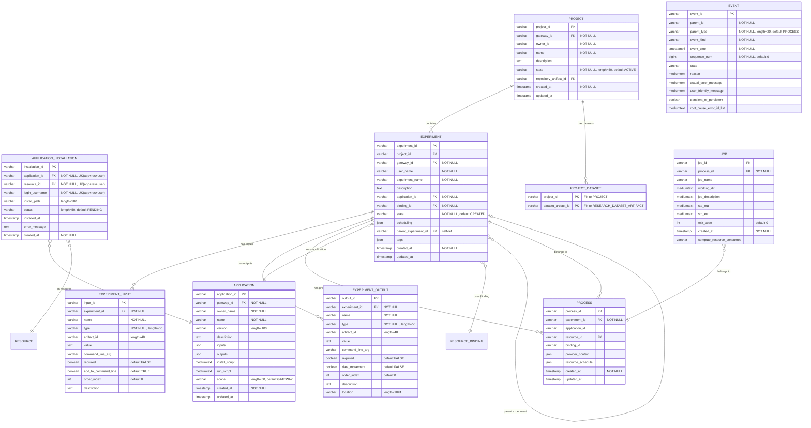
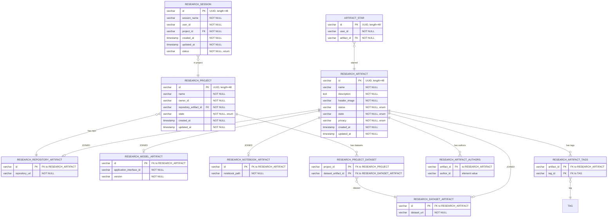
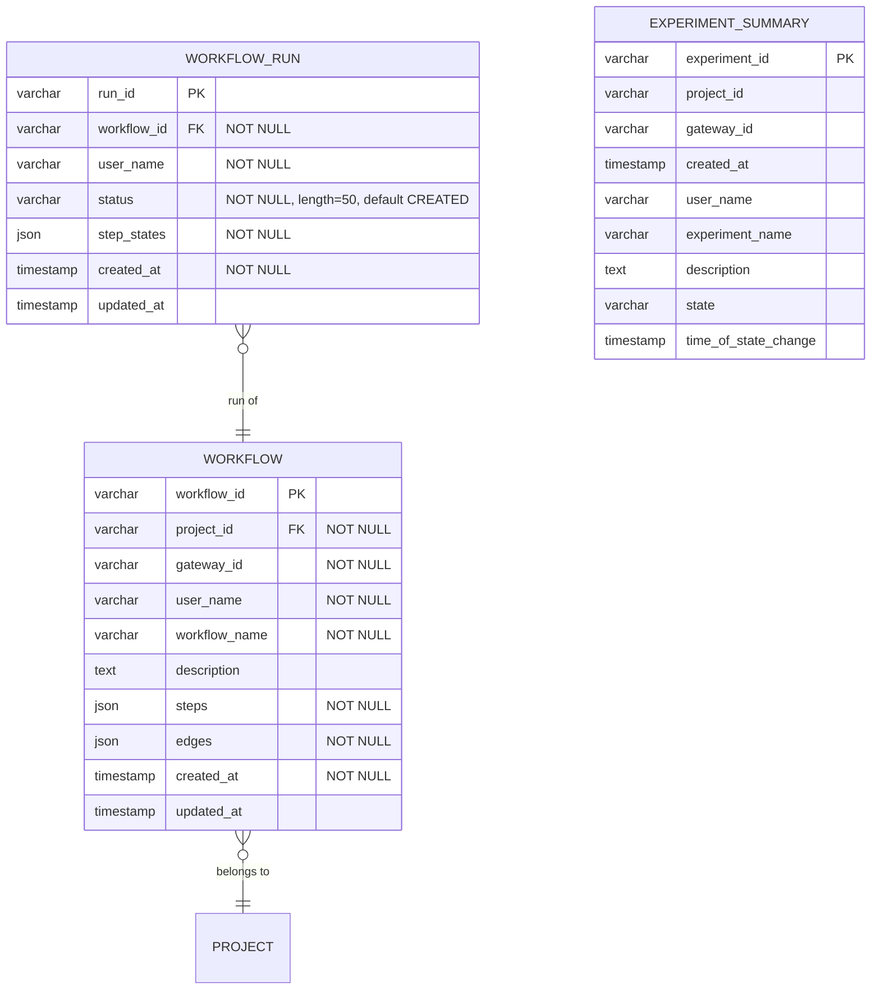

# Apache Airavata Database ERD

Entity-Relationship Diagram for the Airavata database schema.

## Schema Summary

- **38 tables** in the Flyway V1 baseline migration (`V1__Baseline_schema.sql`)
- **No views** — `EXPERIMENT_SUMMARY` is a denormalized table
- **No V2 migration** — all schema is in the single V1 baseline
- **Engine**: InnoDB, charset `utf8mb4`, collation `utf8mb4_unicode_ci`
- **Requires**: MariaDB 10.2+ (JSON column support)
- **All table names use UPPER_CASE**

### Table Origin

All 38 tables are defined in the V1 Flyway baseline migration. There are no Hibernate `ddl-auto`-created tables.

| Part | Tables |
|------|--------|
| Part 1 — Tenant, Identity & IAM (7) | GATEWAY, USER, NOTIFICATION, TAG, USER_GROUP, GROUP_MEMBERSHIP, SHARING_PERMISSION |
| Part 2 — Compute & Credentials (7) | RESOURCE, CREDENTIAL, RESOURCE_BINDING, RESOURCE_PREFERENCE, ALLOCATION_PROJECT, CREDENTIAL_ALLOCATION_PROJECT, COMPUTE_SUBMISSION_TRACKING |
| Part 3 — Application & Experiment (10) | APPLICATION, APPLICATION_INSTALLATION, PROJECT, PROJECT_DATASET, EXPERIMENT, EXPERIMENT_INPUT, EXPERIMENT_OUTPUT, PROCESS, EVENT, JOB |
| Part 4 — Research Platform (11) | RESEARCH_ARTIFACT, RESEARCH_MODEL_ARTIFACT, RESEARCH_NOTEBOOK_ARTIFACT, RESEARCH_REPOSITORY_ARTIFACT, RESEARCH_DATASET_ARTIFACT, RESEARCH_ARTIFACT_AUTHORS, RESEARCH_ARTIFACT_TAGS, ARTIFACT_STAR, RESEARCH_PROJECT, RESEARCH_PROJECT_DATASET, RESEARCH_SESSION |
| Part 5 — Workflow & Tracking (3) | WORKFLOW, WORKFLOW_RUN, EXPERIMENT_SUMMARY |

---

## Part 1 — Tenant, Identity & IAM

7 tables: GATEWAY, USER, NOTIFICATION, TAG, USER_GROUP, GROUP_MEMBERSHIP, SHARING_PERMISSION

**Notes:**
- `USER.user_id` format: `{sub}@{gatewayId}` (generated by `@PrePersist`)
- `USER_GROUP` has composite PK: `(group_id, gateway_id)`
- `GROUP_MEMBERSHIP` has unique constraint: `(group_id, user_id, domain_id)`
- `SHARING_PERMISSION` has unique constraint: `(resource_type, resource_id, grantee_type, grantee_id, permission, domain_id)`
- `GROUP_MEMBERSHIP` and `SHARING_PERMISSION` replace the former polymorphic `entity_relationship` table

---

## Part 2 — Compute & Credentials

7 tables: RESOURCE, CREDENTIAL, RESOURCE_BINDING, RESOURCE_PREFERENCE, ALLOCATION_PROJECT, CREDENTIAL_ALLOCATION_PROJECT, COMPUTE_SUBMISSION_TRACKING

**Notes:**
- `RESOURCE.capabilities` JSON schema: `{ compute?: { type, batchQueues[] }, storage?: { protocol, basePath } }`
- `RESOURCE` is a unified table replacing the old COMPUTE_RESOURCE, STORAGE_RESOURCE, and interface tables
- `RESOURCE.resource_type` discriminator: `COMPUTE` (default) or `STORAGE`
- `CREDENTIAL` table stores encrypted SSH keys, passwords, and certificates. PK is a UUID token string.
- `CREDENTIAL.type`: `SSH`, `PASSWORD`, or `CERTIFICATE` (see `CredentialType` enum)
- `RESOURCE_BINDING.metadata` JSON: `{ scratchPath, defaultQueue, maxWalltime, storagePath, allocationProjects[] }`
- `RESOURCE_PREFERENCE.resource_type` enum: `COMPUTE`, `STORAGE`, `USER_GROUP_SELECTION`, etc.
- `RESOURCE_PREFERENCE.preference_level` enum: `GATEWAY`, `GROUP`, `USER`

---

## Part 3 — Application & Experiment Pipeline

10 tables: APPLICATION, APPLICATION_INSTALLATION, PROJECT, PROJECT_DATASET, EXPERIMENT, EXPERIMENT_INPUT, EXPERIMENT_OUTPUT, PROCESS, EVENT, JOB

**Notes:**
- `EXPERIMENT_INPUT` and `EXPERIMENT_OUTPUT` are separate entity tables (not JSON columns). Each can be a plain parameter or an artifact reference (`type=ARTIFACT`, `artifact_id` populated).
- `EXPERIMENT.scheduling` JSON: `{queueName, nodeCount, cpuCount, walltime, allocationProject}`
- `EXPERIMENT.created_at` is `TIMESTAMP` (not BIGINT)
- `EXPERIMENT.parent_experiment_id` is a self-referencing FK for experiment chains
- `EXPERIMENT.tags` is a JSON column for experiment tags
- `PROCESS.provider_context` JSON: provider-specific context passed between workflow steps (e.g., AWS EC2 instance IDs)
- `PROCESS.resource_schedule` JSON: scheduling overrides used at submission time
- `JOB` has FK constraint to PROCESS (ON DELETE CASCADE)
- `JOB.created_at` is `TIMESTAMP` (not BIGINT)
- `EVENT` has single PK: `EVENT_ID` (not composite). Indexed on `(parent_id, parent_type, event_kind, sequence_num DESC)`.
- `EVENT.event_time` is `TIMESTAMP(6)` (microsecond precision)
- `EVENT.event_kind`: `STATUS` (state transitions) or `ERROR` (error records), enforced by CHECK constraint
- `EVENT.parent_type`: `EXPERIMENT` or `PROCESS` (default `PROCESS`)
- Experiment state is stored directly as `EXPERIMENT.STATE` column. Process statuses are stored in the EVENT table and loaded as `@Transient` fields.
- `PROJECT.state`: default `ACTIVE`
- `PROJECT.repository_artifact_id`: optional FK to `RESEARCH_REPOSITORY_ARTIFACT`
- `PROJECT_DATASET`: join table linking PROJECT to RESEARCH_DATASET_ARTIFACT

### EXPERIMENT_SUMMARY Table

`EXPERIMENT_SUMMARY` is a denormalized table (created in V1 migration) used for fast experiment listing. `ExperimentSummaryEntity` is an `@Immutable` JPA entity mapped to this table.

---

## Part 4 — Research Platform

11 tables: RESEARCH_ARTIFACT (+ 4 subtypes), RESEARCH_ARTIFACT_AUTHORS, RESEARCH_ARTIFACT_TAGS, ARTIFACT_STAR, RESEARCH_PROJECT, RESEARCH_PROJECT_DATASET, RESEARCH_SESSION

**Notes:**
- `RESEARCH_ARTIFACT` uses `@Inheritance(strategy = JOINED)` — subtypes stored in separate tables sharing the same PK
- All IDs are UUID (`@UuidGenerator`, length=48)
- `RESEARCH_ARTIFACT.status` enum: `ArtifactStatus` (e.g., NONE, ACTIVE)
- `RESEARCH_ARTIFACT.state` enum: `ArtifactState` (e.g., DRAFT, PUBLISHED)
- `RESEARCH_ARTIFACT.privacy` enum: `Privacy` (e.g., PRIVATE, PUBLIC)
- `RESEARCH_ARTIFACT_AUTHORS` is an `@ElementCollection` table (Set<String>)
- `RESEARCH_ARTIFACT_TAGS` is a `@ManyToMany` join table
- `RESEARCH_PROJECT_DATASET` is a `@ManyToMany` join table (ResearchProject ↔ DatasetArtifact)
- `RESEARCH_PROJECT.repository_artifact_id` FK to `RESEARCH_REPOSITORY_ARTIFACT` (ManyToOne, EAGER fetch)
- `RESEARCH_SESSION.status` enum: `SessionStatus`
- All research tables are in the V1 Flyway baseline migration (UPPER_CASE names)

---

## Part 5 — Workflow & Tracking

3 tables: WORKFLOW, WORKFLOW_RUN, EXPERIMENT_SUMMARY

**Notes:**
- `WORKFLOW.steps` and `edges` are stored as JSON (serialized `WorkflowStep[]` and `WorkflowEdge[]`)
- `WORKFLOW_RUN.step_states` is JSON (serialized `Map<String, WorkflowRunStepState>`)
- `EXPERIMENT_SUMMARY` is a denormalized table for fast experiment listing. Mapped by `ExperimentSummaryEntity` (`@Immutable`).

---

## Complete Table Index

| # | Table | PK | JPA Entity |
|---|-------|-----|------------|
| 1 | GATEWAY | gateway_id | GatewayEntity |
| 2 | USER | user_id | UserEntity |
| 3 | NOTIFICATION | notification_id | NotificationEntity |
| 4 | TAG | id | TagEntity |
| 5 | RESOURCE | resource_id | ComputeResourceEntity |
| 6 | CREDENTIAL | credential_id | CredentialEntity |
| 7 | RESOURCE_BINDING | binding_id | ResourceBindingEntity |
| 8 | RESOURCE_PREFERENCE | preference_id (auto) | ResourcePreferenceEntity |
| 9 | APPLICATION | application_id | ApplicationEntity |
| 10 | APPLICATION_INSTALLATION | installation_id | ApplicationInstallationEntity |
| 11 | ALLOCATION_PROJECT | allocation_project_id | AllocationProjectEntity |
| 12 | CREDENTIAL_ALLOCATION_PROJECT | (credential_id, alloc_project_id) | CredentialAllocationProjectEntity |
| 13 | RESEARCH_ARTIFACT | id | ResearchArtifactEntity (abstract) |
| 14 | RESEARCH_MODEL_ARTIFACT | id | ModelArtifactEntity |
| 15 | RESEARCH_NOTEBOOK_ARTIFACT | id | NotebookArtifactEntity |
| 16 | RESEARCH_REPOSITORY_ARTIFACT | id | RepositoryArtifactEntity |
| 17 | RESEARCH_DATASET_ARTIFACT | id | DatasetArtifactEntity |
| 18 | RESEARCH_ARTIFACT_AUTHORS | (artifact_id, value) | _(@ElementCollection)_ |
| 19 | RESEARCH_ARTIFACT_TAGS | (artifact_id, tag_id) | _(@ManyToMany join)_ |
| 20 | ARTIFACT_STAR | id | ArtifactStarEntity |
| 21 | PROJECT | project_id | ProjectEntity |
| 22 | RESEARCH_PROJECT | id | ResearchProjectEntity |
| 23 | RESEARCH_PROJECT_DATASET | (project_id, dataset_id) | _(@ManyToMany join)_ |
| 24 | PROJECT_DATASET | (project_id, dataset_artifact_id) | _(@ManyToMany join)_ |
| 25 | EXPERIMENT | experiment_id | ExperimentEntity |
| 26 | EXPERIMENT_INPUT | input_id | ExperimentInputEntity |
| 27 | EXPERIMENT_OUTPUT | output_id | ExperimentOutputEntity |
| 28 | PROCESS | process_id | ProcessEntity |
| 29 | EVENT | event_id | EventEntity |
| 30 | JOB | job_id | JobEntity |
| 31 | RESEARCH_SESSION | id | SessionEntity |
| 32 | USER_GROUP | (group_id, gateway_id) | UserGroupEntity |
| 33 | GROUP_MEMBERSHIP | membership_id | GroupMembershipEntity |
| 34 | SHARING_PERMISSION | permission_id | SharingPermissionEntity |
| 35 | WORKFLOW | workflow_id | WorkflowEntity |
| 36 | WORKFLOW_RUN | run_id | WorkflowRunEntity |
| 37 | COMPUTE_SUBMISSION_TRACKING | compute_resource_id | ComputeSubmissionTrackingEntity |
| — | EXPERIMENT_SUMMARY | experiment_id | ExperimentSummaryEntity (@Immutable) |

---

## Foreign Key Relationships

### V1 Flyway-defined FKs

| Source Table | Column | Target Table | Column | On Delete |
|-------------|--------|-------------|--------|-----------|
| USER | gateway_id | GATEWAY | gateway_id | CASCADE |
| NOTIFICATION | gateway_id | GATEWAY | gateway_id | SET NULL |
| RESOURCE | gateway_id | GATEWAY | gateway_id | CASCADE |
| CREDENTIAL | gateway_id | GATEWAY | gateway_id | CASCADE |
| RESOURCE_BINDING | credential_id | CREDENTIAL | credential_id | CASCADE |
| RESOURCE_BINDING | resource_id | RESOURCE | resource_id | CASCADE |
| RESOURCE_BINDING | gateway_id | GATEWAY | gateway_id | CASCADE |
| APPLICATION | gateway_id | GATEWAY | gateway_id | CASCADE |
| APPLICATION_INSTALLATION | application_id | APPLICATION | application_id | CASCADE |
| APPLICATION_INSTALLATION | resource_id | RESOURCE | resource_id | CASCADE |
| ALLOCATION_PROJECT | resource_id | RESOURCE | resource_id | CASCADE |
| ALLOCATION_PROJECT | gateway_id | GATEWAY | gateway_id | CASCADE |
| CREDENTIAL_ALLOCATION_PROJECT | allocation_project_id | ALLOCATION_PROJECT | allocation_project_id | CASCADE |
| CREDENTIAL_ALLOCATION_PROJECT | binding_id | RESOURCE_BINDING | binding_id | CASCADE |
| RESEARCH_MODEL_ARTIFACT | id | RESEARCH_ARTIFACT | id | CASCADE |
| RESEARCH_NOTEBOOK_ARTIFACT | id | RESEARCH_ARTIFACT | id | CASCADE |
| RESEARCH_REPOSITORY_ARTIFACT | id | RESEARCH_ARTIFACT | id | CASCADE |
| RESEARCH_DATASET_ARTIFACT | id | RESEARCH_ARTIFACT | id | CASCADE |
| RESEARCH_ARTIFACT_AUTHORS | artifact_id | RESEARCH_ARTIFACT | id | CASCADE |
| RESEARCH_ARTIFACT_TAGS | artifact_id | RESEARCH_ARTIFACT | id | CASCADE |
| RESEARCH_ARTIFACT_TAGS | tag_id | TAG | id | CASCADE |
| ARTIFACT_STAR | artifact_id | RESEARCH_ARTIFACT | id | CASCADE |
| PROJECT | gateway_id | GATEWAY | gateway_id | CASCADE |
| PROJECT | repository_artifact_id | RESEARCH_REPOSITORY_ARTIFACT | id | SET NULL |
| RESEARCH_PROJECT | repository_artifact_id | RESEARCH_REPOSITORY_ARTIFACT | id | CASCADE |
| RESEARCH_PROJECT_DATASET | project_id | RESEARCH_PROJECT | id | CASCADE |
| RESEARCH_PROJECT_DATASET | dataset_artifact_id | RESEARCH_DATASET_ARTIFACT | id | CASCADE |
| PROJECT_DATASET | project_id | PROJECT | project_id | CASCADE |
| PROJECT_DATASET | dataset_artifact_id | RESEARCH_DATASET_ARTIFACT | id | CASCADE |
| EXPERIMENT | project_id | PROJECT | project_id | SET NULL |
| EXPERIMENT | gateway_id | GATEWAY | gateway_id | CASCADE |
| EXPERIMENT | application_id | APPLICATION | application_id | RESTRICT |
| EXPERIMENT | binding_id | RESOURCE_BINDING | binding_id | RESTRICT |
| EXPERIMENT | parent_experiment_id | EXPERIMENT | experiment_id | SET NULL |
| EXPERIMENT_INPUT | experiment_id | EXPERIMENT | experiment_id | CASCADE |
| EXPERIMENT_OUTPUT | experiment_id | EXPERIMENT | experiment_id | CASCADE |
| PROCESS | experiment_id | EXPERIMENT | experiment_id | CASCADE |
| PROCESS | resource_id | RESOURCE | resource_id | SET NULL |
| JOB | process_id | PROCESS | process_id | CASCADE |
| RESEARCH_SESSION | project_id | RESEARCH_PROJECT | id | CASCADE |
| USER_GROUP | gateway_id | GATEWAY | gateway_id | CASCADE |
| WORKFLOW | project_id | PROJECT | project_id | _(no action)_ |
| WORKFLOW_RUN | workflow_id | WORKFLOW | workflow_id | _(no action)_ |

### JPA-managed relationships (no DDL FK in V1)

| Source Entity | Field | Target Entity | JPA Annotation |
|--------------|-------|--------------|----------------|
| ExperimentEntity | project | ProjectEntity | @ManyToOne(LAZY) |
| ProcessEntity | experiment | ExperimentEntity | @ManyToOne(LAZY) |
| ProcessEntity | jobs | List\<JobEntity\> | @OneToMany(cascade=ALL, orphanRemoval) |
| JobEntity | process | ProcessEntity | @ManyToOne(LAZY) |
| ExperimentEntity | processes | List\<ProcessEntity\> | @OneToMany(cascade=ALL, orphanRemoval) |
| ExperimentEntity | inputs | List\<ExperimentInputEntity\> | @OneToMany(cascade=ALL, orphanRemoval) |
| ExperimentEntity | outputs | List\<ExperimentOutputEntity\> | @OneToMany(cascade=ALL, orphanRemoval) |
| ExperimentInputEntity | experiment | ExperimentEntity | @ManyToOne(LAZY) |
| ExperimentOutputEntity | experiment | ExperimentEntity | @ManyToOne(LAZY) |
| ApplicationInstallationEntity | application | ApplicationEntity | @ManyToOne(LAZY) |
| ApplicationInstallationEntity | resource | ComputeResourceEntity | @ManyToOne(LAZY) |
| ComputeResourceEntity | gateway | GatewayEntity | @ManyToOne(LAZY) |
| ResourceBindingEntity | resource | ComputeResourceEntity | @ManyToOne(LAZY) |
| UserEntity | gateway | GatewayEntity | @ManyToOne(LAZY) |
| UserGroupEntity | gateway | GatewayEntity | @ManyToOne(LAZY) |
| ProjectEntity | experiments | List\<ExperimentEntity\> | @OneToMany(LAZY) |
| ResearchProjectEntity | repositoryArtifact | RepositoryArtifactEntity | @ManyToOne(EAGER) |
| ResearchProjectEntity | datasetArtifacts | Set\<DatasetArtifactEntity\> | @ManyToMany(EAGER) |
| ArtifactStarEntity | artifact | ResearchArtifactEntity | @ManyToOne(EAGER) |
| SessionEntity | project | ResearchProjectEntity | @ManyToOne(EAGER) |
| ResearchArtifactEntity | tags | Set\<TagEntity\> | @ManyToMany(cascade=MERGE, EAGER) |
| ResearchArtifactEntity | authors | Set\<String\> | @ElementCollection(EAGER) |
