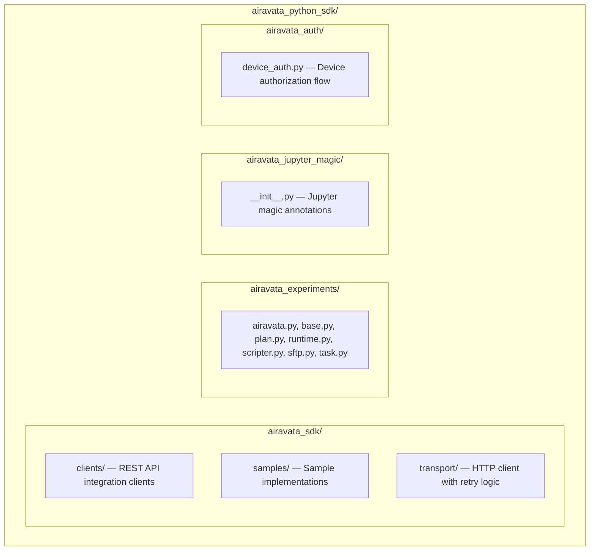

# Apache Airavata Python SDK

The Apache Airavata Python SDK lets third-party clients interact with Airavata to run scientific experiments. It provides declarative APIs to submit and manage experiments, and internally handles the complexities of deploying, running, and connecting to scientific apps on HPC resources.

All communication uses the unified REST API (`/api/v1/`). Data is exchanged as plain Python dicts (JSON). File operations (list, upload, download) use the File API at `/api/v1/files`; the SDK default `FILE_SVC_URL` is `{API_SERVER_URL}/api/v1/files`. Override `FILE_SVC_URL` if using a different file service base URL.

## Main APIs

- **Airavata Experiments** (`airavata_experiments/`) — Run scientific apps, use data/results from past runs. Handles uploading data, running experiments, tracking progress, and fetching data from past runs.
- **Airavata Jupyter Magic** (`airavata_jupyter_magic/`) — Switch runtimes, move data, run experiments/analyses, all from within a notebook. Provides magic annotations (%) to shift notebook runtimes between resources (local/remote).
- **Airavata SDK** (`airavata_sdk/`) — Create research groups, manage resource allocations, and setup scientific apps on different HPC resources.
- **Airavata Auth** (`airavata_auth/`) — Device authorization flow for CLI and headless environments.

## Project Layout



## Quick Start

```bash
# Create and activate virtual environment
python3 -m venv venv
source venv/bin/activate

# Install in development mode
pip install -e .
```

Configure server connection by creating a settings INI file. See [settings.ini](airavata_sdk/transport/settings.ini) for the default configuration.

## Usage

```python
from airavata_sdk.clients import AiravataClient

# Connect to Airavata
client = AiravataClient(settings_file="settings.ini")

# List experiments
experiments = client.get_experiments()
```

## Building Distribution Archives

```bash
# Install build tools
python3 -m pip install --upgrade build setuptools

# Build wheel and tarball
python3 -m build .

# Output:
# dist/
#     airavata_python_sdk-2.0.0-py2.py3-none-any.whl
#     airavata-python-sdk-2.0.0.tar.gz
```

Install the built package into any project with `pip install dist/airavata-python-sdk-*.tar.gz`.

## License

Licensed under the Apache License, Version 2.0. See [LICENSE](LICENSE).
