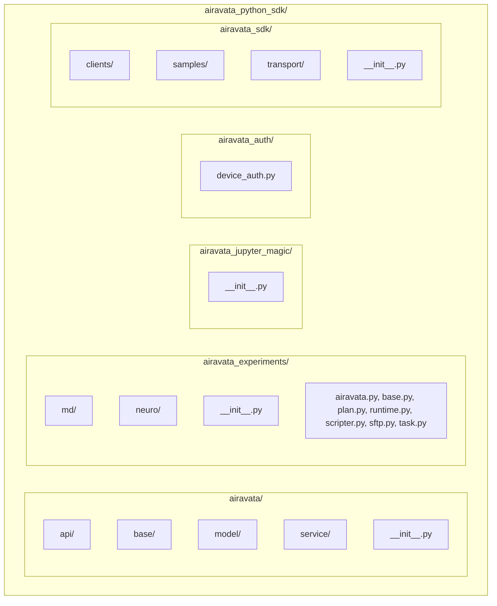

# Airavata Python SDK

The Apache Airavata Python SDK lets third-party clients interact with Airavata to run scientific experiments. It provides declarative APIs to submit and manage experiments, and internally handles the complexities of deploying, running, and connecting to scientific apps on HPC resources.

## Main APIs
* **Airavata Experiments** - Run scientific apps, use data/results from past runs.
* **Airavata Jupyter Magic** - Switch runtimes, move data, run experiments/analyses, all from within a notebook.
* **Airavata SDK** - Create research groups, manage resource allocations, and setup scientific apps on different HPC resources.

## Project Layout

