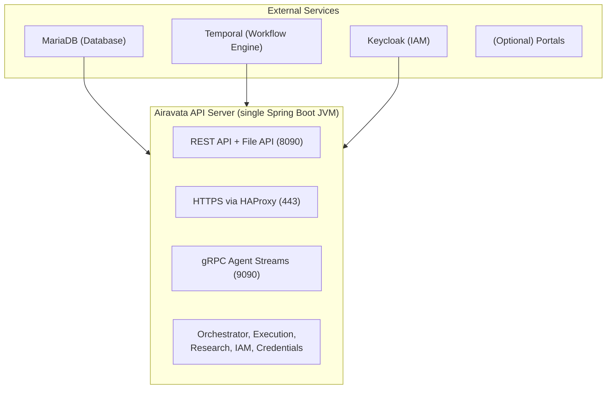

# Airavata Ansible Deployment

Ansible scripts for deploying Apache Airavata.

## Overview

Airavata uses a streamlined architecture with minimal components. All Airavata services run in a single Spring Boot application.

## Architecture



### Components

1. **MariaDB Database**: Single unified `airavata` database containing all tables for experiments, applications, profiles, sharing, credentials, and workflows. A separate `keycloak` database is used for IAM.

2. **Temporal**: Workflow engine for orchestrating job execution (Pre/Post/Cancel workflows). Runs as a separate service on port 7233.

3. **Airavata API Server**: Airavata services (single JVM). See the main [README Architecture section](../../README.md#architecture) for the full API layer and internal service overview. External access is typically via HTTPS via HAProxy (port 443) or directly on port 8090.

4. **Keycloak**: Identity and Access Management (IAM) server for user authentication, OAuth2/OIDC tokens, and authorization.

## Prerequisites

- Python 3.12+
- Ansible Core 2.20.1+ (installed via pyproject.toml)
- Ansible Collections (installed via requirements.yml)
- SSH access to target servers
- Root or sudo access on target servers

## Supported Operating Systems

- **Ubuntu** 18.04+ (fully supported)
- **CentOS** 7 (fully supported)
- **Rocky Linux** 8 (fully supported)

## Component Versions

These versions match the current codebase configuration:

- **Java**: 25 (OpenJDK) - configured in `pom.xml` (`maven-compiler-plugin` release 25)
- **Keycloak**: 26.5 (Quarkus-based) - matches `.devcontainer/compose.yml`
- **MariaDB**: 11.7 - matches `.devcontainer/compose.yml`
- **Temporal**: latest - matches `.devcontainer/compose.yml` (temporalio/admin-tools)
- **Maven**: 3.9.6 - configured in Ansible variables

## Installation

1. Create a virtual environment:

```bash
cd airavata/deployment/ansible
python3 -m venv ENV
source ENV/bin/activate
```

2. Install Python dependencies:

```bash
pip install -e .
```

3. Install Ansible collections:

```bash
ansible-galaxy collection install -r requirements.yml
```

## Quick Start

1. **Copy and customize inventory**:

```bash
cp -r inventories/template inventories/my-deployment
cd inventories/my-deployment
```

2. **Edit `hosts` file** - Replace with actual hostnames/IPs:

```ini
[database]
db.example.com

[temporal]
temporal.example.com

[apiserver]
api.example.com

[keycloak]
iam.example.com
```

3. **Edit `group_vars/all/vars.yml`** - Update all `CHANGEME` values with your configuration:
   - Database credentials
   - Temporal host
   - API server configuration
   - Keycloak configuration
   - SSL certificates

4. **Deploy everything**:

```bash
ansible-playbook -i inventories/my-deployment deploy.yml
```

## Deployment Guide

### Deploy All Components

Deploy the complete stack with a single command:

```bash
ansible-playbook -i inventories/my-deployment deploy.yml
```

### Deploy Individual Components

You can deploy individual components using tags:

#### Deploy Database Only

```bash
ansible-playbook -i inventories/my-deployment deploy.yml --tags database
```

This will:
- Install MariaDB
- Create `airavata` database
- Create `keycloak` database
- Set up database users and permissions
- Configure firewall rules

#### Deploy Temporal Only

```bash
ansible-playbook -i inventories/my-deployment deploy.yml --tags temporal
```

This will:
- Install and configure Temporal server
- Start and enable Temporal service

#### Deploy API Server Only

```bash
ansible-playbook -i inventories/my-deployment deploy.yml --tags apiserver
```

This will:
- Install Java 25 JDK
- Checkout and build Airavata source
- Deploy unified API server (all services in one Spring Boot app)
- Configure SSL certificates (Let's Encrypt)
- Set up HAProxy for TLS termination on port 443
- Configure firewall rules (port 443 for HTTPS, port 8090 for HTTP if exposed, port 9090 for gRPC if exposed)
- Start Airavata service

#### Deploy Keycloak Only

```bash
ansible-playbook -i inventories/my-deployment deploy.yml --tags keycloak
```

This will:
- Install Keycloak 26.5 (Quarkus-based)
- Configure Keycloak database connection
- Set up SSL certificates
- Start Keycloak service

### Single Server Deployment

For development or small deployments, all services can run on a single server:

```ini
[database]
localhost

[temporal]
localhost

[apiserver]
localhost

[keycloak]
localhost
```

Update `group_vars/all/vars.yml` to use `localhost` for host references.

## Configuration

### Airavata Configuration

Main configuration file: `/opt/apache-airavata/conf/application.properties`

**Standard Paths:**
- Installation directory: `/opt/apache-airavata` (AIRAVATA_HOME)
- Configuration directory: `/opt/apache-airavata/conf` (AIRAVATA_CONFIG_DIR, defaults to `AIRAVATA_HOME/conf` if not explicitly set)
- Logs directory: `/opt/apache-airavata/logs`

Key settings:
- Database connections (MariaDB)
- Temporal connection (workflow engine)
- Keycloak IAM URL
- Server ports:
  - HTTP Server port (8090)
  - gRPC Server port (9090)
  - Temporal port (7233)
- Agent Tunnel Server configuration (remote server location, not a service started by Airavata):
  - `airavata.services.agent.tunnelserver.host` - Remote tunnel server hostname
  - `airavata.services.agent.tunnelserver.port` - Remote tunnel server port (typically 17000)
  - `airavata.services.agent.tunnelserver.url` - Remote tunnel server API URL
  - `airavata.services.agent.tunnelserver.token` - Authentication token for tunnel server
- TLS/SSL keystore configuration
- Service enablement flags

### Temporal Configuration

Temporal is configured via Spring Boot `application.properties`:
- `spring.temporal.connection.target=localhost:7233`
- Temporal namespace and worker configuration

### Keycloak Configuration

Keycloak 26.5 (Quarkus-based) configuration:
- Configuration file: `conf/keycloak.conf` (Quarkus configuration format)
- Database connection (MariaDB) - built-in MySQL connector, no additional JDBC driver setup needed
- Admin credentials (set via `KEYCLOAK_ADMIN` and `KEYCLOAK_ADMIN_PASSWORD` environment variables)
- SSL certificates (Let's Encrypt via certbot)
- Service startup: `kc.sh start --optimized` (systemd service)

### OS-Specific Configuration

The deployment automatically handles OS-specific differences:

- **Package Managers**: Uses `apt` for Ubuntu/Debian, `yum` for CentOS, `dnf` for Rocky
- **Firewall**: Uses `ufw` for Ubuntu/Debian, `firewalld` for CentOS/Rocky
- **HAProxy**: Different package names and config directories per OS
- **Auto-updates**: Uses `unattended-upgrades` for Ubuntu, `yum-cron` for CentOS, `dnf-automatic` for Rocky

## Verification

### Check Services

```bash
# Database
systemctl status mariadb  # or mysql on CentOS

# Temporal
systemctl status temporal

# Airavata
systemctl status apiserver
tail -f {{ apiserver_log_dir }}/airavata.log

# Keycloak
systemctl status keycloak
```

### Test Connectivity

```bash
# REST API
curl http://api.example.com:8090/api/v1/

# HTTPS via HAProxy
curl https://api.example.com:443

# Keycloak
curl https://iam.example.com/health
```

## Troubleshooting

### Build Fails

- Ensure Maven has sufficient memory: `MAVEN_OPTS="-Xmx2048m"`
- Check Java version: Requires JDK 25
- Verify network connectivity for Maven downloads

### Service Won't Start

1. Check logs: `{{ apiserver_log_dir }}/airavata.log`
2. Verify AIRAVATA_HOME is set correctly in systemd service
3. Verify `conf/application.properties` exists and is readable
4. Verify database connectivity: `mysql -h db.example.com -u airavata -p`
5. Verify Temporal is accessible: `temporal operator cluster health --address temporal.example.com:7233`
6. Verify Keycloak is running
7. Check Java version: `java --version` (must be 25+)
8. Check service status: `systemctl status apiserver`

### Database Connection Issues

1. Verify MariaDB is running: `systemctl status mariadb`
2. Check firewall rules (firewalld on RedHat, ufw on Ubuntu)
3. Verify credentials in `vars.yml`
4. Test connection: `mysql -h db.example.com -u airavata -p`

### Temporal Issues

1. Verify Temporal is running and accessible on port 7233
2. Check Temporal worker logs
3. Verify `spring.temporal.connection.target` in configuration
4. Check Temporal Web UI at port 8233

### SSL Certificate Issues

1. Ensure Let's Encrypt email is set in `vars.yml`
2. Check firewall allows HTTP (port 80) for certificate renewal
3. Verify DNS points to the server
4. Check certbot logs: `/var/log/letsencrypt/`

### OS-Specific Issues

**Ubuntu/Debian**:
- Ensure `ufw` is installed and configured
- Check `unattended-upgrades` configuration
- Verify apt repositories are accessible

**CentOS**:
- Ensure EPEL repository is enabled
- Check SELinux policies if MariaDB fails
- Verify `yum-cron` is running for auto-updates

**Rocky**:
- Ensure EPEL repository is enabled
- Check SELinux policies if MariaDB fails
- Verify `dnf-automatic` timer is enabled

## Maintenance

### Update Airavata

```bash
ansible-playbook -i inventories/my-deployment deploy.yml --tags apiserver
```

This will rebuild and redeploy the API server with the latest code.

### Backup Database

```bash
mysqldump -u airavata -p --all-databases > backup.sql
```

## Roles

Essential roles (consolidated structure):

- **base**: User/group creation, Java 25 installation, firewall setup, Let's Encrypt certbot (OS-specific)
- **database**: MariaDB installation and database creation (OS-specific)
- **apiserver**: Airavata API server deployment including source checkout, Maven build, keystore setup, HAProxy, and SSL (OS-specific)
- **keycloak**: Keycloak 26.5 (Quarkus-based) IAM server deployment
- **temporal**: Temporal CLI dev server installation and systemd service setup
- **portal**: Next.js portal deployment including Node.js installation, source checkout, build, and systemd service

Each role is organized into logical task files for easier maintenance and debugging.

See [roles/README.md](roles/README.md) for detailed role documentation.

## Inventory Structure

```
inventories/
  my-deployment/
    hosts                    # Server inventory
    group_vars/
      all/
        vars.yml            # All configuration variables
```

## Variables Reference

Key variables in `group_vars/all/vars.yml`:

- `db_server`: MariaDB hostname
- `db_user` / `db_password`: Database credentials
- `db_name`: Database name (default: "airavata")
- `temporal_host`: Temporal hostname
- `api_server_host`: API server hostname
- `iam_server_url`: Keycloak URL
- `default_gateway`: Default gateway ID
- `haproxy_config_dir`: OS-specific HAProxy config directory
- `haproxy_service_name`: OS-specific HAProxy service name

See `inventories/template/group_vars/all/vars.yml` for complete variable list.

## High Availability

For production HA deployments:

1. **Database**: Use MariaDB Galera Cluster
2. **Temporal**: Use Temporal cluster mode with multiple history shards
3. **API Server**: Deploy multiple instances behind load balancer
4. **Keycloak**: Use Keycloak HA cluster mode

## Additional Resources

- [Airavata Documentation](https://airavata.apache.org)
- [Temporal Documentation](https://docs.temporal.io)
- [Keycloak Documentation](https://www.keycloak.org/documentation)
