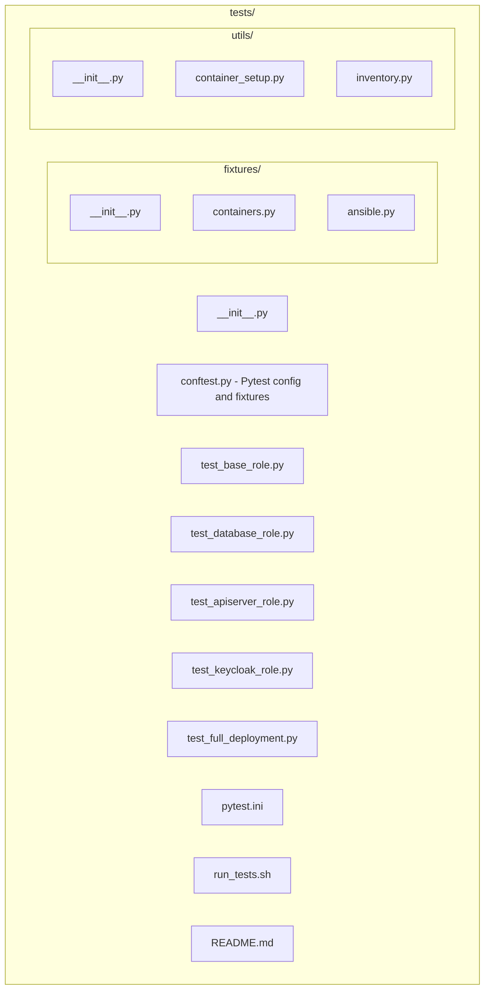

# Ansible Deployment Tests

This directory contains tests for the Airavata Ansible deployment scripts using testcontainers-python.

## Overview

The test suite uses Docker containers to test Ansible deployments against multiple Linux distributions:
- Ubuntu 22.04
- Rocky Linux 8
- CentOS 7

Each component role is tested independently to ensure proper deployment and configuration.

## Prerequisites

1. **Python 3.12+**
2. **Docker** - Must be installed and running
3. **Ansible Collections** - Installed via `ansible-galaxy collection install -r requirements.yml`

## Installation

### Option 1: Using the test runner script

```bash
cd dev-tools/ansible/tests
./run_tests.sh
```

This script will:
- Create a virtual environment if needed
- Install all dependencies
- Install Ansible collections
- Run the tests

### Option 2: Manual setup

```bash
cd dev-tools/ansible

# Create virtual environment
python3 -m venv ENV
source ENV/bin/activate

# Install dependencies
pip install -e ".[dev]"

# Install Ansible collections
ansible-galaxy collection install -r requirements.yml

# Run tests
cd tests
pytest
```

## Running Tests

### Run all tests

```bash
pytest
```

### Run tests for a specific role

```bash
pytest -m base          # Base role tests
pytest -m database      # Database role tests
pytest -m apiserver     # API server role tests
pytest -m keycloak      # Keycloak role tests
```

### Run tests for a specific distribution

```bash
pytest -m ubuntu        # Ubuntu tests
pytest -m rocky         # Rocky Linux tests
pytest -m centos        # CentOS tests
```

### Skip slow tests

```bash
pytest -m "not slow"
```

### Run with verbose output

```bash
pytest -v
```

### Run a specific test

```bash
pytest tests/test_base_role.py::test_base_role_ubuntu
```

## Test Structure



## Test Markers

Tests are marked with pytest markers for easy filtering:

- `@pytest.mark.base` - Base role tests
- `@pytest.mark.database` - Database role tests
- `@pytest.mark.apiserver` - API server role tests
- `@pytest.mark.keycloak` - Keycloak role tests
- `@pytest.mark.ubuntu` - Ubuntu distribution tests
- `@pytest.mark.rocky` - Rocky Linux distribution tests
- `@pytest.mark.centos` - CentOS distribution tests
- `@pytest.mark.integration` - Integration tests
- `@pytest.mark.slow` - Slow-running tests

## How Tests Work

1. **Container Setup**: Each test starts a Docker container for the target distribution
2. **SSH Configuration**: SSH server is installed and configured with test keys
3. **Ansible Execution**: Ansible playbooks are run against the container
4. **Verification**: Tests verify that services are installed, configured, and running correctly
5. **Cleanup**: Containers are automatically stopped and removed after tests

## Troubleshooting

### Docker not available

If you see errors about Docker not being available:
- Ensure Docker is installed: `docker --version`
- Ensure Docker daemon is running: `docker ps`
- On Linux, you may need to add your user to the `docker` group

### Collection not found

If tests fail with "collection not found" errors:
```bash
ansible-galaxy collection install -r ../requirements.yml
```

### SSH connection failures

If SSH connections fail:
- Check that containers are running: `docker ps`
- Verify SSH keys are generated correctly
- Check container logs: `docker logs <container_id>`

### Test timeouts

Some tests may timeout if containers take too long to start. You can:
- Increase timeout in `pytest.ini`
- Run tests individually to isolate issues
- Check Docker resource limits

### Permission errors

If you see permission errors:
- Ensure you have permission to run Docker
- Check file permissions on test files
- Verify virtual environment is activated

## Adding New Tests

To add a new test:

1. Create a test file in `tests/` following the naming convention `test_*.py`
2. Import necessary fixtures from `tests.fixtures`
3. Use the `ansible_runner` fixture to execute playbooks
4. Use the `inventory_generator` fixture to create inventory files
5. Add appropriate pytest markers
6. Verify deployment with SSH commands or Ansible modules

Example:

```python
import pytest
from tests.fixtures.containers import ubuntu_container

@pytest.mark.myrole
@pytest.mark.ubuntu
def test_my_role_ubuntu(ubuntu_container, ansible_runner, inventory_generator, test_ssh_key):
    container_info = ubuntu_container.container_info
    inventory = inventory_generator(
        container_info=container_info,
        group_name="myrole",
    )
    
    result = ansible_runner(
        playbook="my_playbook.yml",
        inventory=inventory,
        group_name="myrole",
    )
    
    assert result.returncode == 0
```

## CI/CD Integration

Tests can be integrated into CI/CD pipelines. The test runner script is designed to work in automated environments.

For GitHub Actions, see `.github/workflows/test-ansible.yml` (if created).

## License

Licensed under the Apache License, Version 2.0.
