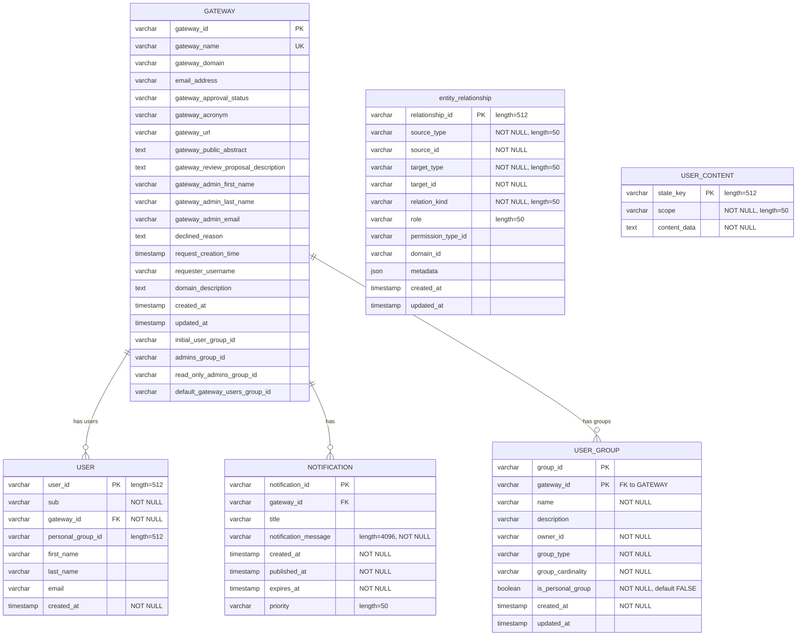
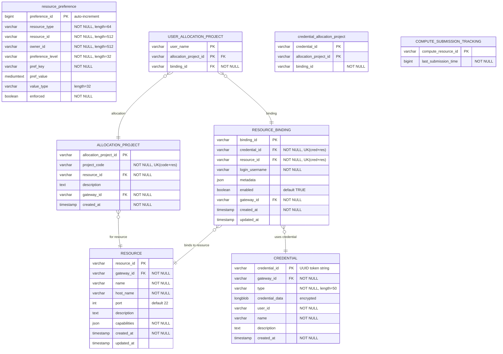
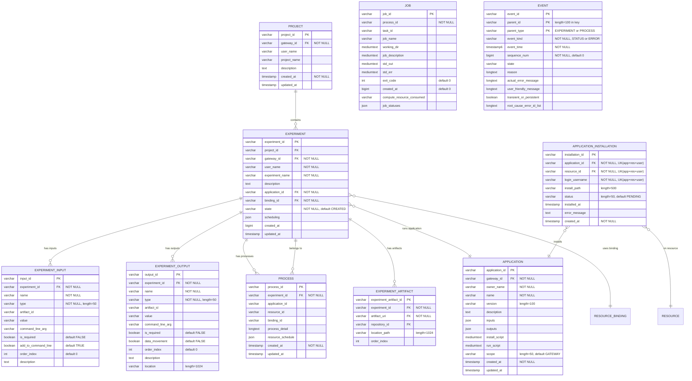
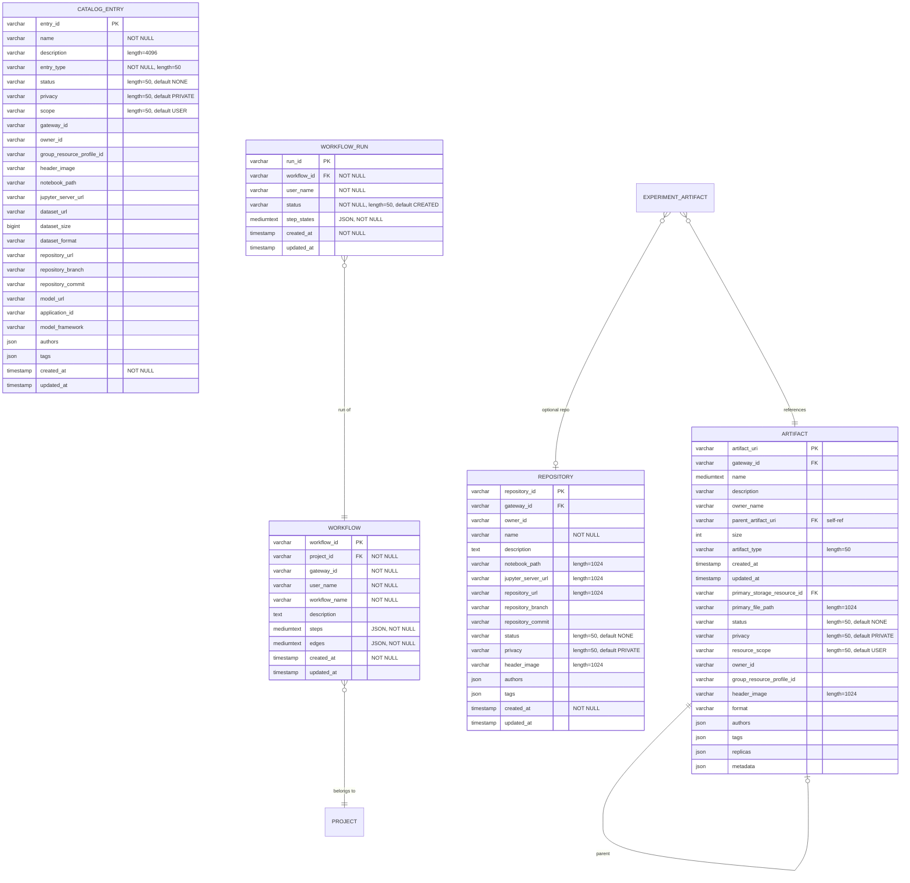
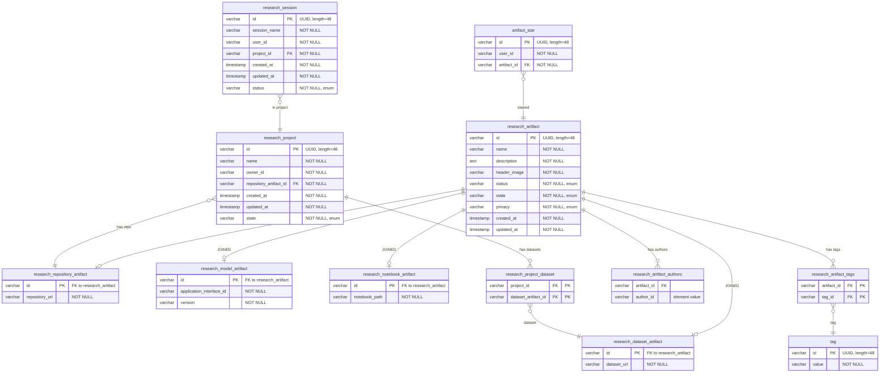

# Apache Airavata Database ERD

Entity-Relationship Diagram for the Airavata database schema.

## Schema Summary

- **41 tables** + **2 views** in the current schema
- **26 tables** created by Flyway V1 baseline migration (uppercase names)
- **15 tables** created by Hibernate `ddl-auto=update` (lowercase names)
- **2 views**: `LATEST_EXPERIMENT_STATUS`, `EXPERIMENT_SUMMARY`
- **Engine**: InnoDB, charset `utf8mb4`, collation `utf8mb4_unicode_ci`
- **Requires**: MariaDB 10.2+ (JSON column support)

### Table Origin

| Origin | Tables |
|--------|--------|
| Flyway V1 | GATEWAY, USER, EVENT, NOTIFICATION, RESOURCE, CREDENTIAL (CredentialStoreEntity), RESOURCE_BINDING, APPLICATION, APPLICATION_INSTALLATION, PROJECT, EXPERIMENT, EXPERIMENT_INPUT, EXPERIMENT_OUTPUT, PROCESS, JOB, ARTIFACT, REPOSITORY, EXPERIMENT_ARTIFACT, USER_GROUP, ALLOCATION_PROJECT, USER_ALLOCATION_PROJECT, WORKFLOW, WORKFLOW_RUN, CATALOG_ENTRY, COMPUTE_SUBMISSION_TRACKING, USER_CONTENT |
| Hibernate | entity_relationship, resource_preference, credential_allocation_project, research_artifact, research_repository_artifact, research_model_artifact, research_notebook_artifact, research_dataset_artifact, tag, artifact_star, research_project, research_session, research_artifact_tags, research_artifact_authors, research_project_dataset |

---

## Part 1 — Tenant, Identity & IAM

6 tables: GATEWAY, USER, NOTIFICATION, USER_GROUP, entity_relationship, USER_CONTENT



**Notes:**
- `USER.user_id` format: `{sub}@{gatewayId}` (generated by `@PrePersist`)
- `USER.first_name`, `last_name`, `email` are Hibernate-added columns (not in V1 migration)
- `USER_GROUP` has composite PK: `(group_id, gateway_id)`
- `entity_relationship.relation_kind`: `MEMBER_OF` (group membership), `HAS_PERMISSION` (sharing)
- `entity_relationship` has no FK constraints — uses string discriminators for polymorphic references

---

## Part 2 — Compute & Credentials

8 tables: RESOURCE, CREDENTIAL, RESOURCE_BINDING, resource_preference, ALLOCATION_PROJECT, USER_ALLOCATION_PROJECT, credential_allocation_project, COMPUTE_SUBMISSION_TRACKING



**Notes:**
- `RESOURCE.capabilities` JSON schema: `{ compute?: { type, batchQueues[] }, storage?: { protocol, basePath } }`
- `RESOURCE` is a unified table replacing the old COMPUTE_RESOURCE, STORAGE_RESOURCE, and interface tables
- `CREDENTIAL` table stores encrypted SSH keys, passwords, and certificates. PK is a UUID token string. `CredentialStoreEntity` maps to this table.
- `RESOURCE_BINDING.metadata` JSON: `{ scratchPath, defaultQueue, maxWalltime, storagePath, allocationProjects[] }`
- `resource_preference.resource_type` enum: `COMPUTE`, `STORAGE`, `USER_GROUP_SELECTION`, etc.
- `resource_preference.preference_level` enum: `GATEWAY`, `GROUP`, `USER`
- `credential_allocation_project` is Hibernate-managed (no FK constraints in DDL)

---

## Part 3 — Application & Experiment Pipeline

10 tables + 2 views: APPLICATION, APPLICATION_INSTALLATION, PROJECT, EXPERIMENT, EXPERIMENT_INPUT, EXPERIMENT_OUTPUT, PROCESS, JOB, EVENT, EXPERIMENT_ARTIFACT



**Notes:**
- `EXPERIMENT_INPUT` and `EXPERIMENT_OUTPUT` are separate entity tables (not JSON columns). Each can be a plain parameter or an artifact reference (`type=ARTIFACT`, `artifact_id` populated).
- `EXPERIMENT.scheduling` JSON: `{queueName, nodeCount, cpuCount, walltime, allocationProject}`
- `EXPERIMENT.created_at` is `BIGINT` (Unix timestamp in millis), not `TIMESTAMP`
- `PROCESS.resource_schedule` JSON: scheduling overrides used at submission time
- `JOB.job_statuses` JSON: `[{state, reason, timeOfStateChange}]` — job status history
- `JOB` has no FK constraint to PROCESS in V1 DDL (index only); JPA `@ManyToOne` adds logical relationship
- `EVENT` has composite PK: `(event_id, parent_id(100), parent_type)` with CHECK constraint on parent_type
- `EVENT.event_time` is `TIMESTAMP(6)` (microsecond precision)
- `EVENT.event_kind`: `STATUS` (state transitions) or `ERROR` (error records)
- Experiment state is stored directly as `EXPERIMENT.STATE` column. Process statuses are still stored in the EVENT table and loaded as `@Transient` fields.

### Views

```sql
-- Latest status per experiment (highest sequence_num)
CREATE VIEW LATEST_EXPERIMENT_STATUS AS
SELECT parent_id AS experiment_id, state, event_time AS time_of_state_change, reason
FROM EVENT WHERE parent_type = 'EXPERIMENT' AND event_kind = 'STATUS'
  AND sequence_num = (SELECT MAX(sequence_num) FROM EVENT e2
    WHERE e2.parent_id = EVENT.parent_id
      AND e2.parent_type = 'EXPERIMENT' AND e2.event_kind = 'STATUS');

-- Experiment summary with latest status
CREATE VIEW EXPERIMENT_SUMMARY AS
SELECT e.experiment_id, e.project_id, e.gateway_id, e.user_name,
       e.experiment_name, e.created_at, e.description,
       es.state, es.time_of_state_change
FROM EXPERIMENT e LEFT JOIN LATEST_EXPERIMENT_STATUS es
  ON e.experiment_id = es.experiment_id;
```

`ExperimentSummaryEntity` is an `@Immutable` JPA entity mapped to the `EXPERIMENT_SUMMARY` view with columns: `experiment_id`, `project_id`, `gateway_id`, `created_at`, `user_name`, `experiment_name`, `description`, `execution_id`, `state`, `resource_host_id`, `time_of_state_change`.

---

## Part 4 — Artifacts, Catalog & Workflow

5 tables: ARTIFACT, REPOSITORY, CATALOG_ENTRY, WORKFLOW, WORKFLOW_RUN



**Notes:**
- `ARTIFACT.replicas` JSON: `[{replicaId, storageResourceId, filePath, ...}]`
- `ARTIFACT.metadata` JSON: arbitrary key-value metadata
- `ARTIFACT.parent_artifact_uri` is a self-referencing FK for hierarchical artifacts
- `ARTIFACT.primary_storage_resource_id` FK references `RESOURCE.resource_id`
- `CATALOG_ENTRY` is a wide polymorphic table; `entry_type` discriminates: DATASET, MODEL, NOTEBOOK, REPOSITORY
- `WORKFLOW.steps` and `edges` are stored as MEDIUMTEXT (JSON-serialized `WorkflowStep[]` and `WorkflowEdge[]`)
- `WORKFLOW_RUN.step_states` is MEDIUMTEXT (JSON-serialized `Map<String, WorkflowRunStepState>`)

---

## Part 5 — Research Platform

12 tables: research_artifact (+ 4 subtypes), tag, artifact_star, research_project, research_session, research_artifact_tags, research_artifact_authors, research_project_dataset

All tables in this section are Hibernate-managed (`ddl-auto=update`), not in V1 migration.



**Notes:**
- `research_artifact` uses `@Inheritance(strategy = JOINED)` — subtypes stored in separate tables sharing the same PK
- All IDs are UUID (`@UuidGenerator`, length=48)
- `research_artifact.status` enum: `ArtifactStatus` (e.g., NONE, ACTIVE)
- `research_artifact.state` enum: `ArtifactState` (e.g., DRAFT, PUBLISHED)
- `research_artifact.privacy` enum: `Privacy` (e.g., PRIVATE, PUBLIC)
- `research_artifact_authors` is an `@ElementCollection` table (Set<String>)
- `research_artifact_tags` is a `@ManyToMany` join table
- `research_project_dataset` is a `@ManyToMany` join table (ResearchProject ↔ DatasetArtifact)
- `research_project.repository_artifact_id` FK to `research_repository_artifact` (ManyToOne, EAGER fetch)
- `research_session.status` enum: `SessionStatus`

---

## Complete Table Index

| # | Table | PK | Origin | JPA Entity |
|---|-------|-----|--------|------------|
| 1 | GATEWAY | gateway_id | V1 | GatewayEntity |
| 2 | USER | user_id | V1+Hibernate | UserEntity |
| 3 | EVENT | (event_id, parent_id, parent_type) | V1 | EventEntity |
| 4 | NOTIFICATION | notification_id | V1 | NotificationEntity |
| 5 | RESOURCE | resource_id | V1 | ComputeResourceEntity |
| 6 | CREDENTIAL | credential_id | V1 | CredentialStoreEntity |
| 7 | RESOURCE_BINDING | binding_id | V1 | ResourceBindingEntity |
| 8 | resource_preference | preference_id (auto) | Hibernate | ResourcePreferenceEntity |
| 9 | APPLICATION | application_id | V1 | ApplicationEntity |
| 10 | APPLICATION_INSTALLATION | installation_id | V1 | ApplicationInstallationEntity |
| 11 | PROJECT | project_id | V1 | ProjectEntity |
| 12 | EXPERIMENT | experiment_id | V1 | ExperimentEntity |
| 13 | EXPERIMENT_INPUT | input_id | V1 | ExperimentInputEntity |
| 14 | EXPERIMENT_OUTPUT | output_id | V1 | ExperimentOutputEntity |
| 15 | PROCESS | process_id | V1 | ProcessEntity |
| 16 | JOB | job_id | V1 | JobEntity |
| 17 | ARTIFACT | artifact_uri | V1 | ArtifactEntity |
| 18 | REPOSITORY | repository_id | V1 | _(legacy, no active entity)_ |
| 19 | EXPERIMENT_ARTIFACT | experiment_artifact_id | V1 | ExperimentArtifactEntity |
| 20 | USER_GROUP | (group_id, gateway_id) | V1 | UserGroupEntity |
| 21 | entity_relationship | relationship_id | Hibernate | EntityRelationshipEntity |
| 22 | USER_CONTENT | state_key | V1 | UserContentEntity |
| 23 | ALLOCATION_PROJECT | allocation_project_id | V1 | AllocationProjectEntity |
| 24 | USER_ALLOCATION_PROJECT | (user_name, alloc_project_id) | V1 | _(no JPA entity)_ |
| 25 | credential_allocation_project | (credential_id, alloc_project_id) | Hibernate | CredentialAllocationProjectEntity |
| 26 | WORKFLOW | workflow_id | V1 | WorkflowEntity |
| 27 | WORKFLOW_RUN | run_id | V1 | WorkflowRunEntity |
| 28 | CATALOG_ENTRY | entry_id | V1 | _(no active entity)_ |
| 29 | COMPUTE_SUBMISSION_TRACKING | compute_resource_id | V1 | ComputeSubmissionTrackingEntity |
| 30 | research_artifact | id | Hibernate | ResearchArtifactEntity (abstract) |
| 31 | research_repository_artifact | id | Hibernate | RepositoryArtifactEntity |
| 32 | research_model_artifact | id | Hibernate | ModelArtifactEntity |
| 33 | research_notebook_artifact | id | Hibernate | NotebookArtifactEntity |
| 34 | research_dataset_artifact | id | Hibernate | DatasetArtifactEntity |
| 35 | tag | id | Hibernate | TagEntity |
| 36 | artifact_star | id | Hibernate | ArtifactStarEntity |
| 37 | research_project | id | Hibernate | ResearchProjectEntity |
| 38 | research_session | id | Hibernate | SessionEntity |
| 39 | research_artifact_tags | (artifact_id, tag_id) | Hibernate | _(@ManyToMany join)_ |
| 40 | research_artifact_authors | (artifact_id, value) | Hibernate | _(@ElementCollection)_ |
| 41 | research_project_dataset | (project_id, dataset_id) | Hibernate | _(@ManyToMany join)_ |
| — | EXPERIMENT_SUMMARY | _(view)_ | V1 | ExperimentSummaryEntity (@Immutable) |
| — | LATEST_EXPERIMENT_STATUS | _(view)_ | V1 | _(used by EXPERIMENT_SUMMARY)_ |

---

## Foreign Key Relationships

### V1 Flyway-defined FKs

| Source Table | Column | Target Table | Column | On Delete |
|-------------|--------|-------------|--------|-----------|
| USER | gateway_id | GATEWAY | gateway_id | CASCADE |
| NOTIFICATION | gateway_id | GATEWAY | gateway_id | SET NULL |
| RESOURCE | gateway_id | GATEWAY | gateway_id | CASCADE |
| CREDENTIAL | gateway_id | GATEWAY | gateway_id | CASCADE |
| RESOURCE_BINDING | credential_id | CREDENTIAL | credential_id | CASCADE |
| RESOURCE_BINDING | resource_id | RESOURCE | resource_id | CASCADE |
| RESOURCE_BINDING | gateway_id | GATEWAY | gateway_id | CASCADE |
| APPLICATION | gateway_id | GATEWAY | gateway_id | CASCADE |
| APPLICATION_INSTALLATION | application_id | APPLICATION | application_id | CASCADE |
| APPLICATION_INSTALLATION | resource_id | RESOURCE | resource_id | CASCADE |
| PROJECT | gateway_id | GATEWAY | gateway_id | CASCADE |
| EXPERIMENT | project_id | PROJECT | project_id | SET NULL |
| EXPERIMENT | gateway_id | GATEWAY | gateway_id | CASCADE |
| EXPERIMENT | application_id | APPLICATION | application_id | RESTRICT |
| EXPERIMENT | binding_id | RESOURCE_BINDING | binding_id | RESTRICT |
| EXPERIMENT_INPUT | experiment_id | EXPERIMENT | experiment_id | CASCADE |
| EXPERIMENT_OUTPUT | experiment_id | EXPERIMENT | experiment_id | CASCADE |
| PROCESS | experiment_id | EXPERIMENT | experiment_id | CASCADE |
| ARTIFACT | parent_artifact_uri | ARTIFACT | artifact_uri | SET NULL |
| ARTIFACT | primary_storage_resource_id | RESOURCE | resource_id | SET NULL |
| ARTIFACT | gateway_id | GATEWAY | gateway_id | SET NULL |
| EXPERIMENT_ARTIFACT | experiment_id | EXPERIMENT | experiment_id | CASCADE |
| EXPERIMENT_ARTIFACT | artifact_uri | ARTIFACT | artifact_uri | CASCADE |
| EXPERIMENT_ARTIFACT | repository_id | REPOSITORY | repository_id | SET NULL |
| USER_GROUP | gateway_id | GATEWAY | gateway_id | CASCADE |
| ALLOCATION_PROJECT | resource_id | RESOURCE | resource_id | CASCADE |
| ALLOCATION_PROJECT | gateway_id | GATEWAY | gateway_id | CASCADE |
| USER_ALLOCATION_PROJECT | allocation_project_id | ALLOCATION_PROJECT | allocation_project_id | CASCADE |
| USER_ALLOCATION_PROJECT | binding_id | RESOURCE_BINDING | binding_id | CASCADE |
| REPOSITORY | gateway_id | GATEWAY | gateway_id | SET NULL |
| WORKFLOW | project_id | PROJECT | project_id | _(no action)_ |
| WORKFLOW_RUN | workflow_id | WORKFLOW | workflow_id | _(no action)_ |

### JPA-managed relationships (no DDL FK in V1)

| Source Entity | Field | Target Entity | JPA Annotation |
|--------------|-------|--------------|----------------|
| ExperimentEntity | project | ProjectEntity | @ManyToOne(LAZY) |
| ProcessEntity | experiment | ExperimentEntity | @ManyToOne(LAZY) |
| ProcessEntity | jobs | List\<JobEntity\> | @OneToMany(cascade=ALL, orphanRemoval) |
| JobEntity | process | ProcessEntity | @ManyToOne(LAZY) |
| ExperimentEntity | processes | List\<ProcessEntity\> | @OneToMany(cascade=ALL, orphanRemoval) |
| ExperimentEntity | inputs | List\<ExperimentInputEntity\> | @OneToMany(cascade=ALL, orphanRemoval) |
| ExperimentEntity | outputs | List\<ExperimentOutputEntity\> | @OneToMany(cascade=ALL, orphanRemoval) |
| ExperimentInputEntity | experiment | ExperimentEntity | @ManyToOne(LAZY) |
| ExperimentOutputEntity | experiment | ExperimentEntity | @ManyToOne(LAZY) |
| ExperimentEntity | artifacts | List\<ExperimentArtifactEntity\> | @OneToMany(cascade=ALL, orphanRemoval) |
| ExperimentArtifactEntity | experiment | ExperimentEntity | @ManyToOne(LAZY) |
| ApplicationInstallationEntity | application | ApplicationEntity | @ManyToOne(LAZY) |
| ApplicationInstallationEntity | resource | ComputeResourceEntity | @ManyToOne(LAZY) |
| ComputeResourceEntity | gateway | GatewayEntity | @ManyToOne(LAZY) |
| ResourceBindingEntity | resource | ComputeResourceEntity | @ManyToOne(LAZY) |
| UserEntity | gateway | GatewayEntity | @ManyToOne(LAZY) |
| UserGroupEntity | gateway | GatewayEntity | @ManyToOne(LAZY) |
| ProjectEntity | experiments | List\<ExperimentEntity\> | @OneToMany(LAZY) |
| ResearchProjectEntity | repositoryArtifact | RepositoryArtifactEntity | @ManyToOne(EAGER) |
| ResearchProjectEntity | datasetArtifacts | Set\<DatasetArtifactEntity\> | @ManyToMany(EAGER) |
| ArtifactStarEntity | artifact | ResearchArtifactEntity | @ManyToOne(EAGER) |
| SessionEntity | project | ResearchProjectEntity | @ManyToOne(EAGER) |
| ResearchArtifactEntity | tags | Set\<TagEntity\> | @ManyToMany(cascade=MERGE, EAGER) |
| ResearchArtifactEntity | authors | Set\<String\> | @ElementCollection(EAGER) |

---

## Unique Constraints

| Table | Constraint Name | Columns |
|-------|----------------|---------|
| GATEWAY | uk_gateway_name | (gateway_name) |
| RESOURCE_BINDING | uk_binding_cred_resource | (credential_id, resource_id) |
| APPLICATION_INSTALLATION | uk_installation | (application_id, resource_id, login_username) |
| ALLOCATION_PROJECT | uk_alloc_project | (project_code, resource_id) |

---

## Indexes

| Table | Index Name | Columns |
|-------|-----------|---------|
| GATEWAY | idx_gateway_approval_status | (gateway_approval_status) |
| USER | idx_user_sub | (sub) |
| USER | idx_user_gateway_id | (gateway_id) |
| USER | idx_user_sub_gateway | (sub, gateway_id) |
| EVENT | idx_event_parent | (parent_id, parent_type) |
| EVENT | idx_event_kind | (event_kind) |
| EVENT | idx_event_parent_kind_seq | (parent_id, parent_type, event_kind, sequence_num DESC) |
| EVENT | idx_event_time | (event_time) |
| NOTIFICATION | idx_notification_gateway | (gateway_id) |
| RESOURCE | idx_resource_gateway | (gateway_id) |
| CREDENTIAL | idx_credential_gateway | (gateway_id) |
| CREDENTIAL | idx_credential_user | (user_id) |
| CREDENTIAL | idx_credential_gateway_user | (gateway_id, user_id) |
| RESOURCE_BINDING | idx_binding_credential | (credential_id) |
| RESOURCE_BINDING | idx_binding_resource | (resource_id) |
| RESOURCE_BINDING | idx_binding_gateway | (gateway_id) |
| APPLICATION | idx_application_gateway | (gateway_id) |
| APPLICATION | idx_application_owner | (owner_name) |
| PROJECT | idx_project_gateway | (gateway_id) |
| PROJECT | idx_project_user | (user_name) |
| EXPERIMENT | idx_experiment_project | (project_id) |
| EXPERIMENT | idx_experiment_gateway | (gateway_id) |
| EXPERIMENT | idx_experiment_user | (user_name) |
| EXPERIMENT | idx_experiment_app | (application_id) |
| EXPERIMENT | idx_experiment_binding | (binding_id) |
| EXPERIMENT | idx_experiment_created_at | (created_at) |
| EXPERIMENT_INPUT | idx_exp_input_experiment | (experiment_id) |
| EXPERIMENT_INPUT | idx_exp_input_artifact | (artifact_id) |
| EXPERIMENT_OUTPUT | idx_exp_output_experiment | (experiment_id) |
| EXPERIMENT_OUTPUT | idx_exp_output_artifact | (artifact_id) |
| PROCESS | idx_process_experiment | (experiment_id) |
| JOB | idx_job_process_id | (process_id) |
| JOB | idx_job_task_id | (task_id) |
| JOB | idx_job_name | (job_name) |
| ARTIFACT | idx_artifact_gateway | (gateway_id) |
| ARTIFACT | idx_artifact_gateway_owner | (gateway_id, owner_name) |
| ARTIFACT | idx_artifact_type | (artifact_type) |
| ARTIFACT | idx_artifact_privacy | (privacy) |
| ARTIFACT | idx_artifact_scope | (resource_scope) |
| ARTIFACT | idx_artifact_owner_id | (owner_id) |
| ARTIFACT | idx_artifact_primary_storage | (primary_storage_resource_id) |
| EXPERIMENT_ARTIFACT | idx_exp_artifact_experiment | (experiment_id) |
| EXPERIMENT_ARTIFACT | idx_exp_artifact_uri | (artifact_uri) |
| USER_GROUP | idx_user_group_owner | (owner_id) |
| USER_GROUP | idx_user_group_type | (group_type) |
| USER_GROUP | idx_personal_group | (is_personal_group, owner_id) |
| ALLOCATION_PROJECT | idx_alloc_project_resource | (resource_id) |
| ALLOCATION_PROJECT | idx_alloc_project_gateway | (gateway_id) |
| REPOSITORY | idx_repository_gateway | (gateway_id) |
| REPOSITORY | idx_repository_owner | (owner_id) |
| REPOSITORY | idx_repository_url | (repository_url(255)) |
| WORKFLOW | idx_workflow_project | (project_id, gateway_id) |
| WORKFLOW | idx_workflow_user | (user_name, gateway_id) |
| WORKFLOW_RUN | idx_workflow_run_workflow | (workflow_id) |
| WORKFLOW_RUN | idx_workflow_run_user | (user_name) |
| CATALOG_ENTRY | idx_catalog_entry_type | (entry_type) |
| CATALOG_ENTRY | idx_catalog_entry_gateway | (gateway_id) |
| CATALOG_ENTRY | idx_catalog_entry_owner | (owner_id) |

---

## JSON Column Schema Reference

| Table | Column | JSON Structure |
|-------|--------|---------------|
| RESOURCE | capabilities | `{ compute?: { type: "SLURM"\|"FORK", batchQueues?: [{name, maxRuntime, maxNodes, maxProcessors, isDefault}] }, storage?: { protocol: "SFTP"\|"SCP", basePath? } }` |
| RESOURCE_BINDING | metadata | `{ scratchLocation?, defaultQueue?, maxWalltime?, storagePath?, allocationProjects?: [{code, name}] }` |
| APPLICATION | inputs | `[{name, type, description, required, defaultValue}]` |
| APPLICATION | outputs | `[{name, type, description, required}]` |
| EXPERIMENT | scheduling | `{queueName, nodeCount, cpuCount, walltime, allocationProject}` |
| PROCESS | resource_schedule | `{queueName, allocationProjectNumber, overrideScratchLocation, staticWorkingDir, credentialToken, ...}` |
| JOB | job_statuses | `[{state: "QUEUED"\|"ACTIVE"\|"COMPLETED"\|..., reason, timeOfStateChange}]` |
| ARTIFACT | authors | `["author1", "author2"]` |
| ARTIFACT | tags | `["tag1", "tag2"]` |
| ARTIFACT | replicas | `[{replicaId, storageResourceId, filePath, ...}]` |
| ARTIFACT | metadata | `{key: value, ...}` |
| REPOSITORY | authors | `["author1", "author2"]` |
| REPOSITORY | tags | `["tag1", "tag2"]` |
| CATALOG_ENTRY | authors | `["author1", "author2"]` |
| CATALOG_ENTRY | tags | `["tag1", "tag2"]` |
| WORKFLOW | steps | `[{stepId, experimentSpec, ...}]` (MEDIUMTEXT) |
| WORKFLOW | edges | `[{sourceStepId, targetStepId, condition}]` (MEDIUMTEXT) |
| WORKFLOW_RUN | step_states | `{stepId: {status, experimentId, ...}}` (MEDIUMTEXT) |
| entity_relationship | metadata | `{key: value, ...}` |

---

## Execution Model

```
EXPERIMENT (user request)
    ├── PROCESS (execution unit)
    │       └── JOB (HPC/fork job tracking)
    └── EVENT (status + error history)
            ├── EVENT_KIND = 'STATUS' (state transitions)
            └── EVENT_KIND = 'ERROR' (error records)
```

- **EXPERIMENT** = user-level request. Tied to APPLICATION, RESOURCE_BINDING, PROJECT.
- **PROCESS** = operations-level execution unit. Carries APPLICATION_ID, RESOURCE_ID, BINDING_ID, RESOURCE_SCHEDULE.
- **JOB** = HPC/fork job submitted to a compute resource. Status history stored as JSON in `job_statuses`.
- **EVENT** = unified status/error audit log. `PARENT_TYPE` discriminates EXPERIMENT vs PROCESS.
- Experiment state is stored directly as `EXPERIMENT.STATE` column. Process statuses are stored in the EVENT table.
