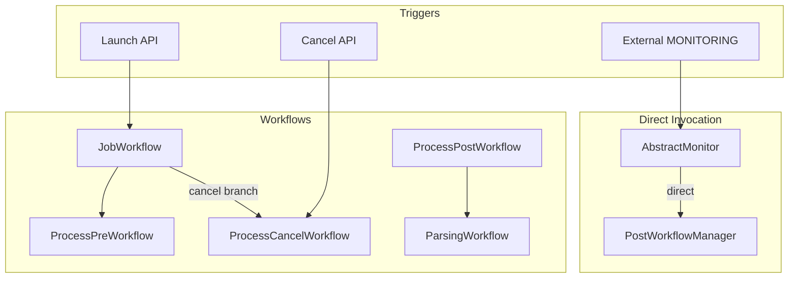

# Remove Pub-Sub and Use Workflow-Driven Flows

**Status:** Planning Document - Not Yet Implemented

This document outlines a plan for removing pub-sub messaging in favor of workflow-driven flows. See [DAPR_WORKFLOW_STATE_MACHINE_SPEC.md](DAPR_WORKFLOW_STATE_MACHINE_SPEC.md) for the current implemented state machine and workflow architecture.

---

## Overview

Remove all pub-sub used for DB synchronization and internal wiring. Remove all pub-sub unless strictly needed for a state transition. Cover main flows (launch, cancel, process→experiment state, post-workflow, parsing) from workflow abstraction so they are easier to maintain and track.

---

## Current Pub-Sub Usage

| Topic | Publish | Subscribe | Purpose |
|-------|---------|-----------|---------|
| **STATUS** | [WorkflowManager](modules/airavata-api/src/main/java/org/apache/airavata/workflow/common/WorkflowManager.java) (process), [OrchestratorService](modules/airavata-api/src/main/java/org/apache/airavata/service/orchestrator/OrchestratorService.java) (experiment) | Integration tests; production routing unclear | DB sync: notify others of status changes; `handleProcessStatusChange` updates experiment state from process state |
| **EXPERIMENT_LAUNCH** | External / API | [OrchestratorService](modules/airavata-api/src/main/java/org/apache/airavata/service/orchestrator/OrchestratorService.java) (ExperimentMessageHandler) | Trigger launch from message |
| **PROCESS_LAUNCH** | [SimpleOrchestratorImpl](modules/airavata-api/src/main/java/org/apache/airavata/workflow/orchestrator/SimpleOrchestratorImpl.java) (TERMINATEPROCESS only) | [PreWorkflowManager](modules/airavata-api/src/main/java/org/apache/airavata/workflow/process/pre/PreWorkflowManager.java) (ProcessLaunchMessageHandler) | Cancel: publish TERMINATEPROCESS → handler schedules ProcessCancelWorkflow |
| **PARSING** | [ParsingTriggeringTask](modules/airavata-api/src/main/java/org/apache/airavata/task/parsing/ParsingTriggeringTask.java) (via [ParsingTriggeringActivity](modules/airavata-api/src/main/java/org/apache/airavata/activities/process/post/ParsingTriggeringActivity.java) → task) | [ParserWorkflowManager](modules/airavata-api/src/main/java/org/apache/airavata/workflow/process/parsing/ParserWorkflowManager.java) (DaprParsingHandler) | ProcessPostWorkflow → activity → task → publish → ParserWorkflowManager |
| **MONITORING** | External (agents) | [RealtimeMonitorHandler](modules/airavata-api/src/main/java/org/apache/airavata/workflow/monitoring/realtime/RealtimeMonitorHandler.java) | External raw job-status ingress |
| **MONITORING_JOB_STATUS** | [AbstractMonitor](modules/airavata-api/src/main/java/org/apache/airavata/monitor/AbstractMonitor.java) → [MessageProducer](modules/airavata-api/src/main/java/org/apache/airavata/orchestrator/internal/monitoring/MessageProducer.java) | [PostWorkflowManager](modules/airavata-api/src/main/java/org/apache/airavata/workflow/process/post/PostWorkflowManager.java) (DaprJobStatusHandler) | Internal: monitor handlers → publish JobStatusResult → PostWorkflowManager |

Dapr delivery: [DaprSubscriptionController](modules/airavata-api/src/main/java/org/apache/airavata/orchestrator/internal/messaging/DaprSubscriptionController.java) handles MONITORING, PARSING, MONITORING_JOB_STATUS; EXPERIMENT_LAUNCH / PROCESS_LAUNCH use [DaprMessagingFactory](modules/airavata-api/src/main/java/org/apache/airavata/orchestrator/internal/messaging/DaprMessagingFactory.java) subscribers.

---

## Target: Workflow-Driven Flows, No Internal Pub-Sub

- **DB sync:** No publish after DB updates. DB is source of truth; no fan-out for sync.
- **State transitions:** Done inside workflows/activities (e.g. JobWorkflow, ApplyExperimentTransitionActivity). No pub-sub for process→experiment or other internal transitions.
- **Main flows:** Launch, cancel, process→experiment, post-workflow, parsing are **workflow-driven** (explicit in code). Easier to maintain and track.
- **External ingress:** Keep **at most one** pub-sub **only if** required for external job-status ingestion (MONITORING). All internal communication is direct/workflow-based.

---

## 1. Remove STATUS Pub-Sub (DB Sync)

**Today:** `publishProcessStatus` and `updateAndPublishExperimentStatus` update DB then publish to STATUS. Subscribers (or registry-driven flow) trigger `handleProcessStatusChange` → experiment state updates.

**Changes:**

- **Stop publishing** process and experiment status to STATUS. Update DB only.
- **Remove** STATUS publisher usage from [WorkflowManager](modules/airavata-api/src/main/java/org/apache/airavata/workflow/common/WorkflowManager.java) (`initStatusPublisher`, `getStatusPublisher`, `publishProcessStatus` publish path) and from [OrchestratorService](modules/airavata-api/src/main/java/org/apache/airavata/service/orchestrator/OrchestratorService.java) (`updateAndPublishExperimentStatus` publish path). Keep **DB update** logic (registry); extract a shared "update process status" / "update experiment status" helper used by workflows/activities.
- **Remove** STATUS subscriber and **handleProcessStatusChange** as a message-driven handler. Process→experiment transition moves into workflow: when an activity updates process state, it also **applies experiment transition** (e.g. via `JobWorkflowTransitionRules` + `ApplyExperimentTransitionActivity` or equivalent) and updates experiment state in DB—no publish.
- **ApplyExperimentTransitionActivity** (from JobWorkflow plan): only **registry updates**; no STATUS publish.

**Files to modify:**

- [WorkflowManager](modules/airavata-api/src/main/java/org/apache/airavata/workflow/common/WorkflowManager.java): remove status publisher init and publish; keep registry-based update API (or call into a shared service).
- [OrchestratorService](modules/airavata-api/src/main/java/org/apache/airavata/service/orchestrator/OrchestratorService.java): remove STATUS publisher, `updateAndPublishExperimentStatus` publish; retain DB-update-only paths; remove or refactor `handleProcessStatusChange` so it is **not** invoked from pub-sub (logic moves to workflow/activities).
- [PreWorkflowManager](modules/airavata-api/src/main/java/org/apache/airavata/workflow/process/pre/PreWorkflowManager.java), [PostWorkflowManager](modules/airavata-api/src/main/java/org/apache/airavata/workflow/process/post/PostWorkflowManager.java): stop using `publishProcessStatus`; use registry-only update (or shared helper).

---

## 2. Remove EXPERIMENT_LAUNCH and PROCESS_LAUNCH Pub-Sub

**Launch:** Already moving to "API schedules JobWorkflow" (orchestrator-as-workflow plan). **Remove** EXPERIMENT_LAUNCH subscriber and `ExperimentMessageHandler` for launch. Launch = API (or equivalent) schedules JobWorkflow directly.

**Cancel:** Today cancel publishes TERMINATEPROCESS → ProcessLaunchMessageHandler → schedules ProcessCancelWorkflow. **Change:** Cancel API or JobWorkflow cancel path **schedules ProcessCancelWorkflow** per process directly. No TERMINATEPROCESS publish, no PROCESS_LAUNCH subscriber.

**Changes:**

- Remove `ExperimentMessageHandler` subscription for EXPERIMENT_LAUNCH (and related wiring in OrchestratorService). *(Note: May already be removed)*
- Remove `ProcessLaunchMessageHandler` and PROCESS_LAUNCH subscriber from [PreWorkflowManager](modules/airavata-api/src/main/java/org/apache/airavata/workflow/process/pre/PreWorkflowManager.java). *(Note: May already be removed)*
- Remove [SimpleOrchestratorImpl](modules/airavata-api/src/main/java/org/apache/airavata/workflow/orchestrator/SimpleOrchestratorImpl.java) process launch publisher and TERMINATEPROCESS publish; implement cancel by scheduling ProcessCancelWorkflow (or use ScheduleCancelWorkflowActivity from JobWorkflow plan).

---

## 3. Parsing: Workflow-Only, No PARSING Pub-Sub

**Today:** ProcessPostWorkflow → ParsingTriggeringActivity → ParsingTriggeringTask → publish to PARSING → DaprSubscriptionController → ParserWorkflowManager.onParsingMessage.

**Change:** ParsingTriggeringActivity **schedules ParsingWorkflow** (Dapr workflow) via `DaprWorkflowClient.scheduleNewWorkflow(ParsingWorkflow.class, input)` with `ProcessCompletionMessage`-equivalent input. No PARSING publish, no PARSING subscriber.

**Concrete steps:**

- Update [ParsingTriggeringActivity](modules/airavata-api/src/main/java/org/apache/airavata/activities/process/post/ParsingTriggeringActivity.java): **replace** "create ParsingTriggeringTask and run it" with "schedule ParsingWorkflow" using `DaprWorkflowClient` (from `DaprWorkflowClientHolder`). Reuse `ProcessCompletionMessage` or a small record as workflow input.
- [ParsingWorkflow](modules/airavata-api/src/main/java/org/apache/airavata/workflow/process/parsing/ParsingWorkflow.java) already accepts `ProcessCompletionMessage`; keep that contract.
- Remove [ParsingTriggeringTask](modules/airavata-api/src/main/java/org/apache/airavata/task/parsing/ParsingTriggeringTask.java) usage for this flow (and its publish to PARSING). Deprecate or remove the task if unused elsewhere.
- [ParserWorkflowManager](modules/airavata-api/src/main/java/org/apache/airavata/workflow/process/parsing/ParserWorkflowManager.java): remove `DaprParsingHandler` / `onParsingMessage` **for pub-sub**. Keep any config or helpers used by ParsingWorkflow if needed.
- [DaprSubscriptionController](modules/airavata-api/src/main/java/org/apache/airavata/orchestrator/internal/messaging/DaprSubscriptionController.java): remove PARSING branch (or leave unused until topic removed).

---

## 4. Job Status → PostWorkflow: Direct Invoke, No MONITORING_JOB_STATUS Pub-Sub

**Today:** RealtimeMonitorHandler / EmailMonitorWorkflow → `AbstractMonitor.submitJobStatus` → MessageProducer → MONITORING_JOB_STATUS → PostWorkflowManager.onJobStatusMessage.

**Change:** Monitor handlers **directly invoke** post-workflow logic. No MessageProducer, no MONITORING_JOB_STATUS.

**Options:**

- **A.** Inject a `JobStatusService` (or `PostWorkflowManager`) into `AbstractMonitor` (or pass it into handlers). `submitJobStatus` **calls** `jobStatusService.handleJobStatus(jobStatusResult)` (or `postWorkflowManager.onJobStatusMessage(...)`) instead of publishing. PostWorkflowManager keeps `process(JobStatusResult)` logic; it is invoked **in-process**.
- **B.** Handlers **schedule ProcessPostWorkflow** (or a dedicated JobStatusWorkflow) with `JobStatusResult` as input. Workflow encapsulates post-workflow behavior.

**Recommendation:** Option A for minimal change: direct call into PostWorkflowManager's existing processing logic. AbstractMonitor no longer uses MessageProducer.

**Concrete steps:**

- Change [AbstractMonitor](modules/airavata-api/src/main/java/org/apache/airavata/monitor/AbstractMonitor.java): replace MessageProducer publish with a call to a `JobStatusHandler` (e.g. PostWorkflowManager) that performs the same processing as `onJobStatusMessage`. Ensure validation and threading (e.g. `processingPool`) remain as today.
- [PostWorkflowManager](modules/airavata-api/src/main/java/org/apache/airavata/workflow/process/post/PostWorkflowManager.java): implement `DaprJobStatusHandler` only if still needed for **external** Dapr delivery; otherwise, expose a `handleJobStatus(JobStatusResult)` used by AbstractMonitor. Remove MONITORING_JOB_STATUS subscription for **internal** flow.
- [DaprSubscriptionController](modules/airavata-api/src/main/java/org/apache/airavata/orchestrator/internal/messaging/DaprSubscriptionController.java): remove or repurpose MONITORING_JOB_STATUS handling for internal use. Keep only if we retain a **single** external job-status pub-sub (see §6).
- [MessageProducer](modules/airavata-api/src/main/java/org/apache/airavata/orchestrator/internal/monitoring/MessageProducer.java): no longer used for job status; remove or limit to external-only if needed.

---

## 5. External Ingress: MONITORING (Keep Only If Needed)

**Today:** External agents publish **raw** job status to **MONITORING** (monitoring-data-topic). Dapr delivers to app. RealtimeMonitorHandler parses and calls `AbstractMonitor.submitJobStatus` → previously MessageProducer; after §4, that becomes direct post-workflow invoke.

**Policy:** "Remove all pub-sub **unless** needed for a **state transition**." External job status **triggers** state transitions (post-workflow, etc.). The **ingress** can stay as **one** pub-sub **only if** we cannot use HTTP.

- **Option 1 – Keep MONITORING subscription:** External systems continue to publish to MONITORING. We subscribe, parse, then **directly** invoke post-workflow (§4). No other pub-sub.
- **Option 2 – HTTP instead:** Provide an HTTP endpoint (e.g. under `/api/...`) for job-status. Agents POST there; we parse and invoke the same logic as RealtimeMonitorHandler. **Zero** pub-sub.

**Recommendation:** Plan for **Option 1** (keep MONITORING only) unless you explicitly move agents to HTTP. Document that MONITORING is the **only** remaining pub-sub and is for external ingress only.

**Files:**

- [RealtimeMonitorHandler](modules/airavata-api/src/main/java/org/apache/airavata/workflow/monitoring/realtime/RealtimeMonitorHandler.java): keep subscription to MONITORING; after parse, call AbstractMonitor (which now invokes post-workflow directly, no MessageProducer).
- [DaprSubscriptionController](modules/airavata-api/src/main/java/org/apache/airavata/orchestrator/internal/messaging/DaprSubscriptionController.java): keep MONITORING → DaprMonitoringHandler. Remove STATUS, EXPERIMENT_LAUNCH, PROCESS_LAUNCH, PARSING, MONITORING_JOB_STATUS as above.

---

## 6. Cleanup: Messaging Factory, Types, Topics, Tests

- **OrchestratorService:** Remove STATUS publisher and experiment subscriber init; remove `OrchestratorContext.setPublisher`; remove any `Type.STATUS` / `Type.EXPERIMENT_LAUNCH` usage.
- **WorkflowManager:** Remove `DaprMessagingFactory` / status publisher; remove `publishProcessStatus` publish path. Retain registry-based update or delegate to shared service.
- **SimpleOrchestratorImpl:** Remove process launch publisher, TERMINATEPROCESS publish, `DaprMessagingFactory` for PROCESS_LAUNCH.
- **PreWorkflowManager:** Remove `DaprMessagingFactory` subscriber for PROCESS_LAUNCH; remove ProcessLaunchMessageHandler.
- **Type / DaprTopics:** Remove or mark unused: STATUS, EXPERIMENT_LAUNCH, PROCESS_LAUNCH, PARSING, MONITORING_JOB_STATUS (except MONITORING if kept). Prune [Type](modules/airavata-api/src/main/java/org/apache/airavata/orchestrator/internal/messaging/Type.java) and [DaprTopics](modules/airavata-api/src/main/java/org/apache/airavata/orchestrator/internal/messaging/DaprTopics.java) accordingly.
- **DaprSubscriptionRegistry:** Remove registrations for STATUS, EXPERIMENT_LAUNCH, PROCESS_LAUNCH, PARSING, MONITORING_JOB_STATUS if any.
- **Integration tests** that use STATUS subscriber (e.g. [OrchestratorServiceIntegrationTest](modules/airavata-api/src/test/java/org/apache/airavata/service/integration/OrchestratorServiceIntegrationTest.java), [ProcessExecutionStateMachineIntegrationTest](modules/airavata-api/src/test/java/org/apache/airavata/service/integration/ProcessExecutionStateMachineIntegrationTest.java), etc.): update to use **workflow-driven** flows or direct API calls instead of pub-sub.

---

## 7. Summary: Main Flows After Changes

| Flow | Before | After |
|------|--------|-------|
| **Launch** | API / EXPERIMENT_LAUNCH → OrchestratorService → create processes → launchProcess → PreWorkflow | API → **schedule JobWorkflow** → CreateProcesses → ValidateTasks → LaunchPreWorkflow → ProcessPreWorkflow |
| **Cancel** | Cancel API → TERMINATEPROCESS publish → ProcessLaunchMessageHandler → ProcessCancelWorkflow | Cancel API / JobWorkflow → **schedule ProcessCancelWorkflow** per process |
| **Process → experiment state** | publishProcessStatus / updateAndPublishExperimentStatus → STATUS → handleProcessStatusChange | **Workflow/activity** updates process state, applies **JobWorkflowTransitionRules**, updates experiment state in **DB only** |
| **Post-workflow** | Monitor → AbstractMonitor → MessageProducer → MONITORING_JOB_STATUS → PostWorkflowManager | Monitor → AbstractMonitor → **direct** call to PostWorkflowManager (or JobStatusService) |
| **Parsing** | ProcessPostWorkflow → ParsingTriggeringActivity → task → PARSING → ParserWorkflowManager | ProcessPostWorkflow → ParsingTriggeringActivity → **schedule ParsingWorkflow** |
| **External job status** | Agents → MONITORING → RealtimeMonitorHandler → AbstractMonitor → (internal pub-sub) | Agents → **MONITORING** → RealtimeMonitorHandler → AbstractMonitor → **direct** post-workflow (or HTTP in Option 2) |

---

## 8. Alignment with JobWorkflow Plan

- **ApplyExperimentTransitionActivity** and **JobWorkflowTransitionRules:** perform **registry-only** updates; **no** STATUS publish.
- **Launch:** JobWorkflow started by API (no EXPERIMENT_LAUNCH).
- **Cancel:** ScheduleCancelWorkflowActivity or equivalent; no TERMINATEPROCESS.
- **handleProcessStatusChange** logic is **moved** into workflow/transition rules; the **message-driven** handler is removed.

---

## 9. Files to Add

- Optional: `JobStatusService` (or similar) if you prefer a dedicated interface for "handle job status" used by AbstractMonitor and PostWorkflowManager, instead of calling PostWorkflowManager directly.

---

## 10. Files to Modify (Consolidated)

| File | Changes |
|------|---------|
| [WorkflowManager](modules/airavata-api/src/main/java/org/apache/airavata/workflow/common/WorkflowManager.java) | Remove status publisher, publish path in `publishProcessStatus`; keep registry update |
| [OrchestratorService](modules/airavata-api/src/main/java/org/apache/airavata/service/orchestrator/OrchestratorService.java) | Remove STATUS publisher, experiment subscriber; `updateAndPublishExperimentStatus` → DB-only; remove message-driven `handleProcessStatusChange` |
| [SimpleOrchestratorImpl](modules/airavata-api/src/main/java/org/apache/airavata/workflow/orchestrator/SimpleOrchestratorImpl.java) | Remove process launch publisher, TERMINATEPROCESS; cancel via scheduling ProcessCancelWorkflow |
| [PreWorkflowManager](modules/airavata-api/src/main/java/org/apache/airavata/workflow/process/pre/PreWorkflowManager.java) | Remove PROCESS_LAUNCH subscriber, ProcessLaunchMessageHandler; no `publishProcessStatus` |
| [PostWorkflowManager](modules/airavata-api/src/main/java/org/apache/airavata/workflow/process/post/PostWorkflowManager.java) | No `publishProcessStatus`; accept direct `handleJobStatus` from AbstractMonitor; drop MONITORING_JOB_STATUS for internal use |
| [AbstractMonitor](modules/airavata-api/src/main/java/org/apache/airavata/monitor/AbstractMonitor.java) | Replace MessageProducer with direct call to JobStatusHandler / PostWorkflowManager |
| [ParsingTriggeringActivity](modules/airavata-api/src/main/java/org/apache/airavata/activities/process/post/ParsingTriggeringActivity.java) | Schedule ParsingWorkflow instead of ParsingTriggeringTask |
| [ParserWorkflowManager](modules/airavata-api/src/main/java/org/apache/airavata/workflow/process/parsing/ParserWorkflowManager.java) | Remove DaprParsingHandler / PARSING pub-sub trigger |
| [DaprSubscriptionController](modules/airavata-api/src/main/java/org/apache/airavata/orchestrator/internal/messaging/DaprSubscriptionController.java) | Remove PARSING, MONITORING_JOB_STATUS (and STATUS, EXPERIMENT, PROCESS if wired); keep MONITORING |
| `ProcessLaunchMessageHandler` | **Remove** *(may already be removed)* |
| `ExperimentMessageHandler` | **Remove** or strip to non–pub-sub launch path only *(may already be removed)* |
| [MessageProducer](modules/airavata-api/src/main/java/org/apache/airavata/orchestrator/internal/monitoring/MessageProducer.java) | Remove or restrict to external-only (none if §4 full) |
| [Type](modules/airavata-api/src/main/java/org/apache/airavata/dapr/messaging/Type.java), [DaprTopics](modules/airavata-api/src/main/java/org/apache/airavata/dapr/messaging/DaprTopics.java) | Remove unused topics/types |
| Integration tests | Use workflow-driven flows; no STATUS (or other removed) pub-sub |

---

## 11. Optional: Zero Pub-Sub

If you later switch **external** job-status ingress to **HTTP** (§5 Option 2), you can remove the MONITORING subscription as well. Then **no** pub-sub remains; all flows are workflow- or API-driven.
