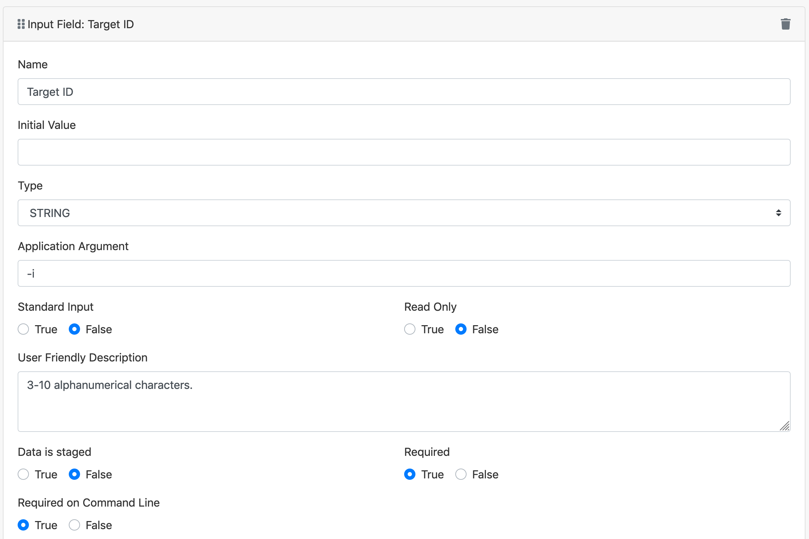
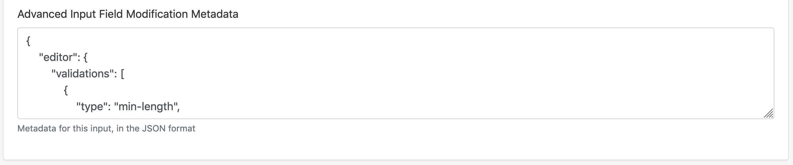
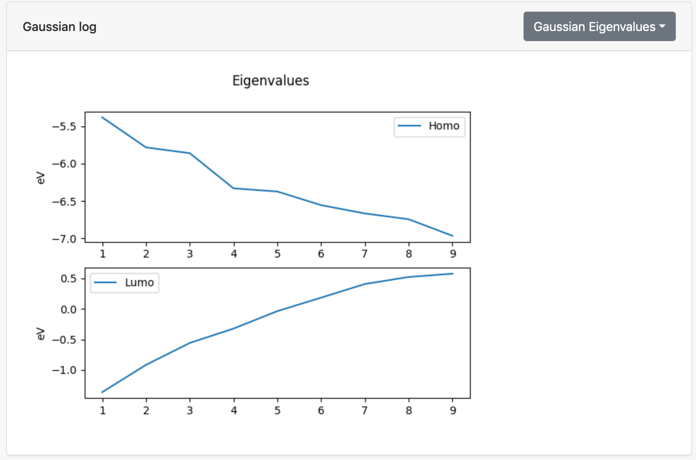

# Custom UI Tutorial

Objective: learn the basics of the Apache Airavata Django Portal and how to make
both simple and complex customizations to the user interface.

## Prerequisites

Tutorial attendees should have:

-   a text editor or IDE for writing Python and web code. Any text editor or IDE
    will do but if you're looking for recommendations, I recommend
    [Visual Studio Code](https://code.visualstudio.com/).
-   latest Python (current version as of this writing is 3.9.5)
-   Git client
-   [Docker Desktop](https://www.docker.com/products/docker-desktop)
-   If you don't have Docker installed or can't install it, you'll also need:
    -   [Node LTS](https://nodejs.org/en/download/),
    -   and
        [Yarn 1 (Classic) package manager](https://classic.yarnpkg.com/en/docs/install).

### Installing Python

Python 3.6-3.9 are supported, but I highly recommend you download and use
**Python 3.9**

Download and install Python 3.9.

-   (macOS/Windows): Download from <https://www.python.org/downloads/>
-   (Linux): use your distribution's package manager to install Python 3.9

Verify you have installed Python 3.9:

=== "macOS/Linux"

        $ python3.9 --version
        Python 3.9.5

=== "Windows"

    Open PowerShell then run:

        PS C:\Users\username> py --version
        Python 3.9.5

### Installing Git

If you don't already have Git installed, see <https://git-scm.com/downloads> and
follow the installation instructions for your platform.

Verify that you have installed Git:

=== "macOS/Linux"

    Open a terminal

        $ git --version
        git version 2.26.0

    The command should print "git version X.X". The version should be at least 2.0.

=== "Windows"

    Open PowerShell then run:

        PS C:\Users\username> git --version
        git version 2.32.0.windows.2

    The command should print "git version X.X". The version should be at least 2.0.

### Installing Docker Desktop

Follow the instructions at
[Docker Desktop](https://www.docker.com/products/docker-desktop) to install
Docker Desktop.

Verify that you have installed Docker Desktop:

=== "macOS/Linux"

    Open a terminal

        $ docker --version
        Docker version 20.10.7, build f0df350
        $ docker run hello-world
        Unable to find image 'hello-world:latest' locally
        latest: Pulling from library/hello-world
        109db8fad215: Pull complete
        Digest: sha256:df5f5184104426b65967e016ff2ac0bfcd44ad7899ca3bbcf8e44e4461491a9e
        Status: Downloaded newer image for hello-world:latest

        Hello from Docker!
        This message shows that your installation appears to be working correctly.
        ...


    The command should print "Docker version X.X". As long as it is a recent
    version, you should be fine.

=== "Windows"

    Open PowerShell then run:

        PS C:\Users\username> docker --version
        Docker version 20.10.7, build f0df350
        PS C:\Users\username> docker run hello-world
        Unable to find image 'hello-world:latest' locally
        latest: Pulling from library/hello-world
        b8dfde127a29: Pull complete
        Digest: sha256:df5f5184104426b65967e016ff2ac0bfcd44ad7899ca3bbcf8e44e4461491a9e
        Status: Downloaded newer image for hello-world:latest

        Hello from Docker!
        This message shows that your installation appears to be working correctly.
        ...

    The command should print "Docker version X.X". As long as it is a recent
    version, you should be fine.

### Installing Node.js LTS

Note: you only need to install Node.js LTS if you don't have Docker installed.

Follow the instructions on the
[Node.js downloads page](https://nodejs.org/en/download/) to install Node.js LTS
for your platform.

Verify that you have installed Node.js LTS:

=== "macOS/Linux"

    Open a terminal

        $ node --version
        v14.17.1

    The command should print "vX.X". The version should be at least v14.0.

=== "Windows"

    Open PowerShell then run:

        PS C:\Users\username> node --version
        v14.17.3

    The command should print "vX.X". The version should be at least v14.0.

### Installing Yarn

Note: you only need to install Yarn if you don't have Docker installed. Yarn
requires Node.js.

To install Yarn run

    npm install -g yarn

Verify that you have installed Yarn:

=== "macOS/Linux"

    Open a terminal

        $ yarn --version
        1.22.10

    The command should print "X.X". The version should be 1.X.

=== "Windows"

    Open PowerShell then run:

        PS C:\Users\username> yarn --version
        1.22.10

    The command should print "X.X". The version should be 1.X.

## Outline

-   Introduction
-   Presentation: Overview of Airavata and Django Portal
    -   History of the Airavata UI and how did we get here
-   Hands on: run a basic computational experiment in the Django portal
-   Tutorial exercise: customize the input user interface for an application
-   Tutorial exercise: Create a custom output viewer for an output file
-   Tutorial exercise: Create a custom Django app
    -   use the `AiravataAPI` JavaScript library for utilizing the backend
        Airavata API
    -   develop a simple custom user interface for setting up and visualizing
        computational experiments

## Hands on: run a Gaussian computational experiment in the Django portal

### Log into testdrive.airavata.org

First, you'll need a user account. For the in person tutorial we'll have a set
of pre-created usernames and passwords to use. If you are unable to attend the
in person tutorial or would otherwise like to create your own account, go to the
[Create Account](https://testdrive.airavata.org/auth/create-account) page and
select **Sign in with existing institution credentials**. This will take you to
the CILogon institution selection page. If you don't find your institution
listed here, go back to the _Create Account_ page and fill out the form to
create an account with a username, password, etc.

Once you have an account,
[log into the Airavata Testdrive portal](https://testdrive.airavata.org/auth/login).

After you've logged in, an administrator can grant you access to run the
Gaussian application. During the tutorial we'll grant you access right away and
let you know. If you're at the in person tutorial and using a pre-created
username and password, you should already have all of the necessary
authorizations.

When you log in for the first time you will see a list of applications that are
available in this science gateway. Applications that you are not able to run are
greyed out but the other ones you can run. Once you are granted access, refresh
the page and you should now see that you the _Gaussian16_ application is not
greyed out.

### Submit a test job

From the dashboard, click on the **Gaussian16** application. The page title is
_Create a New Experiment_.

Here you can change the _Experiment Name_, add a _description_ or select a
different project if you have multiple projects.

We'll focus on the _Application Inputs_ for this hands-on. The Gaussian
application requires one input, an _Input-File_. The following is a
preconfigured Gaussian input file. Download this to your local computer and then
click the **Browse** button to upload the file:

-   [npentane12diol.inp](./data/npentane12diol.inp)

You can click on the file to take a quick look at the file in a popup window.

Now we'll select what account to charge and where to run this job. The
_Allocation_ field should already have **Default** selected. Under _Compute
Resource_ make sure you select **Expanse**.

Then click **Save and Launch**.

You should then be taken to the _Experiment Summary_ page which will update as
the job progresses. When the job finishes you'll be able to download the `.log`
file which is the primary output file of the gaussian application.

We'll come back to this experiment later in the tutorial.

## Tutorial exercise: customize the input user interface for an application

For this exercise we'll define an application based on the Computational Systems
Biology Group's [_eFindSite_](http://www.brylinski.org/efindsite) drug-binding
site detection software. We'll use this application to demonstrate how to
customize the user interface used for application inputs.

### Basic application configuration

1. In the portal, click on the dropdown menu at the top right (currently
   **Workspace** is likely selected) and select **Settings**.


2. You should see the _Application Catalog_. Click on the **New Application**
   button.
3. For _Application Name_ provide `eFindSite-<your username>`. Appending your
   username will allow you to distinguish your version of _eFindSite_ from other
   users.
4. Click **Save**.
5. Click on the **Interface** tab.
6. This application has 4 command line inputs. We'll add them now. To add the
   first one, click on **Add application input** and provide the following
   information:
    - _Name_: `Target ID`
    - _Type_: STRING (which is the default)
    - _Application Argument_: `-i`
    - _User Friendly Description_: `3-10 alphanumerical characters.`
    - _Required_: `True`
    - _Required on Command Line_: `True`



7. Add the next three application inputs in the same way, using the values in
   the table below:

| Name                  | Type   | Application Argument | Required | Required on Command Line |
| --------------------- | ------ | -------------------- | -------- | ------------------------ |
| Target Structure      | URI    | `-s`                 | True     | True                     |
| Screening libraries   | STRING | `-l`                 | False    | True                     |
| Visualization scripts | STRING | `-v`                 | False    | True                     |

(In Airavata, files are represented as URIs. When an application input has type
_URI_ it means that a file is needed for that input. From a UI point of view,
this essentially means that the user will be able to upload a file for inputs of
type URI.)

Normally we would also define the output files for this application, but for
this exercise we are only interested in exploring the options available in
customizing the application inputs and we won't actually run this application.
We need to register a _deployment_ to be able to invoke this application. An
application deployment includes the details of how and where an application is
installed on a compute resource. Since we won't actually run this application,
we'll just create a dummy deployment so that we can invoke it from the Workspace
Dashboard.

8. Click **Save** at the bottom of the screen.
9. Click on the **Deployments** tab.
10. Click on the **New Deployment** button. Select the
    _example-vc.jetstream-cloud.org_ compute resource in the drop down list and
    click **OK**.
11. For the _Application Executable Path_, provide the value `/usr/bin/true`.
    This is the only required field.
12. Click **Save** at the bottom of the screen.
13. Use the top level menu to go back to the **Workspace**. You should see your
    _eFindSite_ application listed there.
14. Click on your _eFindSite_ application.

If you see a form with the inputs that we registered for the application
(_Target ID_, etc.) then you have successfully registered the application
interface.

### Improving the application input user interface

There are a few things to point out now:

-   the _Target ID_ input takes a string value, but only certain characters
    (alphanumeric) are allowed and the string value has a minimum and maximum
    allowed length.
-   the _Screening libraries_ and _Visualization scripts_ only accept specific
    values. For example, one of the allowed values for _Screening libraries_ is
    `screen_drugbank`

We can make this user interface more user friendly by providing more guidance in
the application inputs' user interface. What we'll do:

-   for _Target ID_ (input #1) we'll provide validation feedback that verifies
    that the given value has an allowed length and only allowed characters.
-   nothing to configure for _Target Structure_ (input #2)
-   for _Screening libraries_ and _Visualization scripts_ (inputs #3 and #4)
    we'll provide a list of labeled checkboxes for the user to select.

1. Go back to **Settings** and in the **Application Catalog** click on your
   eFindSite application.
2. Click on the **Interface** tab.
3. For _Target ID_ (input #1), in the _Advanced Input Field Modification
   Metadata_ box, add the following JSON configuration:

<button class="btn" data-clipboard-target="#target_id">
    Copy to clipboard
</button>

<div id="target_id">

```json
{
    "editor": {
        "validations": [
            {
                "type": "min-length",
                "value": 3
            },
            {
                "type": "max-length",
                "value": 10
            },
            {
                "message": "Target ID may only contain alphanumeric characters and underscores.",
                "type": "regex",
                "value": "^[a-zA-Z0-9_]+$"
            }
        ],
        "ui-component-id": "string-input-editor"
    }
}
```

</div>

It should look something like this:



This JSON configuration customizes the input editor in two ways:

-   it adds 3 validations: min-length, max-length and a regex
-   it sets the UI component of the input editor to be the `string-input-editor`
    (which is also the default)

4. Skipping past _Target Structure_ (input #2) and on to **_Screening
   Libraries_** (input #3), set the _Advanced Input Field Modification Metadata_
   to:

<button class="btn" data-clipboard-target="#screening_libraries">
    Copy to clipboard
</button>

<div id="screening_libraries">

```json
{
    "editor": {
        "ui-component-id": "checkbox-input-editor",
        "config": {
            "options": [
                {
                    "text": "BindingDB",
                    "value": "screen_bindingdb"
                },
                {
                    "text": "ChEMBL (non-redundant, TC<0.8)",
                    "value": "screen_chembl_nr"
                },
                {
                    "text": "DrugBank",
                    "value": "screen_drugbank"
                },
                {
                    "text": "KEGG Compound",
                    "value": "screen_keggcomp"
                },
                {
                    "text": "KEGG Drug",
                    "value": "screen_keggdrug"
                },
                {
                    "text": "NCI-Open",
                    "value": "screen_nciopen"
                },
                {
                    "text": "RCSB PDB",
                    "value": "screen_rcsbpdb"
                },
                {
                    "text": "ZINC12 (non-redundant, TC<0.7)",
                    "value": "screen_zinc12_nr"
                }
            ]
        }
    }
}
```

</div>

This JSON configuration specifies a different UI component to use as the input
editor, the `checkbox-input-editor`. It also provides a list of text/value pairs
for the checkboxes; the values are what will be provided to the application as
command line arguments.

5. Similarly for the _Visualization scripts_ (input #4), provide the following
   JSON configuration:

<button class="btn" data-clipboard-target="#visualization_scripts">
    Copy to clipboard
</button>
<div id="visualization_scripts">

```json
{
    "editor": {
        "ui-component-id": "checkbox-input-editor",
        "config": {
            "options": [
                {
                    "text": "VMD",
                    "value": "visual_vmd"
                },
                {
                    "text": "PyMOL",
                    "value": "visual_pymol"
                },
                {
                    "text": "ChimeraX",
                    "value": "visual_chimerax"
                }
            ]
        }
    }
}
```

</div>

6. Click **Save** at the bottom of the page.
7. Now, go back to the **Workspace** and on the Dashboard click on your
   _eFindSite_ application. The _application inputs_ form should now reflect
   your changes.
8. Try typing an invalid character (for example, `#`) in _Target ID_. Also try
   typing in more than 10 alphanumeric characters. When an invalid value is
   provided the validation feedback informs the user of the problem so that the
   user can correct it.


### Additional application input customizations

Other
[UI components](https://github.com/apache/airavata-django-portal/tree/master/django_airavata/apps/workspace/static/django_airavata_workspace/js/components/experiment/input-editors)
are available:

-   textarea
-   radio buttons
-   dropdown

We're working to provide a way for custom input editors to be added by the
community, especially domain specific input editors. For example, a ball and
stick molecule editor or a map view for selecting a bounding box of a region of
interest.

Also you can define dependencies between application inputs and show or hide
inputs based on the values of other inputs.

## Tutorial exercise: Create a custom output viewer for an output file

By default, the Django portal provides a very simple view for output files that
allows users to download the file to their local machine. However, it is
possible to provide additional custom views for output files. Examples include:

-   image (visualization)
-   link (perhaps to another web application that can visualize the file)
-   chart
-   parameterized notebook

To be able to create a custom output viewer we'll need to write some Python
code. First we'll generate the custom Django app code.

### Generate a custom Django app

We have a local develop environment created. Now we can start adding custom
code. First, we'll create a custom Django app, which is the standard way to
package a Django extension. We won't write any Django code until the next
exercise, but generating the custom Django app code gives us a Python package we
can install in which we can write the custom output view code.

#### Create and activate a Python virtual environment

=== "macOS/Linux"

        $ cd $HOME
        $ python3.9 -m venv tutorial-env
        $ source tutorial-env/bin/activate
        (tutorial-env) $

=== "Windows"

        PS C:\Users\username> cd $HOME
        PS C:\Users\username> py -m venv tutorial-env
        PS C:\Users\username> .\tutorial-env\Scripts\Activate.ps1
        (tutorial-env) PS C:\Users\username>

#### Run the django app cookiecutter

1. Install the latest version of cookiecutter. Cookiecutter is a tool for
   generating project source code from a template.

```sh
pip install -U cookiecutter
```

2. Use cookiecutter to run the Airavata Django app template.

```sh
cookiecutter https://github.com/machristie/cookiecutter-airavata-django-app.git
```

You'll need to answer some questions. You can name it whatever you want, but to
follow along with the tutorial, for `project_name` give **Custom UI Tutorial
App**. For the rest of the questions, you can simply accept the defaults:

```
project_name [My Custom Django App]: Custom UI Tutorial App
project_slug [custom_ui_tutorial_app]:
project_short_description [Custom Django app with everything needed to be installed in the airavata-django-portal]:
app_config_class_name [CustomUiTutorialAppConfig]:
version [0.1.0]:
```

### Setup local Django portal development environment

For running the local Django portal development environment, there are a few
options:

-   **Docker**: Run the portal as a Docker container. If you have Docker
    installed, this is the **recommended** option for the tutorial.
-   **Python**: Install the portal dependencies (Python and Nodejs) and then run
    it directly on your computer. This is recommended when you don't or can't
    have Docker installed. It is also what we recommend when you are developing
    a real custom django app extension.

Regardless of which approach you use, you'll need to get a config file for
setting up a local development environment that has the same settings as
Testdrive. Go to <https://testdrive.airavata.org/admin/developers/> and download
the settings_local.py file for local development. Move or copy it to the
`$HOME/custom_ui_tutorial_app/` directory.

=== "Docker (macOS/Linux/Windows)"

    Note for **Windows** users, the following commands assume PowerShell.

    1. Make sure you have
    [Docker installed](https://www.docker.com/products/docker-desktop).
    2. Run the following to create a Docker container called **custom-ui-tutorial**.

            cd $HOME/custom_ui_tutorial_app
            docker run --pull always -d --name custom-ui-tutorial -p 8000:8000 -v "${PWD}:/extensions" -v "${PWD}/settings_local.py:/code/django_airavata/settings_local.py" machristie/airavata-django-portal
    3. Wait until the Docker container starts up. Go to <http://localhost:8000>
    and when it loads and you see **Welcome to your new Wagtail site!**, then
    you're ready to proceed to the next step.
    4. Run the following to load the default set of CMS pages:

            docker exec custom-ui-tutorial python manage.py load_cms_data new_default_theme

    Go to [http://localhost:8000](http://localhost:8000), click on **Login in**,
    enter your username and password. On the dashboard you should see the your
    experiments listed on the right hand side.

=== "Python (Windows)"

    Verify that you have the following installed

    -   Python 3.9
    -   Node LTS
    -   Yarn
    -   Git

    The following instructions assume that you start in your home directory, but you
    could technically checkout and build the code anywhere.

    1. Make sure that you have activated your `tutorial-env` virtual
    environment. You should see `(tutorial-env)` at the beginning of the CMD
    prompt. See the [virtual environment instructions if
    needed](#create-and-activate-a-python-virtual-environment).

    2. Clone the custom_ui_tutorial_app and airavata-django-portal repositories.

            (tutorial-env) PS C:\Users\username>cd $HOME
            (tutorial-env) PS C:\Users\username>git clone https://github.com/apache/airavata-django-portal.git

    3. Install the airavata-django-portal dependencies.

            (tutorial-env) PS C:\Users\username>cd airavata-django-portal
            (tutorial-env) PS C:\Users\username\airavata-django-portal>pip install -U pip
            (tutorial-env) PS C:\Users\username\airavata-django-portal>pip install -r requirements.txt

    4. Copy in the settings_local.py file.

            (tutorial-env) PS C:\Users\username\airavata-django-portal>copy ..\custom_ui_tutorial_app\settings_local.py django_airavata\

    5. Run Django database migrations

            (tutorial-env) PS C:\Users\username\airavata-django-portal>python manage.py migrate

    6. Load the default Wagtail CMS pages.

            (tutorial-env) PS C:\Users\username\airavata-django-portal>python manage.py load_cms_data new_default_theme

    7. Build the JavaScript frontend code.

            (tutorial-env) PS C:\Users\username\airavata-django-portal>.\build_js.bat

       This last step can take a few minutes to complete.

=== "Python (macOS/Linux)"

    Verify that you have the following installed

    -   Python 3.9
    -   Node LTS
    -   Yarn
    -   Git

    The following instructions assume that you start in your home directory, but you
    could technically checkout and build the code anywhere.

    1. Make sure that you have activated your `tutorial-env` virtual
    environment. You should see `(tutorial-env)` at the beginning of the shell
    prompt. See the [virtual environment instructions if
    needed](#create-and-activate-a-python-virtual-environment).

    2. Clone the custom_ui_tutorial_app and airavata-django-portal repositories.

            (tutorial-env) $ cd $HOME
            (tutorial-env) $ git clone https://github.com/apache/airavata-django-portal.git

    3. Install the airavata-django-portal dependencies.

            (tutorial-env) $ cd airavata-django-portal
            (tutorial-env) $ pip install -U pip
            (tutorial-env) $ pip install -r requirements.txt

    4. Copy in the settings_local.py file.

            (tutorial-env) $ cp ../custom_ui_tutorial_app/settings_local.py django_airavata/

    5. Run Django database migrations

            (tutorial-env) $ python manage.py migrate

    6. Load the default Wagtail CMS pages.

            (tutorial-env) $ python manage.py load_cms_data new_default_theme

    7. Build the JavaScript frontend code.

            (tutorial-env) $ ./build_js.sh

       This last step can take a few minutes to complete.

### Create the custom output viewer

Now we'll also generate and implement a **Gaussian Eigenvalues View** provider.

1. We'll run another cookiecutter template to generate the output view provider
   code. First, change into the `custom_ui_tutorial_app` generated in the
   previous step:

=== "macOS/Linux"

        (tutorial-env) $ cd $HOME/custom_ui_tutorial_app

=== "Windows"

        (tutorial-env) PS C:\Users\username>cd $HOME\custom_ui_tutorial_app

2. Run the following cookiecutter template:

```sh
cookiecutter https://github.com/machristie/cookiecutter-airavata-django-output-view.git -f
```

You'll need to answer some questions again. For `project_name` give **Gaussian
Eigenvalues View**. For `custom_django_app_module_name`, you need to provide the
name of the Python module that was generated by
cookiecutter-airavata-django-app, which for this tutorial is
**custom_ui_tutorial_app**. For all of the other questions you can accept the
default.

```
project_name [My Custom Output View]: Gaussian Eigenvalues View
project_slug [gaussian_eigenvalues_view]:
project_short_description [Gaussian Eigenvalues View generates data for an output view in the Airavata Django Portal]:
output_view_provider_class_name [GaussianEigenvaluesViewProvider]:
custom_django_app_module_name []: custom_ui_tutorial_app
output_views_directory_name [output_views]:
Select output_view_display_type:
1 - image
2 - link
3 - html
Choose from 1, 2, 3 [1]:
Select number_of_output_files:
1 - single (URI)
2 - multiple (URI_COLLECTION)
Choose from 1, 2 [1]:
```

3. This creates a custom output view provider, called
   GaussianEigenvaluesViewProvider, in `custom_ui_tutorial_app/output_views/`.
   Open
   `$HOME/custom_ui_tutorial_app/custom_ui_tutorial_app/output_views/gaussian_eigenvalues_view.py`
   in your editor and we'll look at the generated code. The cookiecutter
   template has generated a GaussianEigenvaluesViewProvider class with a method
   called `generate_data`. The generate_data method has some commented out code
   samples and links to further information. There is also guidance at the end
   for how to prepare the values expected in the returned dictionary. Let's
   start filling in the implementation.

4. As a final result, the output_views/gaussian_eigenvalues_view.py file should
   have the following contents. I'll explain each part of this in the following
   steps, but you can go ahead and copy and paste the following into
   `gaussian_eigenvalues_view.py`:

<button class="btn" data-clipboard-target="#gaussian_eigenvalues_view">
    Copy to clipboard
</button>

<div id="gaussian_eigenvalues_view">

```python
import io
import os

import numpy as np from cclib.parser import ccopen from django.conf import
settings from matplotlib.figure import Figure

from airavata_django_portal_sdk import user_storage

class GaussianEigenvaluesViewProvider: display_type = 'image' name = "Gaussian
Eigenvalues"

    def generate_data(self, request, experiment_output, experiment, output_file=None, **kwargs):

        # Parse output_file
        output_text = io.TextIOWrapper(output_file)
        gaussian = ccopen(output_text)
        data = gaussian.parse()
        data.listify()
        homo_eigenvalues = None
        lumo_eigenvalues = None
        if hasattr(data, 'homos') and hasattr(data, 'moenergies'):
            homos = data.homos[0] + 1
            moenergies = data.moenergies[0]
            if homos > 9 and len(moenergies) >= homos:
                homo_eigenvalues = [data.moenergies[0][homos - 1 - i] for i in range(1, 10)]
            if homos + 9 <= len(moenergies):
                lumo_eigenvalues = [data.moenergies[0][homos + i] for i in range(1, 10)]

        # Create plot
        fig = Figure()
        if homo_eigenvalues and lumo_eigenvalues:
            fig.suptitle("Eigenvalues")
            ax = fig.subplots(2, 1)
            ax[0].plot(range(1, 10), homo_eigenvalues, label='Homo')
            ax[0].set_ylabel('eV')
            ax[0].legend()
            ax[1].plot(range(1, 10), lumo_eigenvalues, label='Lumo')
            ax[1].set_ylabel('eV')
            ax[1].legend()
        else:
            ax = fig.subplots()
            ax.text(0.5, 0.5, "No applicable data", horizontalalignment='center',
                verticalalignment='center', transform=ax.transAxes)

        # Export plot as image buffer
        buffer = io.BytesIO()
        fig.savefig(buffer, format='png')
        image_bytes = buffer.getvalue()
        buffer.close()

        # return dictionary with image data
        return {
            'image': image_bytes,
            'mime-type': 'image/png'
        }

```

</div>

5. Let's take a look at the implementation. First we added some imports at the
   top:

```python
import io
import os

import numpy as np
from cclib.parser import ccopen
from django.conf import settings
from matplotlib.figure import Figure

from airavata_django_portal_sdk import user_storage
```

6.  Next we implemented the
    [`generate_data` function](../dev/custom_output_view_provider.md#output-view-provider-interface).
    This function should return a dictionary with values that are expected for
    this `display_type`. For a display type of _image_, the required return
    values are _image_ which should be a bytes array or file-like object with
    the image bytes and _mime-type_ which should be the image's mime type. There
    implementation plots the eigenvalues of molecular orbital energies
    calculated by Gaussian and has three parts:

    1. Use the _cclib_ library to parse the Gaussian log file. _cclib_ is a
       Python computational chemistry library which is used to read the
       molecular orbital energies.
    2. Generate a plot using _matplotlib_.
    3. Save the plot as a PNG image into an in-memory array of bytes.

    Here's the `generate_data` function:

```python
    def generate_data(self, request, experiment_output, experiment, output_file=None, **kwargs):
        # Parse output_file
        output_text = io.TextIOWrapper(output_file)
        gaussian = ccopen(output_text)
        data = gaussian.parse()
        data.listify()
        homo_eigenvalues = None
        lumo_eigenvalues = None
        if hasattr(data, 'homos') and hasattr(data, 'moenergies'):
            homos = data.homos[0] + 1
            moenergies = data.moenergies[0]
            if homos > 9 and len(moenergies) >= homos:
                homo_eigenvalues = [data.moenergies[0][homos - 1 - i] for i in range(1, 10)]
            if homos + 9 <= len(moenergies):
                lumo_eigenvalues = [data.moenergies[0][homos + i] for i in range(1, 10)]

        # Create plot
        fig = Figure()
        if homo_eigenvalues and lumo_eigenvalues:
            fig.suptitle("Eigenvalues")
            ax = fig.subplots(2, 1)
            ax[0].plot(range(1, 10), homo_eigenvalues, label='Homo')
            ax[0].set_ylabel('eV')
            ax[0].legend()
            ax[1].plot(range(1, 10), lumo_eigenvalues, label='Lumo')
            ax[1].set_ylabel('eV')
            ax[1].legend()
        else:
            ax = fig.subplots()
            ax.text(0.5, 0.5, "No applicable data", horizontalalignment='center',
                verticalalignment='center', transform=ax.transAxes)

        # Export plot as image buffer
        buffer = io.BytesIO()
        fig.savefig(buffer, format='png')
        image_bytes = buffer.getvalue()
        buffer.close()

        # return dictionary with image data
        return {
            'image': image_bytes,
            'mime-type': 'image/png'
        }
```

7. Now we need to register our _output view provider_ with the package metadata
   so that the Django Portal will be able to discover it. The cookiecutter
   template already created this when it generated the
   gaussian_eigenvalues_view.py code. We can take a look and make sure it added
   an `airavata.output_view_providers` entry to the `[options.entry_points]`
   section in the `$HOME/custom_ui_tutorial_app/setup.cfg` file:

```ini
[options.entry_points]
airavata.djangoapp =
    custom_ui_tutorial_app = custom_ui_tutorial_app.apps:CustomUiTutorialAppConfig
airavata.output_view_providers =
    gaussian_eigenvalues_view = custom_ui_tutorial_app.output_views.gaussian_eigenvalues_view:GaussianEigenvaluesViewProvider
```

`gaussian_eigenvalues_view` is the output view provider id.
`custom_ui_tutorial_app.output_views.gaussian_eigenvalues_view` is the module in
which the `GaussianEigenvaluesViewProvider` output view provider class is found.

9. While we're looking at setup.cfg, let's add our output view providers Python
   dependencies. Under `install_requires` add _cclib_, _numpy_ and _matplotlib_,
   so that it looks like:

<button class="btn" data-clipboard-target="#install_requires">
    Copy to clipboard
</button>
<div id="install_requires">

```
install_requires =
    django >= 2.2
    airavata-django-portal-sdk
    cclib
    numpy
    matplotlib
```

</div>

10. Now we need to install the _custom_ui_tutorial_app_ package into the Django
    portal's virtual environment.

=== "Docker (macOS/Linux/Windows)"

        docker exec -w /extensions custom-ui-tutorial pip install -e .
        docker exec custom-ui-tutorial touch /code/django_airavata/wsgi.py

    These commands:

    1. install our custom django app package and its dependencies into the
    container's Python environment, and
    2. touches the wsgi.py to trigger a reload of the Django portal dev server.

=== "Python (Windows)"

        (tutorial-env) PS C:\Users\username\airavata-django-portal> cd $HOME\custom_ui_tutorial_app
        (tutorial-env) PS C:\Users\username\custom_ui_tutorial_app> pip install -e .
        (tutorial-env) PS C:\Users\username\custom_ui_tutorial_app> cd ..\airavata-django-portal
        (tutorial-env) PS C:\Users\username\airavata-django-portal> python manage.py runserver

=== "Python (macOS/Linux)"

        (tutorial-env) $ cd $HOME/custom_ui_tutorial_app
        (tutorial-env) $ pip install -e .
        (tutorial-env) $ cd ../airavata-django-portal
        (tutorial-env) $ python manage.py runserver

### Use the GaussianEigenvaluesViewProvider with the Gaussian log output file

Back in the Django Portal, we'll make sure the application interface for
Gaussian is configured to add the GaussianEigenvaluesViewProvider as an
additional output view of the file.

1. Log into your local Django Portal instance at <http://localhost:8000>.
2. In the menu at the top, select **Settings**.
3. Click on the **Gaussian16** application.
4. Click on the **Interface** tab.
5. Scroll down to the _Output Field: Gaussian-Application-Output_.
6. Verify that the following is in the _Metadata_ section:

```json
{
    "output-view-providers": ["gaussian_eigenvalues_view"]
}
```

It should look something like this:


7. Go back to the **Workspace** using the menu at the top.
8. Select your Gaussian16 experiment from the right sidebar.
9. For the .log output file there should be a dropdown menu allowing you to
   select an alternate view. Select **Gaussian Eigenvalues**. Now you should see
   the image generated by the custom output view provider.



### (Optional) Interactive parameter

In additional to producing static visualizations, output view providers can
declare interactive parameters that can be manipulated by the user. We can add a
simple boolean interactive parameter to toggle the display of the matplotlib
grid as an example.

1. Open
   `$HOME/custom_ui_tutorial_app/custom_ui_tutorial_app/output_views/gaussian_eigenvalues_view.py`.
   Change the `generate_data` function so that it has an additional `show_grid`
   parameter with a default value of `False`:

```python
    def generate_data(self, request, experiment_output, experiment, output_file=None, show_grid=False, **kwargs):
```

2. Add the following `.grid()` lines to the matplotlib code:

```python
...
            fig.suptitle("Eigenvalues")
            ax = fig.subplots(2, 1)
            ax[0].plot(range(1, 10), homo_eigenvalues, label='Homo')
            ax[0].set_ylabel('eV')
            ax[0].legend()
            ax[0].grid(show_grid)
            ax[1].plot(range(1, 10), lumo_eigenvalues, label='Lumo')
            ax[1].set_ylabel('eV')
            ax[1].legend()
            ax[1].grid(show_grid)
...
```

3. Change the resulting dictionary to have the special `interactive` property
   and declare the `show_grid` parameter:

```python
...
        # return dictionary with image data
        return {
            'image': image_bytes,
            'mime-type': 'image/png'
            'interactive': [
                {'name': 'show_grid', 'value': show_grid}
            ]
        }
```

This will provider the user with a checkbox for manipulating the show_grid
parameter. Every time the user changes it, the GaussianEigenvaluesViewProvider
will be again invoked. It should look something like the following:


There are several more interactive parameter types and additional options. You
can learn more about them in the
[custom output view provider documentation](../dev/custom_output_view_provider.md#interactive-parameters).

## Tutorial exercise: Create a custom Django app

In this tutorial exercise we'll create a fully custom user interface that lives
within the Django Portal.

What we're going to build is a very simple user interface that will:

-   allow a user to pick a greeting in one of several languages
-   submit a simple _echo_ job to a batch scheduler to echo that greeting
-   display the echoed greeting by displaying the STDOUT file produced by the
    job

This is an intentionally simple example to demonstrate the general principle of
using custom REST APIs and UI to setup, execute and post-process/visualize the
output of a computational experiment.

We've already registered the _Echo_ application with the portal, meaning we
registered its interface and on which compute resource it is deployed.

A
[Django _application_ or _app_](https://docs.djangoproject.com/en/2.2/ref/applications/)
is a Python package that may include Django views, url mappings, models, etc.
It's a way of creating a kind of plug-in that integrates with a Django server.
We'll create this custom user interface by developing a Django app that uses the
Django framework as well as the Airavata Django Portal REST APIs and JS library.

### Setting up the Django app

To start, we'll just create a simple "Hello World" page for the Django app and
get it properly registered with the local Django Portal instance.

1. In the `custom_ui_tutorial_app` directory, open
   `$HOME/custom_ui_tutorial_app/custom_ui_tutorial_app/templates/custom_ui_tutorial_app/home.html`.
   Copy this file to `hello.html` in the same directory.

2. Change the title of the page, in the `<h1>` tag, to **Hello World** and save
   the file.

```xml



<div class="main-content-wrapper">
    <main class="main-content">
        <div class="container-fluid">
            <h1>Hello World</h1>
        </div>
    </main>
</div>

```

3. Open the file `$HOME/custom_ui_tutorial_app/custom_ui_tutorial_app/views.py`
   and add the following `hello_world` view function at the end of the file:

<button class="btn" data-clipboard-target="#hello_world">
    Copy to clipboard
</button>

<div id="hello_world">

```python
@login_required
def hello_world(request):
    return render(request, "custom_ui_tutorial_app/hello.html")
```

</div>

This view will simply display the template created in the previous step.

4. Open the file `$HOME/custom_ui_tutorial_app/custom_ui_tutorial_app/urls.py`
   and add a URL mapping for of `hello/` to the `hello_world` view function:

<button class="btn" data-clipboard-target="#urlspy">
    Copy to clipboard
</button>
<div id="urlspy">

```python
from django.urls import path

from . import views

app_name = 'custom_ui_tutorial_app' urlpatterns = [ path('home/', views.home,
name='home'), path('hello/', views.hello_world, name='hello_world'), ]
```

</div>

This maps the `/hello/` URL to the `hello_world` view.

5. Open the file `$HOME/custom_ui_tutorial_app/custom_ui_tutorial_app/apps.py`
   and update the `fa_icon_class` attribute and the `url_home` attribute to the
   `CustomUiTutorialAppConfig` class:

<button class="btn" data-clipboard-target="#appspy">
    Copy to clipboard
</button>
<div id="appspy">

```python
from django.apps import AppConfig

class CustomUiTutorialAppConfig(AppConfig): name = 'custom_ui_tutorial_app'
label = name verbose_name = "Custom UI Tutorial App" fa_icon_class =
"fa-comment" url_home = "custom_ui_tutorial_app:hello_world"

```

</div>

This the main metadata for this custom Django app. Besides the normal metadata
that the Django framework expects, this also defines a display name
(`verbose_name`) and an icon (`fa_icon_class`) to use for this custom app. The
`url_home` attribute specifies the initial view that should be rendered when
navigating to this app.

---

Now you should be able to [log into the portal locally](http://localhost:8000)
and see **Custom UI Tutorial App** in the drop down menu in the header (click on
**Workspace** then you should see it in that menu).


### Adding a list of "Hello" greetings

Now we'll create a REST endpoint in our custom Django app that will return
greetings in several languages.

1. In the `$HOME/custom_ui_tutorial_app/custom_ui_tutorial_app/views.py` file,
   we add the following imports:

<button class="btn" data-clipboard-target="#jsonresponse">
    Copy to clipboard
</button>
<div id="jsonresponse">

```python
from django.http import JsonResponse
from rest_framework.decorators import api_view
```

</div>

2. Also we add the following view:

<button class="btn" data-clipboard-target="#languages">
    Copy to clipboard
</button>
<div id="languages">

```python
@api_view()
def languages(request):
    return JsonResponse({'languages': [{
        'lang': 'French',
        'greeting': 'bonjour',
    }, {
        'lang': 'German',
        'greeting': 'guten tag'
    }, {
        'lang': 'Hindi',
        'greeting': 'namaste'
    }, {
        'lang': 'Japanese',
        'greeting': 'konnichiwa'
    }, {
        'lang': 'Swahili',
        'greeting': 'jambo'
    }, {
        'lang': 'Turkish',
        'greeting': 'merhaba'
    }]})
```

</div>

3. In `$HOME/custom_ui_tutorial_app/custom_ui_tutorial_app/urls.py` we add a url
   mapping for the `languages` view:

<button class="btn" data-clipboard-target="#urls_languages">
    Copy to clipboard
</button>
<div id="urls_languages">

```python
from django.urls import path

from . import views

app_name = 'custom_ui_tutorial_app' urlpatterns = [ path('home/', views.home,
name='home'), path('hello/', views.hello_world, name="hello_world"),
path('languages/', views.languages, name="languages"), ]

```

</div>

4. In
   `$HOME/custom_ui_tutorial_app/custom_ui_tutorial_app/templates/custom_ui_tutorial_app/hello.html`,
   add the lines between the **STARTING HERE** and **ENDING HERE** comments.
   This adds a `<select>` element to the template which will be used to display
   the greeting options:

```html
...
<div class="main-content-wrapper">
    <main class="main-content">
        <div class="container-fluid">
            <h1>Hello World</h1>

            <!-- STARTING HERE -->
            <div class="card">
                <div class="card-header">
                    Run "echo" for different languages
                </div>
                <div class="card-body">
                    <select id="greeting-select"></select>
                    <button id="run-button" class="btn btn-primary">Run</button>
                </div>
            </div>
            <!-- ENDING HERE -->
        </div>
    </main>
</div>
...
```

<button class="btn" data-clipboard-target="#greeting-select">
    Copy to clipboard
</button>
<div id="greeting-select">

```html
<div class="card">
    <div class="card-header">Run "echo" for different languages</div>
    <div class="card-body">
        <select id="greeting-select"></select>
        <button id="run-button" class="btn btn-primary">Run</button>
    </div>
</div>
```

</div>

5. The `hello.html` template already has the `` directive and a
   `scripts` block at the end. This will load the AiravataAPI JavaScript library
   which has utilities for interacting with the Django portal's REST API (which
   can also be used for custom developed REST endpoints) and model classes for
   Airavata's data models. The `utils.FetchUtils` is used to load the languages
   REST endpoint.

    Add to `hello.html` the code between the **STARTING HERE** and **ENDING
    HERE** comments.

```html

<script src=""></script>
<script>
    const { models, services, session, utils } = AiravataAPI;

    // STARTING HERE
    utils.FetchUtils.get("/custom_ui_tutorial_app/languages/").then((data) => {
        data.languages.forEach((language) => {
            $("#greeting-select").append(
                `<option value="${language.greeting}">
                    ${language.lang} - "${language.greeting}"
                 </option>`
            );
        });
    });
    // ENDING HERE
</script>

```

<button class="btn" data-clipboard-target="#fetch_languages">
    Copy to clipboard
</button>
<div id="fetch_languages">

```javascript
utils.FetchUtils.get("/custom_ui_tutorial_app/languages/").then((data) => {
    data.languages.forEach((language) => {
        $("#greeting-select").append(
            `<option value="${language.greeting}">
                ${language.lang} - "${language.greeting}"
             </option>`
        );
    });
});
```

</div>

Now when you view the custom app at
[http://localhost:8000/custom_ui_tutorial_app/hello/](http://localhost:8000/custom_ui_tutorial_app/hello/)
you should see a dropdown of greetings in several languages, like so:


### Displaying a list of recent experiments

Now we'll use the `AiravataAPI` library to load the user's recent experiments.

1. In
   `$HOME/custom_ui_tutorial_app/custom_ui_tutorial_app/templates/custom_ui_tutorial_app/hello.html`,
   add the following lines between the **STARTING HERE** and **ENDING HERE**
   comments. This adds table to display recent experiments to the bottom of
   `hello.html`:

```html
...
            <div class="card">
                <div class="card-header">
                    Run "echo" for different languages
                </div>
                <div class="card-body">
                    <select id="greeting-select"></select>
                    <button id="run-button" class="btn btn-primary">Run</button>
                </div>
            </div>

            <!-- STARTING HERE -->
            <div class="card">
                <div class="card-header">
                    Experiments
                </div>
                <div class="card-body">
                    <button id="refresh-button" class="btn btn-secondary">Refresh</button>
                    <table class="table">
                        <thead>
                            <tr>
                                <th scope="col">Name</th>
                                <th scope="col">Application</th>
                                <th scope="col">Creation Time</th>
                                <th scope="col">Status</th>
                                <th scope="col">Output</th>
                            </tr>
                        </thead>
                        <tbody id="experiment-list">
                        </tbody>
                    </table>
                </div>
            </div>
            <!-- ENDING HERE -->

        </div>
    </main>
</div>

```

<button class="btn" data-clipboard-target="#experiments-table">
    Copy to clipboard
</button>
<div id="experiments-table">

```html
<div class="card">
    <div class="card-header">Experiments</div>
    <div class="card-body">
        <button id="refresh-button" class="btn btn-secondary">Refresh</button>
        <table class="table">
            <thead>
                <tr>
                    <th scope="col">Name</th>
                    <th scope="col">Application</th>
                    <th scope="col">Creation Time</th>
                    <th scope="col">Status</th>
                    <th scope="col">Output</th>
                </tr>
            </thead>
            <tbody id="experiment-list"></tbody>
        </table>
    </div>
</div>
```

</div>

2. Now we'll use the ExperimentSearchService to load the user's most recent 5
   _Echo_ experiments and display them in the table. We add the following to the
   end of the _scripts_ block in `hello.html`:

<button class="btn" data-clipboard-target="#loadExperiments">
    Copy to clipboard
</button>
<div id="loadExperiments">

```javascript
const appInterfaceId = "Echo_23d67491-1bef-47bd-a0f5-faf069e09773";

async function loadExperiments() {
    const data = await services.ExperimentSearchService.list({
        limit: 5,
        [models.ExperimentSearchFields.USER_NAME.name]:
            session.Session.username,
        [models.ExperimentSearchFields.APPLICATION_ID.name]: appInterfaceId,
    });

    $("#experiment-list").empty();
    data.results.forEach(async (expSummary, index) => {
        $("#experiment-list").append(
            `<tr>
                <td>${expSummary.name}</td>
                <td>${expSummary.executionId}</td>
                <td>${expSummary.creationTime}</td>
                <td>${expSummary.experimentStatus.name}</td>
                <td id="output_${index}"></td>
            </tr>`
        );
    });
}

loadExperiments();
$("#refresh-button").click(loadExperiments);
```

</div>

The user interface should now look something like:


### Submitting an Echo job

Now we'll use `AiravataAPI` to submit an Echo job. First we'll add the code and
then examine it line by line to see what it is doing.

1. Add the following to the end of the _scripts_ block in `hello.html`:

<button class="btn" data-clipboard-target="#submitExperiment">
    Copy to clipboard
</button>
<div id="submitExperiment">

```javascript
async function submitExperiment(greeting) {
    // Construct experiment object
    const experimentData = await utils.ExperimentUtils.createExperiment({
        applicationInterfaceId: appInterfaceId,
        computeResourceName: "example-vc.jetstream-cloud.org",
        experimentName: "Echo " + greeting,
        experimentInputs: {
            "Input-to-Echo": greeting,
        },
    });
    // Save experiment
    const experiment = await services.ExperimentService.create({
        data: experimentData,
    });
    // Launch experiment
    await services.ExperimentService.launch({
        lookup: experiment.experimentId,
    });
}

async function runClickHandler() {
    const greeting = $("#greeting-select").val();
    await submitExperiment(greeting);
    // Reload experiments to see the new one
    loadExperiments();
}

$("#run-button").click(runClickHandler);
```

</div>

2. Going line by line we'll now take a look at this code. We added a click
   handler to the _Run_ button that gets the selected greeting value:

```javascript
async function runClickHandler() {
    const greeting = $("#greeting-select").val();
    await submitExperiment(greeting);
    // Reload experiments to see the new one
    loadExperiments();
}

$("#run-button").click(runClickHandler);
```

3. Next, the `submitExperiment` function is called. This code constructs an
   experiment object using the utility function
   `utils.ExperimentUtils.createExperiment`. In Airavata, Experiments are
   created from Application Interface descriptions, so we'll first pass the
   `applicationInterfaceId`. We already have the `appInterfaceId` in the code
   because we used this to retrieve experiment results for the Echo application.

    You might wonder, how would I find this ID if I wanted to look one up for an
    application? For this you can use the REST API and programmatically look up
    these values in your code. Also, the Airavata Django Portal has a browseable
    REST API and we'll take a look at that now.

    If you go to <https://testdrive.airavata.org/api/applications/> (make sure
    you are logged in first) you'll see the _Application Module List_. For each
    entry you can click on the URL for the `applicationInterface` and get the
    REST API response for the application interface. For example, if you click
    on the applicationInterface link for the Echo application module,
    <https://testdrive.airavata.org/api/applications/Echo_37eb38ac-74c8-4aa4-a037-c656ab5bc6b8/application_interface/>,
    you'll then get a response that shows that the _applicationInterfaceId_ is
    `Echo_23d67491-1bef-47bd-a0f5-faf069e09773`.

    The other parameters to the `createExperiment` function are the
    `computeResourceName` of the cluster to which we want to submit as well as
    the name of the experiment and the experiment's input values.

```javascript
// Construct experiment object
const experimentData = await utils.ExperimentUtils.createExperiment({
    applicationInterfaceId: appInterfaceId,
    computeResourceName: "example-vc.jetstream-cloud.org",
    experimentName: "Echo " + greeting,
    experimentInputs: {
        "Input-to-Echo": greeting,
    },
});
```

4. The `utils.ExperimentUtils.createExperiment` function does a few more things
   behind the scenes and once we run it we can take a look at the REST API calls
   it makes. In summary `utils.ExperimentUtils.createExperiment`:

    - loads the Application Interface
    - loads the compute resource ID
    - finds a Group Resource Profile that can be used to submit the job to the
      given compute resource
    - finds the Application Deployment for the application on the given compute
      resource
    - loads the default queue settings for that Application Deployment and uses
      them when constructing the Experiment
    - loads the user's most recently used Project and uses it when constructing
      the Experiment
    - creates an Experiment instance from the Application Interface and
      populates its fields

5. Now that the experiment object is created, we can save it
   (`ExperimentService.create`) and then launch it (`ExperimentService.launch`).

```javascript
// ...
// Save experiment
const experiment = await services.ExperimentService.create({
    data: experimentData,
});
// Launch experiment
await services.ExperimentService.launch({ lookup: experiment.experimentId });
```

Now that we can launch the experiment we can go ahead and give it a try.

You can also try this out in the production deployment at
<https://testdrive.airavata.org/custom_ui_tutorial_app/hello/>.

### Displaying the experiment output

Instead of simply reporting the status of the job we would also like to do
something with the output. The STDOUT of the Echo job has a format like the
following:

```
bonjour
```

We'll read the STDOUT file and display that in our experiment listing table.

1. What we need to do is get the identifier for the experiment's STDOUT file. In
   Airavata, this identifier is called the _Data Product ID_. The experiment
   metadata includes a list of output files and the `value` of each one is that
   file's Data Product ID. For each `exp` we can use the `ExperimentService` to
   load this metadata for the experiment, find the STDOUT output object and get
   its value, which is the _Data Product ID_.

```javascript
if (exp.experimentStatus === models.ExperimentState.COMPLETED) {
    const experiment = await services.ExperimentService.retrieve({
        lookup: expSummary.experimentId,
    });
    const stdoutInput = experiment.getExperimentOutput("Echo-STDOUT");
    const dataProductURI = stdoutInput.value;
}
```

2. Then we'll simply download the file and display the value in the table. We'll
   use `ExperimentUtils.readDataProduct()` to download the file.

```javascript
if (expSummary.experimentStatus === models.ExperimentState.COMPLETED) {
    const experiment = await services.ExperimentService.retrieve({
        lookup: expSummary.experimentId,
    });
    const stdoutInput = experiment.getExperimentOutput("Echo-STDOUT");
    const dataProductURI = stdoutInput.value;
    try {
        const stdout = await utils.ExperimentUtils.readDataProduct(
            dataProductURI
        );
        $(`#output_${index}`).text(stdout);
    } catch (error) {
        $(`#output_${index}`).text("N/A");
    }
}
```

3. To enable this, add the lines between the **STARTING HERE** and **ENDING
   HERE** comments to the `loadExperiments` function. Here's the update to the
   `loadExperiments` function:

```javascript
async function loadExperiments() {
    const data = await services.ExperimentSearchService.list({
        limit: 5,
        [models.ExperimentSearchFields.USER_NAME.name]:
            session.Session.username,
        [models.ExperimentSearchFields.APPLICATION_ID.name]: appInterfaceId,
    });

    $("#experiment-list").empty();
    data.results.forEach(async (expSummary, index) => {
        $("#experiment-list").append(
            `<tr>
                <td>${expSummary.name}</td>
                <td>${expSummary.executionId}</td>
                <td>${expSummary.creationTime}</td>
                <td>${expSummary.experimentStatus.name}</td>
                <td id="output_${index}"></td>
            </tr>`
        );

        // STARTING HERE
        // If experiment has finished, download and display the stdout file contents
        if (expSummary.experimentStatus === models.ExperimentState.COMPLETED) {
            const experiment = await services.ExperimentService.retrieve({
                lookup: expSummary.experimentId,
            });
            const stdoutInput = experiment.getExperimentOutput("Echo-STDOUT");
            const dataProductURI = stdoutInput.value;
            try {
                const stdout = await utils.ExperimentUtils.readDataProduct(
                    dataProductURI
                );
                // if stdout is null, it means the file wasn't found
                if (stdout !== null) {
                    $(`#output_${index}`).text(stdout);
                } else {
                    $(`#output_${index}`).text("N/A");
                }
            } catch (error) {
                $(`#output_${index}`).text("N/A");
            }
        }
        // ENDING HERE
    });
}
```

<button class="btn" data-clipboard-target="#readDataProduct">
    Copy to clipboard
</button>
<div id="readDataProduct">

```javascript
// If experiment has finished, download and display the stdout file contents
if (expSummary.experimentStatus === models.ExperimentState.COMPLETED) {
    const experiment = await services.ExperimentService.retrieve({
        lookup: expSummary.experimentId,
    });
    const stdoutInput = experiment.getExperimentOutput("Echo-STDOUT");
    const dataProductURI = stdoutInput.value;
    try {
        const stdout = await utils.ExperimentUtils.readDataProduct(
            dataProductURI
        );
        // if stdout is null, it means the file wasn't found
        if (stdout !== null) {
            $(`#output_${index}`).text(stdout);
        } else {
            $(`#output_${index}`).text("N/A");
        }
    } catch (error) {
        $(`#output_${index}`).text("N/A");
    }
}
```

</div>

## Resources

You can browser the final version of the code at
<https://github.com/machristie/custom_ui_tutorial_app>.

### Airavata API

The Django portal provides a REST API bridge to the backend Airavata API. So
it's helpful to look at what is available in the backend Airavata API. See the
[Apache Airavata API docs](https://airavata.readthedocs.io/en/master/technical-documentation/airavata-api/)

To see what is in the `AiravataAPI` JavaScript library, take a look at it's
[index.js](https://github.com/apache/airavata-django-portal/blob/master/django_airavata/apps/api/static/django_airavata_api/js/index.js)
file in the
[airavata-django-portal repo](https://github.com/apache/airavata-django-portal).

### Airavata Gateway Hosting

SciGaP provides free Airavata Gateways hosting services. Log in or create an
account at [scigap.org](https://scigap.org/) to request gateway hosting.
