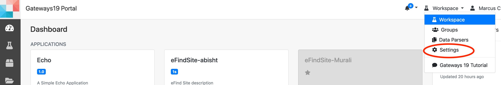
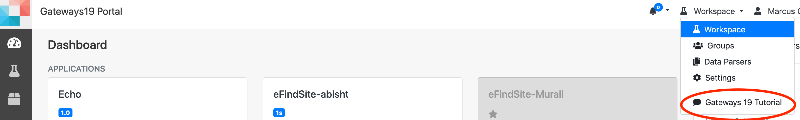

# Gateways 2019 Tutorial

Objective: learn the basics of the Apache Airavata Django Portal and how to make
both simple and complex customizations to the user interface.

Prerequisites: tutorial attendees should have:

-   a laptop on which to write Python code
-   Git client
-   Docker desktop

## Outline

-   Introduction
-   Presentation: Overview of Airavata and Django Portal
    -   History of the Airavata UI and how did we get here
-   Hands on: run a basic computational experiment in the Django portal
-   Tutorial exercise: customize the input user interface for an application
-   Tutorial exercise: Create a custom output viewer for an output file
-   Tutorial exercise: Create a custom Django app
    -   use the `AiravataAPI` JavaScript library for utilizing the backend
        Airavata API
    -   develop a simple custom user interface for setting up and visualizing
        computational experiments

## Hands on: run a Gaussian computational experiment in the Django portal

### Log into testdrive.airavata.org

First, you'll need a user account. For the in person tutorial we'll have a set
of pre-created usernames and passwords to use. If you are unable to attend the
in person tutorial or would otherwise like to create your own account, go to the
[Create Account](https://testdrive.airavata.org/auth/create-account) page and
select **Sign in with existing institution credentials**. This will take you to
the CILogon institution selection page. If you don't find your institution
listed here, go back to the _Create Account_ page and fill out the form to
create an account with a username, password, etc.

Once you have an account,
[log into the Airavata Testdrive portal](https://testdrive.airavata.org/auth/login).

After you've logged in, an administrator can grant you access to run the
Gaussian application. During the tutorial we'll grant you access right away and
let you know. If you're at the in person tutorial and using a pre-created
username and password, you should already have all of the necessary
authorizations.

When you log in for the first time you will see a list of applications that are
available in this science gateway. Applications that you are not able to run are
greyed out but the other ones you can run. Once you are granted access, refresh
the page and you should now see that you the _Gaussian16_ application is not
greyed out.

### Submit a test job

From the dashboard, click on the **Gaussian16** application. The page title is
_Create a New Experiment_.

Here you can change the _Experiment Name_, add a _description_ or select a
different project if you have multiple projects.

We'll focus on the _Application Inputs_ for this hands-on. The Gaussian
application requires one input, an _Input-File_. The following is a
preconfigured Gaussian input file. Download this to your local computer and then
click the **Browse** button to upload the file:

-   [npentane12diol.inp](./data/npentane12diol.inp)

You can click on **View File** to take a quick look at the file.

Now we'll select what account to charge and where to run this job. The
_Allocation_ field should already have _Default Gateway Profile_ selected. Under
_Compute Resource_ make sure you select **comet.sdsc.edu**.

Then click **Save and Launch**.

You should then be taken to the _Experiment Summary_ page which will update as
the job progresses. When the job finishes you'll be able to download the `.log`
file which is the primary output file of the gaussian application.

We'll come back to this experiment later in the tutorial.

## Tutorial exercise: customize the input user interface for an application

For this exercise we'll define an application based on the Computational Systems
Biology Group's [_eFindSite_](http://www.brylinski.org/efindsite) drug-binding
site detection software. We'll use this application to demonstrate how to
customize the user interface used for application inputs.

### Basic application configuration

1. In the portal, click on the dropdown menu at the top right (currently
   **Workspace** is likely selected) and select **Settings**.



2. You should see the _Application Catalog_. Click on the **New Application**
   button.
3. For _Application Name_ provide `eFindSite-<your username>`. Appending your
   username will allow you to distinguish your version of _eFindSite_ from other
   users.
4. Click **Save**.
5. Click on the **Interface** tab.
6. This application has 4 command line inputs. We'll add them now. To add the
   first one, click on **Add application input** and provide the following
   information:
    - _Name_: `Target ID`
    - _Type_: STRING (which is the default)
    - _Application Argument_: `-i`
    - _User Friendly Description_: `3-10 alphanumerical characters.`
    - _Required_: `True`
    - _Required on Command Line_: `True`


7. Add the next three application inputs in the same way, using the values in
   the table below:

| Name                  | Type   | Application Argument | Required | Required on Command Line |
| --------------------- | ------ | -------------------- | -------- | ------------------------ |
| Target Structure      | URI    | `-s`                 | True     | True                     |
| Screening libraries   | STRING | `-l`                 | False    | True                     |
| Visualization scripts | STRING | `-v`                 | False    | True                     |

(In Airavata, files are represented as URIs. When an application input has type
_URI_ it means that a file is needed for that input. From a UI point of view,
this essentially means that the user will be able to upload a file for inputs of
type URI.)

Normally we would also define the output files for this application, but for
this exercise we are only interested in exploring the options available in
customizing the application inputs and we won't actually run this application.
We need to register a _deployment_ to be able to invoke this application. An
application deployment includes the details of how and where an application is
installed on a compute resource. Since we won't actually run this application,
we'll just create a dummy deployment so that we can invoke it from the Workspace
Dashboard.

8. Click **Save** at the bottom of the screen.
9. Click on the **Deployments** tab.
10. Click on the **New Deployment** button. Select the _mike.hpc.lsu.edu_
    compute resource in the drop down list and click **OK**.
11. For the _Application Executable Path_, provide the value `/usr/bin/true`.
    This is the only required field.
12. Click **Save** at the bottom of the screen.
13. Use the top level menu to go back to the **Workspace**. You should see your
    _eFindSite_ application listed there.
14. Click on your _eFindSite_ application.

If you see a form with the inputs that we registered for the application
(_Target ID_, etc.) then you have successfully registered the application
interface.

### Improving the application input user interface

There are a few things to point out now:

-   the _Screening libraries_ and _Visualization scripts_ only accept specific
    values. For example, one of the allowed values for _Screening libraries_ is
    `screen_drugbank`
-   the _Target ID_ input takes a string value, but only certain characters
    (alphanumeric) are allowed and the string value has a minimum and maximum
    allowed length.

We can make this user interface more user friendly by providing more guidance in
the application inputs' user interface. For the _Screening libraries_ and
_Visualization scripts_ we'll provide a list of labeled checkboxes for the user
to select. For the _Target ID_ we'll provide validation feedback that verifies
that the given value has an allowed length and only allowed characters.

1. Go back to **Settings** and in the **Application Catalog** click on your
   eFindSite application.
2. Click on the **Interface** tab.
3. For _Target ID_, in the _Advanced Input Field Modification Metadata_ box, add
   the following JSON configuration:

```json
{
    "editor": {
        "validations": [
            {
                "type": "min-length",
                "value": 3
            },
            {
                "type": "max-length",
                "value": 10
            },
            {
                "message": "Target ID may only contain alphanumeric characters and underscores.",
                "type": "regex",
                "value": "^[a-zA-Z0-9_]+$"
            }
        ],
        "ui-component-id": "string-input-editor"
    }
}
```

It should look something like this:


This JSON configuration customizes the input editor in two ways:

-   it adds 3 validations: min-length, max-length and a regex
-   it sets the UI component of the input editor to be the `string-input-editor`
    (which is also the default)

4. Likewise for _Screening Libraries_, set the _Advanced Input Field
   Modification Metadata_ to:

```json
{
    "editor": {
        "ui-component-id": "checkbox-input-editor",
        "config": {
            "options": [
                {
                    "text": "BindingDB",
                    "value": "screen_bindingdb"
                },
                {
                    "text": "ChEMBL (non-redundant, TC<0.8)",
                    "value": "screen_chembl_nr"
                },
                {
                    "text": "DrugBank",
                    "value": "screen_drugbank"
                },
                {
                    "text": "KEGG Compound",
                    "value": "screen_keggcomp"
                },
                {
                    "text": "KEGG Drug",
                    "value": "screen_keggdrug"
                },
                {
                    "text": "NCI-Open",
                    "value": "screen_nciopen"
                },
                {
                    "text": "RCSB PDB",
                    "value": "screen_rcsbpdb"
                },
                {
                    "text": "ZINC12 (non-redundant, TC<0.7)",
                    "value": "screen_zinc12_nr"
                }
            ]
        }
    }
}
```

This JSON configuration specifies a different UI component to use as the input
editor, the `checkbox-input-editor`. It also provides a list of text/value pairs
for the checkboxes; the values are what will be provided to the application as
command line arguments.

5. Similarly for the _Visualization scripts_, provide the following JSON
   configuration:

```json
{
    "editor": {
        "ui-component-id": "checkbox-input-editor",
        "config": {
            "options": [
                {
                    "text": "VMD",
                    "value": "visual_vmd"
                },
                {
                    "text": "PyMOL",
                    "value": "visual_pymol"
                },
                {
                    "text": "ChimeraX",
                    "value": "visual_chimerax"
                }
            ]
        }
    }
}
```

6. Click **Save** at the bottom of the page.
7. Now, go back to the **Workspace** and on the Dashboard click on your
   _eFindSite_ application. The _application inputs_ form should now reflect
   your changes.
8. Try typing an invalid character (for example, `#`) in _Target ID_. Also try
   typing in more than 10 alphanumeric characters. When an invalid value is
   provided the validation feedback informs the user of the problem so that the
   user can correct it.


### Additional application input customizations

Other
[UI components](https://github.com/apache/airavata-django-portal/tree/master/django_airavata/apps/workspace/static/django_airavata_workspace/js/components/experiment/input-editors)
are available:

-   textarea
-   radio buttons
-   dropdown

We're working to provide a way for custom input editors to be added by the
community, especially domain specific input editors. For example, a ball and
stick molecule editor or a map view for selecting a bounding box of a region of
interest.

Also you can define dependencies between application inputs and show or hide
inputs based on the values of other inputs.

## Tutorial exercise: Create a custom output viewer for an output file

By default, the Django portal provides a very simple view for output files that
allows users to download the file to their local machine. However, it is
possible to provide additional custom views for output files. Examples include:

-   image (visualization)
-   link (perhaps to another web application that can visualize the file)
-   chart
-   parameterized notebook

To be able to create a custom output viewer we'll need to write some Python
code. First, we'll get a local version of the Django portal running which we'll
use as a development environment.

### Setup local Django portal development environment

To run the Django portal locally we'll start it as a Docker container. Another
option, which we won't cover in this tutorial, is to check out the code and run
the portal locally as a Python process (see the airavata-django-portal
[README](https://github.com/apache/airavata-django-portal/blob/master/README.md)
if you are interested).

1. Make sure you have
   [Docker installed](https://www.docker.com/products/docker-desktop).
2. Run the following to create a Docker container called
   **gateways19-tutorial**.

```
cd $HOME
git clone https://github.com/machristie/gateways19-tutorial.git
cd gateways19-tutorial
docker run -d --name gateways19-tutorial -p 8000:8000 -v $PWD:/extensions -v $PWD/settings_local.py:/code/django_airavata/settings_local.py machristie/airavata-django-portal
```

!!! note

    You can also build the Docker image from scratch, which you might want to
    do if the Docker image is out-dated. To do that run the following:

        cd /tmp/
        git clone https://github.com/apache/airavata-django-portal.git
        cd airavata-django-portal
        docker build -t airavata-django-portal

    Now you can `airavata-django-portal` instead of
    `machristie/airavata-django-portal` in the `docker run` command above.

3. Run the following to load the default set of CMS pages:

```
docker exec gateways19-tutorial python manage.py load_cms_data default
```

---

Go to [http://localhost:8000](http://localhost:8000), click on **Login in**,
enter your username and password. On the dashboard you should see the your
experiments listed on the right hand side.

### Setup the custom output viewer package

1. We've defined a custom output view provider, called
   GaussianEigenvaluesViewProvider, in `output_views.py`. Open
   `$HOME/gateways19-tutorial/gateways19_tutorial/output_views.py` in your
   editor and we'll look at how it is implemented. First we add some imports

```python
import io
import os

import numpy as np
from matplotlib.figure import Figure

from cclib.parser import ccopen

BASE_DIR = os.path.dirname(os.path.abspath(__file__))
```

2. Next we define the GaussianEigenvaluesViewProvider class, set some metadata
   attributes on the class. We set it's `display_type` to _image_ and give it a
   _name_:

```python
class GaussianEigenvaluesViewProvider:
    display_type = 'image'
    name = "Gaussian Eigenvalues"
```

3. Now we implement the `generate_data` function. This function should return a
   dictionary with values that are expected for this `display_type`. For a
   display type of _image_, the required return values are _image_ which should
   be a bytes array or file-like object with the image bytes and _mime-type_
   which should be the image's mime type. Here's the `generate_data` function:

```python
    def generate_data(self, request, experiment_output, experiment, output_file=None):
        # Parse output_file
        output_text = io.TextIOWrapper(output_file)
        gaussian = ccopen(output_text)
        data = gaussian.parse()
        data.listify()
        homo_eigenvalues = None
        lumo_eigenvalues = None
        if hasattr(data, 'homos') and hasattr(data, 'moenergies'):
            homos = data.homos[0] + 1
            moenergies = data.moenergies[0]
            if homos > 9 and len(moenergies) >= homos:
                homo_eigenvalues = [data.moenergies[0][homos - 1 - i] for i in range(1, 10)]
            if homos + 9 <= len(moenergies):
                lumo_eigenvalues = [data.moenergies[0][homos + i] for i in range(1, 10)]

        # Create plot
        fig = Figure()
        if homo_eigenvalues and lumo_eigenvalues:
            fig.suptitle("Eigenvalues")
            ax = fig.subplots(2, 1)
            ax[0].plot(range(1, 10), homo_eigenvalues, label='Homo')
            ax[0].set_ylabel('eV')
            ax[0].legend()
            ax[1].plot(range(1, 10), lumo_eigenvalues, label='Lumo')
            ax[1].set_ylabel('eV')
            ax[1].legend()
        else:
            ax = fig.subplots()
            ax.text(0.5, 0.5, "No applicable data", horizontalalignment='center',
                verticalalignment='center', transform=ax.transAxes)

        # Export plot as image buffer
        buffer = io.BytesIO()
        fig.savefig(buffer, format='png')
        image_bytes = buffer.getvalue()
        buffer.close()

        # return dictionary with image data
        return {
            'image': image_bytes,
            'mime-type': 'image/png'
        }
```

This plots the eigenvalues of molecular orbital energies calculated by Gaussian.
`cclib` is a Python computational chemistry library which is used to read the
molecular orbital energies. Then `matplotlib` is used to create two plots of
these values. Finally, the plots are exported as a PNG image that is returns as
a buffer of bytes.

4. To test this locally we need access to a file to test with. While our local
   portal instance can connect to the Airavata API just like the production
   deployed Django portal instance, only the production deployed Django portal
   has access to the output files generated by users' experiments. So for
   testing purposes we'll define a file to be used when there is no Gaussian log
   file available (this test file will only be used when the Django portal is
   running in `DEBUG` mode).

Just after the `name` attribute of `GaussianEigenvaluesViewProvider` we add the
following:

```python
test_output_file = os.path.join(BASE_DIR, "data", "gaussian.log")
```

5. Altogether, the output_views.py file should have the following contents:

```python
import io
import os

import numpy as np
from matplotlib.figure import Figure

from cclib.parser import ccopen

BASE_DIR = os.path.dirname(os.path.abspath(__file__))

class GaussianEigenvaluesViewProvider:
    display_type = 'image'
    name = "Gaussian Eigenvalues"
    test_output_file = os.path.join(BASE_DIR, "data", "gaussian.log")

    def generate_data(self, request, experiment_output, experiment, output_file=None):

        # Parse output_file
        output_text = io.TextIOWrapper(output_file)
        gaussian = ccopen(output_text)
        data = gaussian.parse()
        data.listify()
        homo_eigenvalues = None
        lumo_eigenvalues = None
        if hasattr(data, 'homos') and hasattr(data, 'moenergies'):
            homos = data.homos[0] + 1
            moenergies = data.moenergies[0]
            if homos > 9 and len(moenergies) >= homos:
                homo_eigenvalues = [data.moenergies[0][homos - 1 - i] for i in range(1, 10)]
            if homos + 9 <= len(moenergies):
                lumo_eigenvalues = [data.moenergies[0][homos + i] for i in range(1, 10)]

        # Create plot
        fig = Figure()
        if homo_eigenvalues and lumo_eigenvalues:
            fig.suptitle("Eigenvalues")
            ax = fig.subplots(2, 1)
            ax[0].plot(range(1, 10), homo_eigenvalues, label='Homo')
            ax[0].set_ylabel('eV')
            ax[0].legend()
            ax[1].plot(range(1, 10), lumo_eigenvalues, label='Lumo')
            ax[1].set_ylabel('eV')
            ax[1].legend()
        else:
            ax = fig.subplots()
            ax.text(0.5, 0.5, "No applicable data", horizontalalignment='center',
                verticalalignment='center', transform=ax.transAxes)

        # Export plot as image buffer
        buffer = io.BytesIO()
        fig.savefig(buffer, format='png')
        image_bytes = buffer.getvalue()
        buffer.close()

        # return dictionary with image data
        return {
            'image': image_bytes,
            'mime-type': 'image/png'
        }

```

6. Now we need to register our _output view provider_ with the package metadata
   so that the Django Portal will be able to discover it. We add the following
   lines to the `entry_points` parameter in the
   `$HOME/gateways19-tutorial/setup.py` file:

```python
setuptools.setup(
# ...
    entry_points="""
[airavata.output_view_providers]
gaussian-eigenvalues-plot = gateways19_tutorial.output_views:GaussianEigenvaluesViewProvider
""",
)
```

`gaussian-eigenvalues-plot` is the output view provider id.
`gateways19_tutorial.output_views` is the module in which the
`GaussianEigenvaluesViewProvider` output view provider class is found.

7. Now we need to install the _gateways19-tutorial_ package into the Django
   portal's virtual environment.

```bash
docker exec -w /extensions gateways19-tutorial pip install -r requirements.txt
docker exec -w /extensions gateways19-tutorial python setup.py develop
docker exec gateways19-tutorial touch /code/django_airavata/wsgi.py
```

These commands:

1. install our package's dependencies,
2. install the package into the container's Python environment, and
3. touches the wsgi.py to trigger a reload of the Django portal dev server.

### Use the GaussianEigenvaluesViewProvider with the Gaussian log output file

Back in the Django Portal, we'll make sure the application interface for
Gaussian is configured to add the GaussianEigenvaluesViewProvider as an
additional output view of the file.

1. Log into your local Django Portal instance at <http://localhost:8000>.
2. In the menu at the top, select **Settings**.
3. Click on the **Gaussian16** application.
4. Click on the **Interface** tab.
5. Scroll down to the _Output Field: Gaussian-Application-Output_.
6. Verify that the following is in the _Metadata_ section:

```json
{
    "output-view-providers": ["gaussian-eigenvalues-plot"]
}
```

It should look something like this:


7. Go back to the **Workspace** using the menu at the top.
8. Select your Gaussian16 experiment from the right sidebar.
9. For the .log output file there should be a dropdown menu allowing you to
   select an alternate view. Select **Gaussian Eigenvalues**. Now you should see
   the image generated by the custom output view provider.


## Tutorial exercise: Create a custom Django app

In this tutorial exercise we'll create a fully custom user interface that lives
within the Django Portal.

What we're going to build is a very simple user interface that will:

-   allow a user to pick a greeting in one of several languages
-   submit a simple _echo_ job to a batch scheduler to echo that greeting
-   display the echoed greeting by displaying the STDOUT file produced by the
    job

This is an intentionally simple example to demonstrate the general principle of
using custom REST APIs and UI to setup, execute and post-process/visualize the
output of a computational experiment.

We've already registered the _Echo_ application with the portal, meaning we
registered its interface and on which compute resource it is deployed.

A
[Django _application_ or _app_](https://docs.djangoproject.com/en/2.2/ref/applications/)
is a Python package that may include Django views, url mappings, models, etc.
It's a way of creating a kind of plug-in that integrates with a Django server.
We'll create this custom user interface by developing a Django app that uses the
Django framework as well as the Airavata Django Portal REST APIs and JS library.

### Setting up the Django app

To start, we'll just create a simple "Hello World" page for the Django app and
get it properly registered with the local Django Portal instance.

1. In the `gateways19-tutorial` directory, open
   `$HOME/gateways19-tutorial/gateways19_tutorial/templates/gateways19_tutorial/hello.html`.
   Some of the HTML view is commented out. The following is the uncommented
   content:

```xml



<div class="main-content-wrapper">
    <main class="main-content">
        <div class="container-fluid">
            <h1>Hello World</h1>
        </div>
    </main>
</div>

```

2. Open the file `$HOME/gateways19-tutorial/gateways19_tutorial/apps.py`:

```python
from django.apps import AppConfig


class Gateways19TutorialAppConfig(AppConfig):
    name = 'gateways19_tutorial'
    label = name
    verbose_name = "Gateways 19 Tutorial"
    fa_icon_class = "fa-comment"
```

This the main metadata for this custom Django app. Besides the normal metadata
that the Django framework expects, this also defines a display name
(`verbose_name`) and an icon (`fa_icon_class`) to use for this custom app.

3. Open the file `$HOME/gateways19-tutorial/gateways19_tutorial/views.py`:

```python
from django.shortcuts import render
from django.contrib.auth.decorators import login_required


@login_required
def hello_world(request):
    return render(request, "gateways19_tutorial/hello.html")
```

This view will simply display the template created in the previous step.

4. Open the file `$HOME/gateways19-tutorial/gateways19_tutorial/urls.py`:

```python
from django.conf.urls import url, include

from . import views

app_name = 'gateways19_tutorial'
urlpatterns = [
    url(r'^hello/', views.hello_world, name="home"),
]
```

This maps the `/hello/` URL to the `hello_world` view.

5. We've created the necessary code for our Django app to display the hello
   world page, but now we need to add some metadata to this Python package so
   that the Django Portal knows about this Django app. In
   `$HOME/gateways19-tutorial/setup.py`, we add the following
   `[airavata.djangoapp]` metadata to the entry_points section:

```python
setuptools.setup(
# ...
    entry_points="""
[airavata.output_view_providers]
gaussian-eigenvalues-plot = gateways19_tutorial.output_views:GaussianEigenvaluesViewProvider
[airavata.djangoapp]
gateways19_tutorial = gateways19_tutorial.apps:Gateways19TutorialAppConfig
""",
)
```

---

Now you should be able to [log into the portal locally](http://localhost:8000)
and see **Gateways 19 Tutorial** in the drop down menu in the header (click on
**Workspace** then you should see it in that menu).



### Adding a list of "Hello" greetings

Now we'll create a REST endpoint in our custom Django app that will return
greetings in several languages.

1. In the `$HOME/gateways19-tutorial/gateways19_tutorial/views.py` file, we add
   the following import:

```python
from django.http import JsonResponse
```

2. Also we add the following view:

```python
@login_required
def languages(request):
    return JsonResponse({'languages': [{
        'lang': 'French',
        'greeting': 'bonjour',
    }, {
        'lang': 'German',
        'greeting': 'guten tag'
    }, {
        'lang': 'Hindi',
        'greeting': 'namaste'
    }, {
        'lang': 'Japanese',
        'greeting': 'konnichiwa'
    }, {
        'lang': 'Swahili',
        'greeting': 'jambo'
    }, {
        'lang': 'Turkish',
        'greeting': 'merhaba'
    }]})
```

3. In `$HOME/gateways19-tutorial/gateways19_tutorial/urls.py` we add a url
   mapping for the `languages` view:

```python
urlpatterns = [
    url(r'^hello/', views.hello_world, name="home"),
    url(r'^languages/', views.languages, name="languages"),
]
```

4. In
   `$HOME/gateways19-tutorial/gateways19_tutorial/templates/gateways19_tutorial/hello.html`,
   uncomment the comment that starts `<!-- Adding a list of "Hello" greetings`
   on line 11 and ends on line 21. That is, just delete lines 11 and 21. This
   adds a `<select>` element to the template which will be used to display the
   greeting options:

```html
...
<h1>Hello World</h1>

<div class="card">
    <div class="card-header">
        Run "echo" for different languages
    </div>
    <div class="card-body">
        <select id="greeting-select"></select>
        <button id="run-button" class="btn btn-primary">Run</button>
    </div>
</div>
...
```

5. We also add the `` directive and then a `scripts` block to
   the end of `hello.html`. This will load the AiravataAPI JavaScript library
   which has utilities for interacting with the Django portal's REST API (which
   can also be used for custom developed REST endpoints) and model classes for
   Airavata's data models. The `utils.FetchUtils` is used to load the languages
   REST endpoint.

```xml




...



<script src=""></script>
<script>
    const { models, services, session, utils } = AiravataAPI;

    utils.FetchUtils.get("/gateways19_tutorial/languages").then(data => {
        data.languages.forEach(language => {
            $("#greeting-select").append(
                `<option value="${language.greeting}">
                    ${language.lang} - "${language.greeting}"
                 </option>`
            );
        });
    });
</script>

```

Now when you view the custom app at
[http://localhost:8000/gateways19_tutorial/hello/](http://localhost:8000/gateways19_tutorial/hello/)
you should see a dropdown of greetings in several languages, like so:


### Displaying a list of recent experiments

Now we'll use the `AiravataAPI` library to load the user's recent experiments.

1. In
   `$HOME/gateways19-tutorial/gateways19_tutorial/templates/gateways19_tutorial/hello.html`,
   uncomment the comment that begins with
   `<!-- Displaying a list of recent experiments` on line 21 or so and ends on
   line 45. This adds table to display recent experiments to the bottom of
   `hello.html`:

```xml
...
            <div class="card">
                <div class="card-header">
                    Run "echo" for different languages
                </div>
                <div class="card-body">
                    <select id="greeting-select"></select>
                    <button id="run-button" class="btn btn-primary">Run</button>
                </div>
            </div>
            <div class="card">
                <div class="card-header">
                    Experiments
                </div>
                <div class="card-body">
                    <button id="refresh-button" class="btn btn-secondary">Refresh</button>
                    <table class="table">
                        <thead>
                            <tr>
                                <th scope="col">Name</th>
                                <th scope="col">Application</th>
                                <th scope="col">Creation Time</th>
                                <th scope="col">Status</th>
                                <th scope="col">Output</th>
                            </tr>
                        </thead>
                        <tbody id="experiment-list">
                        </tbody>
                    </table>
                </div>
            </div>
        </div>
    </main>
</div>

```

2. Now we'll use the ExperimentSearchService to load the user's most recent 5
   _Echo_ experiments and display them in the table. We add the following to the
   end of the _scripts_ block in `hello.html`:

```javascript
// ...
    const appInterfaceId = "Echo_23d67491-1bef-47bd-a0f5-faf069e09773";

    function loadExperiments() {

        return services.ExperimentSearchService
            .list({limit: 5,
                [models.ExperimentSearchFields.USER_NAME.name]: session.Session.username,
                [models.ExperimentSearchFields.APPLICATION_ID.name]: appInterfaceId,
            })
            .then(data => {
                $('#experiment-list').empty();
                data.results.forEach((exp, index) => {
                    $('#experiment-list').append(
                    `<tr>
                        <td>${exp.name}</td>
                        <td>${exp.executionId}</td>
                        <td>${exp.creationTime}</td>
                        <td>${exp.experimentStatus.name}</td>
                        <td id="output_${index}"></td>
                    </tr>`);
                });
        });
    }

    loadExperiments();
    $("#refresh-button").click(loadExperiments);

</script>


```

The user interface should now look something like:


### Submitting an Echo job

Now we'll use `AiravataAPI` to submit an Echo job.

1. In
   `$HOME/gateways19-tutorial/gateways19_tutorial/templates/gateways19_tutorial/hello.html`
   we add a click handler to the _Run_ button that gets the selected greeting
   value:

```javascript
$("#run-button").click(e => {
    const greeting = $("#greeting-select").val();
});
```

2. There are a couple key pieces of information that are needed to submit a
   computational experiment. First, we need the _Application Interface_ for the
   application, which defines the inputs and outputs of the application. We'll
   create an _Experiment_ instance from the _Application Interface_ definition:

```javascript
const loadAppInterface = services.ApplicationInterfaceService.retrieve({
    lookup: appInterfaceId
});
```

3. Second, we need to know where and how the application is deployed. We could
   let the user then pick where they want to run this application. For this
   exercise we're going to hard code the resource and the application deployment
   that will be used for executing the application, but we still need the
   application deployment information so we can get default values for the
   application that can be used when submitting the job to that scheduler.

```javascript
const appDeploymentId =
    "js-156-93.jetstream-cloud.org_Echo_37eb38ac-74c8-4aa4-a037-c656ab5bc6b8";
const loadQueues = services.ApplicationDeploymentService.getQueues({
    lookup: appDeploymentId
});
```

4. We also need to know a few other pieces of information, like the id of the
   compute resource, the queue and the groupResourceProfileId which identifies
   the allocation used to submit the job. Experiments are organized by projects
   so we'll also load the user's most recently used project:

```javascript
const resourceHostId =
    "js-156-93.jetstream-cloud.org_33019860-54c2-449b-96d3-988d4f5a501e";
const queueName = "cloud";
const groupResourceProfileId = "5d4ef270-057c-410b-a2bb-36b5262ce265";
const loadWorkspacePrefs = services.WorkspacePreferencesService.get();
```

5. Once we have all of this information we can then create an `Experiment`
   object then _save_ and _launch_ it. Here's the complete click handler:

```javascript
$("#run-button").click(e => {
    const greeting = $("#greeting-select").val();
    const loadAppInterface = services.ApplicationInterfaceService.retrieve({
        lookup: appInterfaceId
    });
    const appDeploymentId =
        "js-156-93.jetstream-cloud.org_Echo_37eb38ac-74c8-4aa4-a037-c656ab5bc6b8";
    const loadQueues = services.ApplicationDeploymentService.getQueues({
        lookup: appDeploymentId
    });
    const resourceHostId =
        "js-156-93.jetstream-cloud.org_33019860-54c2-449b-96d3-988d4f5a501e";
    const queueName = "cloud";
    const groupResourceProfileId = "5d4ef270-057c-410b-a2bb-36b5262ce265";
    const loadWorkspacePrefs = services.WorkspacePreferencesService.get();
    Promise.all([loadAppInterface, loadWorkspacePrefs, loadQueues])
        .then(([appInterface, workspacePrefs, queues]) => {
            const experiment = appInterface.createExperiment();
            experiment.experimentName = "Echo " + greeting;
            experiment.projectId = workspacePrefs.most_recent_project_id;
            const cloudQueue = queues.find(q => q.queueName === queueName);
            experiment.userConfigurationData.groupResourceProfileId = groupResourceProfileId;
            experiment.userConfigurationData.computationalResourceScheduling.resourceHostId = resourceHostId;
            experiment.userConfigurationData.computationalResourceScheduling.totalCPUCount =
                cloudQueue.defaultCPUCount;
            experiment.userConfigurationData.computationalResourceScheduling.nodeCount =
                cloudQueue.defaultNodeCount;
            experiment.userConfigurationData.computationalResourceScheduling.wallTimeLimit =
                cloudQueue.defaultWalltime;
            experiment.userConfigurationData.computationalResourceScheduling.queueName = queueName;
            // Copy the selected greeting to the value of the first input
            experiment.experimentInputs[0].value = greeting;

            return services.ExperimentService.create({ data: experiment });
        })
        .then(exp => {
            return services.ExperimentService.launch({
                lookup: exp.experimentId
            });
        });
});
```

Now that we can launch the experiment we can go ahead and give it a try.
However, the job will ultimately fail because Airavata won't be able to transfer
the file back to our locally running Django portal (if we had our locally
running Django portal running a public SSH server we could configure it so that
Airavata could SCP the file back to our local instance). But this custom Django
app is also deployed in the hosted tutorial Django instance so you can run it
there to verify it works.

6. Try this out in the production deployment at
   <https://testdrive.airavata.org/gateways19_tutorial/hello/>.

### Displaying the experiment output

Instead of simply reporting the status of the job we would also like to do
something with the output. The STDOUT of the Echo job has a format like the
following:

```
bonjour
```

We'll read the STDOUT file and display that in our experiment listing table.

1. What we need to do is get the identifier for the experiment's STDOUT file. In
   Airavata, this identifier is called the _Data Product ID_. Once we have that
   we can get the DataProduct object which has the files metadata, including a
   `downloadURL`. For each `exp` we can use the `FullExperimentService` to get
   these details like so:

```javascript
if (exp.experimentStatus === models.ExperimentState.COMPLETED) {
    services.FullExperimentService.retrieve({ lookup: exp.experimentId }).then(
        fullDetails => {
            const stdoutDataProductId = fullDetails.experiment.experimentOutputs.find(
                o => o.name === "Echo-STDOUT"
            ).value;
            const stdoutDataProduct = fullDetails.outputDataProducts.find(
                dp => dp.productUri === stdoutDataProductId
            );
            if (stdoutDataProduct && stdoutDataProduct.downloadURL) {
                return fetch(stdoutDataProduct.downloadURL, {
                    credentials: "same-origin"
                }).then(result => result.text());
            }
        }
    );
}
```

2. Then we'll simply display the value in the table.

```javascript
if (exp.experimentStatus === models.ExperimentState.COMPLETED) {
    services.FullExperimentService.retrieve({ lookup: exp.experimentId })
        .then(fullDetails => {
            const stdoutDataProductId = fullDetails.experiment.experimentOutputs.find(
                o => o.name === "Echo-STDOUT"
            ).value;
            const stdoutDataProduct = fullDetails.outputDataProducts.find(
                dp => dp.productUri === stdoutDataProductId
            );
            if (stdoutDataProduct && stdoutDataProduct.downloadURL) {
                return fetch(stdoutDataProduct.downloadURL, {
                    credentials: "same-origin"
                }).then(result => result.text());
            }
        })
        .then(text => {
            $(`#output_${index}`).text(text);
        });
}
```

3. However, as noted earlier this won't quite work with our local Django
   instance since it doesn't have access to the output file. That's fine though
   since we can fake the STDOUT text so that we can test our code locally.
   Remove the comment starting with `/* Displaying the experiment output` on
   line 88 and ending on line 116. Here's the update to the `loadExperiments`
   function:

```javascript
const FAKE_STDOUT = `
bonjour
`;

function loadExperiments() {
    return services.ExperimentSearchService.list({
        limit: 5,
        [models.ExperimentSearchFields.USER_NAME.name]:
            session.Session.username,
        [models.ExperimentSearchFields.APPLICATION_ID.name]: appInterfaceId
    }).then(data => {
        $("#experiment-list").empty();
        data.results.forEach((exp, index) => {
            $("#experiment-list").append(
                `<tr>
                            <td>${exp.name}</td>
                            <td>${exp.executionId}</td>
                            <td>${exp.creationTime}</td>
                            <td>${exp.experimentStatus.name}</td>
                            <td id="output_${index}"></td>
                        </tr>`
            );
            // If experiment has finished, load full details, then parse the stdout file
            if (exp.experimentStatus === models.ExperimentState.COMPLETED) {
                services.FullExperimentService.retrieve({
                    lookup: exp.experimentId
                })
                    .then(fullDetails => {
                        const stdoutDataProductId = fullDetails.experiment.experimentOutputs.find(
                            o => o.name === "Echo-STDOUT"
                        ).value;
                        const stdoutDataProduct = fullDetails.outputDataProducts.find(
                            dp => dp.productUri === stdoutDataProductId
                        );
                        if (
                            stdoutDataProduct &&
                            stdoutDataProduct.downloadURL
                        ) {
                            return fetch(stdoutDataProduct.downloadURL, {
                                credentials: "same-origin"
                            }).then(result => result.text());
                        } else {
                            // If we can't download it, fake it
                            return FAKE_STDOUT;
                        }
                    })
                    .then(text => {
                        $(`#output_${index}`).text(text);
                    });
            }
        });
    });
}
```

4. You can try out this custom Django app in the production deployed instance at
   <https://testdrive.airavata.org/gateways19_tutorial/hello/> where it really
   does download and parse the standard out.

## Resources

You can browser the final version of the _gateways19-tutorial_ code at
<https://github.com/machristie/gateways19-tutorial/tree/solution>. If you get
stuck at some point with the tutorial you can skip to the solution by running
the following git command in your _gateways19-tutorial_ repo:

```bash
cd $HOME/gateways19-tutorial
git reset --hard origin/solution
```

### Airavata API

The Django portal provides a REST API bridge to the backend Airavata API. So
it's helpful to look at what is available in the backend Airavata API. See the
[Apache Airavata API docs](https://airavata.readthedocs.io/en/master/technical-documentation/airavata-api/)

To see what is in the `AiravataAPI` JavaScript library, take a look at it's
[index.js](https://github.com/apache/airavata-django-portal/blob/master/django_airavata/apps/api/static/django_airavata_api/js/index.js)
file in the
[airavata-django-portal repo](https://github.com/apache/airavata-django-portal).

### Airavata Gateway Hosting

SciGaP provides free Airavata Gateways hosting services. Log in or create an
account at [scigap.org](https://scigap.org/) to request gateway hosting.
