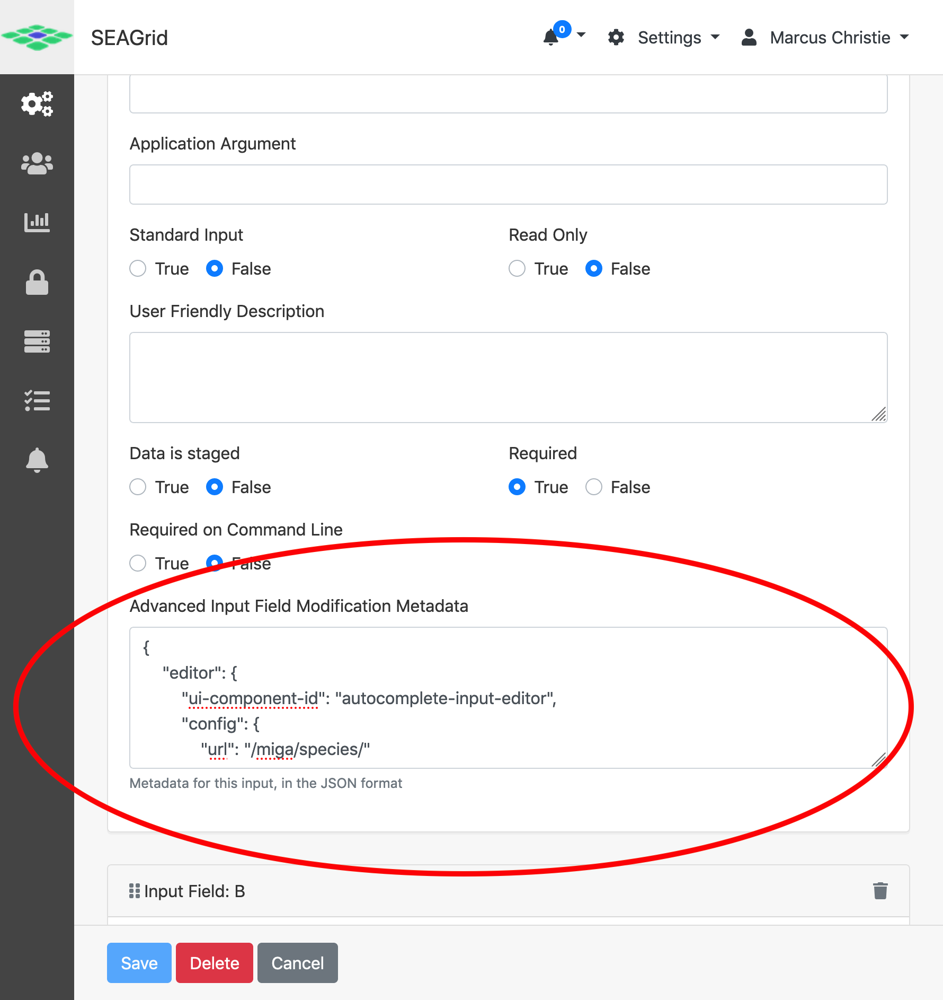

# Advanced Applicaton Input Configuration

The Airavata Django Portal supports customization of the user interface used to
configure an application input. For example, instead of the default text input
box for a string input, with customization the UI can be configured to be a drop
down list of options.

To configure application inputs one needs to provide JSON configuration in the
**Advanced Input Field Modification Metadata** field of the application input.
To get there:

1. Select **Settings** from the drop down menu in the header.
2. You should see the **Application Catalog**. If not, click the gears icon on
   the left hand side.
3. Select the application you want to configure by clicking on it.
4. Select the _Interface_ tab.
5. Scroll down to the _Input Field_ that you want to customize then scroll down
   to the **Advanced Input Field Modification Metadata** text box. This is the
   field where you will input your JSON configuration. This field will outline
   in green when the JSON is valid and in red when invalid. See the following
   screenshot.



## Validation

### Example

```json
{
    "editor": {
        "ui-component-id": "textarea-input-editor",
        "config": {
            "rows": 6
        },
        "validations": [
            {
                "type": "min-length",
                "value": 10
            },
            {
                "type": "max-length",
                "value": 200
            },
            {
                "type": "regex",
                "value": "^[XYL\\s]+$",
                "message": "Target sequence may only contain letters X, Y and L."
            }
        ]
    }
}
```

## Dependencies

You can hide/show inputs based on the values of other inputs. For example, if
the option selected in input A is 'list-of-urls' then you can have input B show
a field to upload a file.

### Example

```json
{
    "editor": {
        "dependencies": {
            "show": {
                "Select reading options": {
                    "comparison": "equals",
                    "value": "list-urls"
                }
            }
        }
    }
}
```

See
[code comment on evaluateDependencies()](https://github.com/apache/airavata-django-portal/blob/develop/django_airavata/apps/api/static/django_airavata_api/js/models/InputDataObjectType.js#L146)
for more information on how to define expressions.

## Alternate UI Components

### Checkboxes

#### Example

```json
{
    "editor": {
        "ui-component-id": "checkbox-input-editor",
        "config": {
            "options": [
                {
                    "value": "a",
                    "text": "A label"
                },
                {
                    "value": "b",
                    "text": "B label"
                },
                {
                    "value": "c",
                    "text": "C label"
                }
            ]
        }
    }
}
```

### Radio Buttons

#### Example

```json
{
    "editor": {
        "ui-component-id": "radio-button-input-editor",
        "config": {
            "options": [
                {
                    "value": "breakfast",
                    "text": "Breakfast"
                },
                {
                    "value": "lunch",
                    "text": "Lunch"
                },
                {
                    "value": "dinner",
                    "text": "Dinner"
                }
            ]
        }
    }
}
```

### Selects

#### Example

```json
{
    "editor": {
        "ui-component-id": "select-input-editor",
        "config": {
            "options": [
                {
                    "value": "breakfast",
                    "text": "Breakfast"
                },
                {
                    "value": "lunch",
                    "text": "Lunch"
                },
                {
                    "value": "dinner",
                    "text": "Dinner"
                }
            ]
        }
    }
}
```

### Slider

Displays a slider for picking a value between some minimum and maximum value.

#### Config options

-   _min_ - minimum value, defaults to 0.
-   _max_ - maximum value, defaults to 100.
-   _step_ - step between values. Default is 1. Can be less that one for decimal
    values.
-   _valueFormat.percentage_ - whether to save the value with a trailing "%".
    Defaults to false. Note, this is the value that will be placed in the job
    script.
-   _displayFormat.percentage_ - whether to display the value to the user with a
    trailing "%". Defaults to false.

#### Example

```json
{
    "editor": {
        "ui-component-id": "slider-input-editor",
        "config": {
            "min": 32,
            "max": 212,
            "step": 0.1,
            "valueFormat": {
                "percentage": true
            },
            "displayFormat": {
                "percentage": true
            }
        }
    }
}
```

### Range Slider

Like the Slider component but there are two sliders, one for selecting the
beginning and one for selecting the end of a range.

#### Config options

All of the options of the Slider component, plus:

-   _delimiter_ - the character to place between the values, for example, ",".
    The default value is a hyphen, "-". This will be placed into the job script.

```json
{
    "editor": {
        "ui-component-id": "range-slider-input-editor",
        "config": {
            "min": 32,
            "max": 212,
            "step": 0.1,
            "valueFormat": {
                "percentage": true
            },
            "displayFormat": {
                "percentage": true
            },
            "delimiter": ","
        }
    }
}
```

### Autocomplete

The Autocomplete UI component looks up matching entries for the given substring
typed by the user. This one requires that a custom Django app be developed to
implement the REST API for returning autocomplete suggestions.

#### REST API contract

-   URL is called with query parameter search with value of whatever the user
    has currently typed
-   URL should return a JSON response with a search key and the value of that
    key used for the search and an results key with a list matching results,
    limited to the top 10. Each result should have a text key with the text
    displayed to the user and a value key which is the value applied to the
    experiment input if selected. For example:

```json
{
    "search": "mammal",
    "results": [
        {
            "text": "Horse",
            "value": "horse"
        },
        {
            "text": "Mouse",
            "value": "mouse"
        }
    ]
}
```

-   URL can also be called with query parameter exact with a value that was
    previously returned. This call is made by the UI to retrieve the "text"
    value to display to the user for this value. The JSON response should be
    similar to the above except that it should only have one result:

```json
{
    "search": "horse",
    "results": [
        {
            "text": "Horse",
            "value": "horse"
        }
    ]
}
```

-   If the exact query parameter is specified and there is no match for that
    value, the JSON response should have HTTP status 404. The error reason can
    be added to the "detail" key of the response body, for example:

```json
{
    "detail": "No matching value was found."
}
```

#### Example REST API implementation

To create the REST API backend needed by the Autocomplete component, first you
need a create a custom Django app. See
[Custom Django Apps](../dev/custom_django_app) for more information.

Here's a simple implementation of a view function that looks up words in the
system dictionary file:

```python
def test_autocomplete_search(request):
    """Find matching words for given search string."""
    import re
    if 'search' in request.GET:
        query = request.GET['search']
        pattern = re.compile(re.escape(query), re.IGNORECASE)
    elif 'exact' in request.GET:
        query = request.GET['exact']
        pattern = re.compile(r"^" + re.escape(query) + r"$")
    else:
        return generic_json_exception_response(
            "Missing required query parameter: one of 'search' or 'exact'", status=400)

    matches = []
    with open("/usr/share/dict/words", 'r') as f:
        matches = [line.strip() for line in f if pattern.search(line)]
    # TODO: if 'exact', make sure len(matches) == 1. if 0, then return 404
    if 'exact' in request.GET and len(matches) == 0:
        return generic_json_exception_response(f"No match for exact = {request.GET['exact']}", status=404)
    return JsonResponse({
        "search": query,
        "results": [{"text": m, "value": m} for m in matches[:20]]
    })
```

See also a real world example
[miga-autocomplete](https://github.com/bio-miga/miga-autocomplete).

#### Example Input Metadata Configuration

```json
{
    "editor": {
        "ui-component-id": "autocomplete-input-editor",
        "config": {
            "url": "/custom/search/"
        }
    }
}
```
