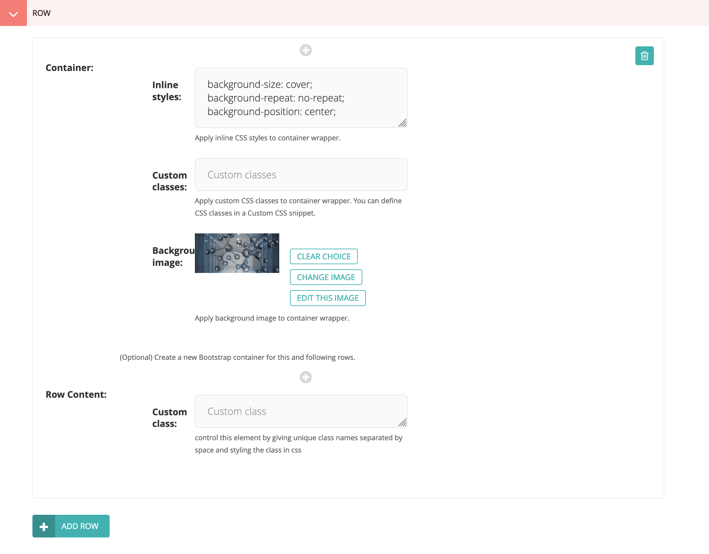

## USING CMS

#### Logging in to CMS Dashboard

1. Make sure you are on the homepage of the website. Now, append `/cms` to the url and click ENTER/GO
2. You will be redirected to a Login Interface for Wagtail which looks like shown below:


3. Input your Username and Password and click `Sign In`. If you are authorized by gateway admin to access the CMS dashboard, you will be redirected to the Wagtail dashboard which should look like shown below:


#### CMS Dashboard Overview


#### Page Structure in CMS

1. Pages in the CMS are created as a Tree Structure.
2. You can have child pages to a particular page and child pages again to any of those child pages and so on.
3. If you are using a pre-configured site, you don't need to set up any root page. Otherwise, if you are creating a website from scratch, you need to create a default root page like Home page which will be accessible at '/' url. you have to create it as a child of root page and configure site settings to set it as default page.
4. If you have a pre-configured site and you just need to maintain it, you don't need to touch site settings unless your host name or site name changes.
5. The following diagram clearly depicts all the useful points to note about CMS page structure.


#### Creating a New Page

1. If you are building a site from scratch, the first page you create will be a child page of Root page and you should name it home page. Root page shouldn't have any other children.
2. All the other pages you create from now on will be children of the home page or children of children of home page etc.
3. If you want to create a page as a child page of Home page, Click on the Pages link on the left side-bar.
4. You will get a side pop-up which will contain "**Welcome to your new Wagtail Site**" and a "**pencil**" icon and a "**right-arrow**" icon.
5. Unless the home page is created, you won't be able to find the "right-arrow" icon. Click on "right-arrow"
6. You will get "**Home**" Link. This is the default page. If you want to modify it you can click on "**pencil**" icon. if you have any child pages to "Home". you will also be able to find a "**right-arrow**" icon.
7. To create a new page as a child of "Home". you need to click on "Home" Link.
8. Then Click on "**ADD CHILD PAGE**" link.
9. Choose a page template type. Currently, three of them are available.
    * Blank Page -> (Build a page from scratch (Best Way))
    * Cybergateway Home Page -> (Build an IU Themed Home Page)
    * Home Page -> (Build a seagrid website based Home page)
10. You can explore other page templates. But Blank Page is the best way to go as it enables you to build your website from scratch without mocking any other website theme.
11. Click on "Blank Page".
12. Each page has four tabs namely:
    * CONTENT (On page load)
    * CUSTOMIZATION
    * PROMOTE
    * SETTINGS
13. Provide a title(**required**) for the page so that you can see it in the CMS.
14. Head over to the **PROMOTE** Section.
15. Provide a slug url ( which is the url extension at which the page will be available). for example if you are creating a documentation page. Provide a slug like `documentation` so that when you visit `<--yourwebsite.com-->/documentation` you will visit this page.
16. Provide a Page Title. This will show up in the page title of each page.
17. Please tick the **Show in Menu** to make the page appear in the Navbar Menu. This only works for children of **Home** This doesn't work for children of other pages.
18. Now head back to the **CONTENT** Section where you have already provided a Title.
19. Click on "**+**" beside Row.
20. It will open up a **PANEL** which contains all the items you can use to build an awesome website. Please click this [link](#understanding-panel) to see which one to choose for which purpose.
21. Every page follows a "**Bootstrap Grid Layout**" to make the website design process easy [Learn More](https://getbootstrap.com/docs/4.0/layout/grid/).
22. To understand this layout in laymens terms, This layout will divide each page into rows and columns like a Table. Columns are limited to 12. You can add as many rows as you can.
23. This layout enables you to place items on panel correctly on the website. Please go through the link mentioned above. It is a good read.
24. Initially after clicking "**+**". it will open up one row. you can add as many items in that row as you can by clicking small grey "+" circle shaped icons on the top and bottom of each item.
25. By default, each row is added to the initial Bootstrap container of the page. This initial container uses class `container-fluid`, meaning that each row will expand to full width of the browser. You may optionally change the container for a row (which will also affect every subsequent row) by specifying a **Container** for the row. The options are **Full width** (same as the initial container, or `container-fluid`) or **Max width** (`container`) which applies a max-width to each row. Each container is wrapped by a `<div>` that can optionally be styled with **Inline styles**, **Custom classes**, and **Background image**. These options allow styling the background of rows, for example, setting a background color of red for a set of rows.
25. To differentiate each item on each row. You will provide a unique attribute to **Custom class** textbox. for eg. (col-md-3). This will make the item take 3 columns space out of 12 available for a row. Similary add another item and give its **Custom class** (for eg. col-md-9). This will make item take 9 columns. Now you have used 12 columns in a row.
26. Then you will click on "Add Row" which will make an another row. A similar song and dance takes place for this row as well.
27. After you have completed making all the rows for the page, you click "**Save Draft**" to save the page.
28. Now your page has been created in CMS. but it is still in CMS and is not published yet.
29. To publish the page live. click on "**up-arrow**" next to "**Save Draft**". This will pop up a list.
30. Click on the "**Publish**" to make the page available to the entire world.
31. Before you publish please make sure all the content is appropriately displayed or not.
32. You can preview the page before you publish it by clicking "**Preview**" next to "**Save Draft**". This lets you get confident about how the page will be displayed. This is also a best practice for a content editor.
33. After you click "**Publish**". you will be redirected to the Parent Page dashboard if there are no validation errors.
34. You can now see the newly created page in the list. Click on "**Live**" or "**View Live**" button to visit the newly published page.
33. Congratulations! you have created a page using CMS.

#### UNDERSTANDING PANEL
1. A panel contains all the items that are necessary to build a great website. It is the arsenal for a content editor.
2. Developers will update this list in the future if they see fit. so please be on look out for any new items in the future.
3. Lets get to the details of each item.


###### Paragraph Block
1. This is the most important item of all the items in the panel.
2. This will let you create a paragraph/text on the website.
3. When you click on it, it will open two fields.
    * **Custom Class** -> ( you can provide a list of class selectors separated by white-space. you already know about "col-md-x". You can also add other classes like text-center to center the text etc. you can also give a custom unique class name for this paragraph. This will let you add css to that particular paragraph by editing in Custom CSS Snippet )
    * **Body** -> (This is called a Draftail Editor. This is the place where you can write some text that you want to get displayed on the web page. The icons here are self-explanatory. You can find more info [here](https://github.com/springload/draftail))

###### Image Block
1. This will let you put an image on the webpage.
2. When you click on it, it will open the following fields:
    * **Image** -> (Click Choose Image which will let you choose an image from images available or let you upload a new one)
    * **Caption** -> (If you want a text to be displayed below the image saying what is it, you can give it a caption. or you can leave blank)
     * **Width** -> (Specify some width for the image. Should be an integer value between 10-1000 ideally. If you want to make it occupy the whole width. specify 100%. You can leave blank to get original image size.)
    * **Height** -> (You can leave blank in most of the cases. If you specify, it should be an integer value between 10-1000. You can also specify 100% if you want it to take the entire height. )
    * **Redirect URL** -> (You can specify a redirect link for the image so that when you click on the image, it will redirect to some other page. You can leave blank.)
    * **Custom Class** -> (Refer to Paragraph Block custom class description)

###### Embed Block
1. This will let you embed youtube videos.
2. When you click on it, it will open the following fields:
    * **Embed** -> (Go to youtube and click a video. Copy the url. Paste it here for the video to appear here)
    * **Custom Class** -> (Refer to Paragraph Block custom class description)

###### Heading Block
1. This will let you write heading text of 6 varying sizes (H1, H2, H3, H4, H5, H6).
2. H1 is the biggest text. H6 is the smallest.
3. Don't choose this block just to make text bigger. If you want to make text bigger. you can give a custom class name and head over to custom css and specify font-size.
4. This block is used for the purpose of headings and sub-headings.
5. When you click on it, it will open the following fields:
    * **Heading Text** -> (Specify some heading text)
    * **Select a Header Size** -> (Select one of H1-H6)
    * **Custom Class** -> (Refer to Paragraph Block custom class description)

###### Bootstrap Jumbotron
1. This will let you create a highlight part for the webpage similar to [this](https://getbootstrap.com/docs/4.1/components/jumbotron/). Usually kept on the top of a page.
2. When you click on it, it will open the following fields:
    * **Title** -> (Specify Title)
    * **Body** -> (Specify description)
    * **Button Text** -> (Specify button text if you want a button. otherwise leave blank and leave all the below button fields blank)
    * **Button Link** -> (Specify button redirect link)
    * **Button Color** -> (Select a button color.)
    * **Button Size** -> (Select a button size)
    * **Custom Class** -> (Refer to Paragraph Block custom class description)

###### Bootstrap Alert
1. This will let you create an alert on the webpage similar to [this](https://getbootstrap.com/docs/4.1/components/alerts/)
2. When you click on it, it will open the following fields.
    * **Alert Text** -> (Specify some text to be displayed in alert)
    * **Alert Color** -> (Select some color for the alert)
    * **Is Link** -> (If the alert is a link. Tick this.)
    * **Alert Link** -> (Specify alert redirect link)
    * **Custom Class** -> (Refer to Paragraph Block custom class description)

###### Bootstrap Button
1. This will let you create a bootstrap button on the webpage similar to [this](https://getbootstrap.com/docs/4.1/components/buttons/)
2. When you click on it, it will open the following fields:
    * **Button Text** -> (Specify button text if you want a button. otherwise leave blank and leave all the below button fields blank)
    * **Button Link** -> (Specify button redirect link)
    * **Button Color** -> (Select a button color.)
    * **Button Size** -> (Select a button size)
    * **Custom Class** -> (Refer to Paragraph Block custom class description)

###### Bootstrap Card
1. This will let you create a bootstrap card on the webpage similar to [this](https://getbootstrap.com/docs/4.1/components/card/)
2. When you click on it, it will open the following fields:
    * **Card Width** -> (Leave blank if you want the card to take the width of the specified columns)
    * **Is Card Img** -> (Tick it if card is displaying an image inside it.)
    * **Card Img** -> (Click Choose Image which will let you choose an image from images available or let you upload a new one)
     * **Card Img Width** -> (Specify some width for the image. Should be an integer value between 10-1000 ideally. If you want to make it occupy the whole width. specify 100%. You can leave blank to get original image size)
    * **Card Img Height** -> (You can leave blank in most of the cases. If you specify, it should be an integer value between 10-1000. You can also specify 100% if you want it to take the entire height. )
    * **Card Title** -> (Specify a Card Title)
    * **Card text** -> (Specify a Card Body)
    * **Card Bg Color** -> (Select a Card Color)
    * **Card Text Color** -> (Select a color for the text on the card)
    * **Button Text** -> (Specify button text if you want a button. otherwise leave blank and leave all the below button fields blank)
    * **Button Link** -> (Specify button redirect link)
    * **Button Color** -> (Select a button color.)
    * **Custom Class** -> (Refer to Paragraph Block custom class description)

###### Bootstrap Carousel
1. This will let you create a rotating image carousel on the webpage similar to [this](https://getbootstrap.com/docs/4.1/components/carousel/)
2. When you click on it, it will open the following fields:
    * **Cimage 1** -> (Click Choose Image which will let you choose an image from images available or let you upload a new one)
    * **Cimage 1 title** -> (Choose a title caption to be displayed on the image)
    * **Cimage 1 body** -> (Choose a body caption to be displayed on the image)
    * **Custom Class** -> (Refer to Paragraph Block custom class description)
3. Similary there are Cimage 2 through 5. So you can have a 5 image carousel at max. Always start with Cimage1 followed by Cimage2 and so on.

###### Bootstrap Well
1. This will let you create highlighted text. Use it to highlight something on a webpage. Refer to Bootstrap Alert for more functionality.
2. When you click on it, it will open the following fields:
    * **Message** -> (Write some text you want to be highlighted)
    * **Well Bg Color** -> (Select a color to make it background for the text)
    * **Custom Class** -> (Refer to Paragraph Block custom class description)

###### Horizontal Rule
1. This will let you create a horizontal line on the webpage. This is not a normal horizontal line. you can customize the thickness and color of it. Use it to separate rows if you like.
2. When you click on it, it will open the following fields:
    * **Thickness** -> (select a number between 1 and 10)
    * **Bg color** -> (Give a hex code color for the line. You can select a hex color [here](https://www.w3schools.com/colors/colors_picker.asp))
    * **Custom Class** -> (Refer to Paragraph Block custom class description)

###### Bootstrap Media Object
1. This will let you create a media object on the webpage similar to [this](https://getbootstrap.com/docs/4.0/layout/media-object/)
2. Use this item for describing a person, university etc. with an image and a description.
3. When you click on it, it will open the following fields:
    * **Media img** -> (Click Choose Image which will let you choose an image from images available or let you upload a new one)
    * **Media img alt** -> (Create a text to be displayed if the image is not working for some reason)
    * **Media img width** -> (Choose the width for the image. Leave blank if you choose.)
    * **Media img height** -> (Choose the height for the image. Leave blank if you choose.)
    * **Heading text** -> (Provide the text description for the media object. For example, person name)
    * **Body Text** -> (Provide some body text for the media object. For example, person details)
    * **Custom Class** -> (Refer to Paragraph Block custom class description)

###### Placeholder Block
1. This is a block which doesn't contain any content. It just creates a space of given columns. Use it to align content properly.
2. When you click on it, it will open the following fields:
    * **Custom Class** -> (Give a bootstrap column for eg. col-md-3. This will leave a space of three columns in a row)

###### Font Awesome Icon Block
1. This is a block which can make a font awesome icon of varying size.
2. When you click on it, it will open the following fields:
    * **Icon tag** -> (Head over to [font awesome website](https://fontawesome.com/icons?d=gallery) and select a free icon you like to be displayed on the web page. For eg. (fas fa-bell)
    * **Icon Size** -> (Select an icon size as an integer value between 1 and 50)
    * **Custom Class** -> (Refer to Paragraph Block custom class description)

###### IU Footer Block
1. This is a block which can be used to make an iu footer.
2. This is a unique block which mocks the Indiana University footer as shown [here](https://www.iu.edu)
3. If you use this don't use the footer in the snippets. Alternatively, you can also go to the **Customization** tab of the page and set **Show Footer** to **No**
4. When you click on it, it will open the following fields:
    * **Footer Links** -> (Give the links you want to appear on the footer)
    * **Custom class** -> (Refer to Paragraph Block custom class description)


#### Modifying a Page content / Unpublishing a page
1. Go to the page you want to modify by selecting the pages link on the dark side bar on the left.
2. When you get to the page, Click "**pencil**" icon beside the page to visit the content of the page.
3. Modify the content on the page by creating a row or adding items to a row.
4. Also, you can customize the page to make navbar, nav-extra and footer snippets not show up.
5. After you are done with changes, preview the page and publish it if it looks as you want it.
6. If you published the page and you noticed some abnormalities and you want it to take it to the previous version, you hover over the page and find **MORE** link.
7. Then click on the **revisions** link to visit all the previous revisions. Click on Preview to check if that was the previous state you want to return to.
8. If that is the state, Click **Review this Revision** to visit the content page. Then Click **Publish** to publish the previous state of the page.

#### Deleting a Page
1. Go to the page you want to delete by selecting the pages link on the dark side bar on the left.
2. When you get to the page, Click "**pencil**" icon beside the page to visit the content of the page.
3. On the "**Pencil**" icon next to "**Save Draft**", click it and select "**DELETE** to delete the page.
4. It will verify again whether you are 100% sure to delete that page.
5. Click "**Yes, Delete It**" to delete the page.
6. If you just want the page not to be displayed on the live website. But you want to keep the page in the CMS. Click "**Unpublish**" instead of "**DELETE**". This will ensure that the page doesn't get completely deleted. If you want to publish in the future, you can do it.


### Snippets
1. Snippets are reusable pieces of code across the whole website.
2. Every website has snippets. For eg. Navbar
3. Navbar is consistent across every page. Navbar won't be changed for each page.
4. Similar consistency applies for Footer, Sidebar, Announcments, CSS, Secondary navbar, Header Links.
5. You can configure these items when you visit the "**Snippets**" tab on the left side dark colored bar on dashboard.
6. It consists of the following fields:
    * **Announcements** -> ( If you want announcements to be displayed on the home page, then you can click it and add as many announcements as you want. They will be displayed on the top portion of your website's home page. These announcemnts won't appear on other pages. A good example would be a convocation which is taking place and you want all the people visiting your website to see it.)
    * **Custom CSS** -> ( This is the place where you can add styles to the custom class unique selectors you defined while creating a page. This is basically writing css and controlling the element you selected. You can provide css comment or css block. A css comment is used to separate each style. for eg.(Navbar Styles). A css block is where you write css for the selector and its children. `Do not add additional Custom Css by clicking Add Custom CSS. Only the first one will take effet` )
    * **Header Custom Links** -> ( The Links on the main navbar are automatically generated depending on the child pages you created from the home page. If you want some other link to be displayed manually on the navbar. you can use this. Click on it and specify the link text and link to make it appear on the Main Navbar. `Do not add additional custom header links by clicking Add Header Custom Links. Only the first one will take effet`)
    * **Footer** -> ( You can design a Footer using this item. It will remain consistent and will appear on every page on website. If you don't want it to appear on a particular page, you can visit that particular page and go to "**Customization**" Tab and set "**Show Footer**" to No. `Do not add additional footers by clicking Add Footer. Only the first one will take effet` )
    * **Nav Extra** -> ( You can make a secondary navbar just below the main navbar if you want to. You can also add a brand logo and links to this navbar. You can customize its color and other properties by giving a custom class selector and specifying styles in "**Custom CSS**". If you don't want it to appear on a particular page, you can visit that particular page and go to "**Customization**" Tab and set "**Show Nav Extra**" to No. `Do not add additional nav extra by clicking Add Nav Extra. Only the first one will take effet` )
    * **Navbar** -> ( This is the main navbar which exists across every page. When you click on Navbar you can add Logo image and text. If you don't want it to appear on a particular page, you can visit that particular page and go to "**Customization**" Tab and set "**Show Navbar**" to No. It has a pre-defined class selector named '**main-nav**'. you can visit "**Custom Css** and write a css block with the '.main-nav' and give it some styles. When you click on Navbar you can add Logo image and text. If you don't want it to appear on a particular page, you can visit that particular page and go to "**Customization**" Tab and set "**Show Navbar**" to No.`Do not add additional navbars by clicking Add Navbar. Only the first one will take effet`)

## RECIPES

### Banner background image

Add a background banner image that spans the entire width of the browser.



1. Add a new row.
2. Add a **Full width container**.
3. Set the **inline styles** to:

```
background-size: cover;
background-repeat: no-repeat;
background-position: center;
```

4. Select or upload the **Background image**.
5. Add *Row Content* as usual. However, if you just want the background
   banner image without foreground content, then add a **Placeholder** block to
   the row content and then add to the container **inline styles**
   `height: 200px;` or whatever height you want for the banner image.

